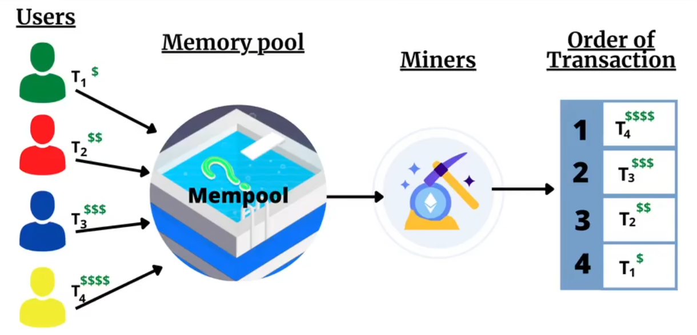
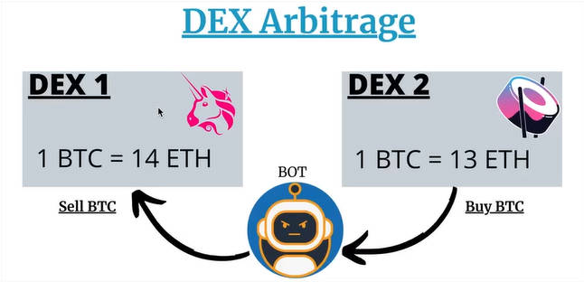
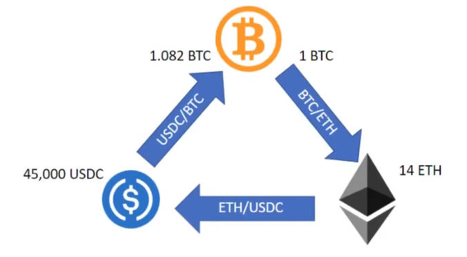

原文链接：https://github.com/autistic-symposium/mev-toolkit

## 什么是 MEV

1. MEV 全称 Miner/Maximum Extractable Value
   * Bloc k创建者(PoW 里的 Miner，PoS 里的 Validator)通过在 Block 中插入、排除、重排交易来获取收益

2. 为什么会有 MEV：Decentralized Sequencer

     a. 传统的交易系统都是中心化的 FCFS(FirstComeFirstServe)，比如股票交易
     b. 区块链里则是去中心化的 Miner 从公开 Mempool 中选取交易，打包上链
     c. 因为 Block 存在 Gas 上限，默认 Miner 会按 Gas Price 从高到低排序，以获得最多的 Gas Fee Payback
     
     

     d. 如果仅存在转账交易，上述方法确实可以实现 MEV
     e. 但当链上出现 DeFi 交易的时候，Miner 可以通过操纵交易顺序来从 DeFi 协议中获取额外收益(比如三明治攻击等)
     f. 类比黑暗森林:宇宙中每个文明都是带枪的猎人，一旦暴露自己存在都将很快被消灭

## MEV 的类型

1. 从手段的角度：如何操纵交易顺序以获取收益

   a. Front Running：看到获利交易，前置插入一笔一样的

   b. Back Running：看到影响大的交易，紧跟插入交易搬平它的影响

   c. Sandwich Attack、Time-Bandit Attack 等

2. 从应用的角度：从哪些 DeFi 协议获取收益

   a. 主要有 DEX 套利、Liquidations，下文详述

   b. 还有一些长尾的NFT等

## DEX 套利

1. 利用交易对之间的价差进行搬砖

   

   

2. 特性1，Multi-hop：区块链一笔交易中可以连续进行多次 swap 操作，提供了交易的原子性，所以比传统套利更多 hop

   特性2，无本金：Flashloan 提供了在同一笔交易内先借后还的操作，所以可以实现无本金套利

## Liquidations

1. DeFi 借贷:为抵押比例不足的借款人，进行部分债务的清算(卖出部分抵押物以偿还借款)，使其抵押比例上升。举例:
   a. BTC 价格 2 wU，Alice 抵押 1 BTC 借出 1 wU，2 倍抵押
   b. BTC 价格跌至 1.5 wU，Alice 只剩 1.5 倍抵押，达到清算值
   c. 允许任何人为 Alice 偿还一定额度的借款，比如 Bob 为 Alice 偿还 0.3 wU
   Bob可以获取当前价格下等额的抵押物，即0.2BTC(价值0.3wU)
   Bob还可以获得额外的抵押物作为奖励，比如0.01BTC(5%奖励)ii.d.此时Alice还剩0.79 BTC(价值1.185wU)抵押物，0.7wU债务，1.69倍抵押，回到清算阈值以上
2. 