原文链接：https://biquanlibai.notion.site/MEV-0069872a7241476f82bf5f7a4e1068ea

## 什么是 MEV

1. MEV 全称 Miner/MaximumExtractable Value
   * Block 创建者（PoW 里的 Miner，PoS 里的 Validator）通过在 Block 中插入、排除、重排交易来获取收益
2. 为什么会有 MEV：Decentralized Sequencer
   
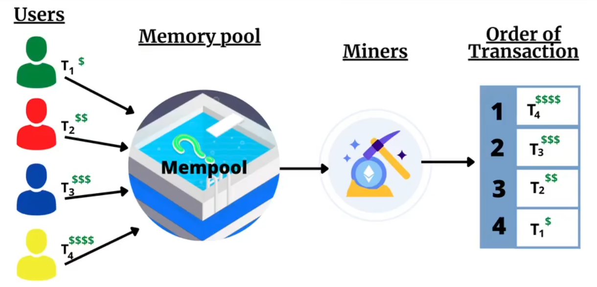

   a. 传统的交易系统都是中心化的 FCFS（First Come First Serve），比如股票交易
   b. 区块链里则是`去中心化`的 Miner从`公开` Mempool中`选取`交易，打包上链
   c. 因为 Block 存在 Gas 上限，默认 Miner 会按 Gas Price 从高到低排序，以获得最多的 Gas Fee Payback https://etherworld.co/2022/04/05/mev-research-report/
   d. 如果仅存在转账交易，上述方法确实可以实现 MEV
   e. 但当链上出现 DeFi 交易的时候，Miner 可以通过操纵交易顺序来从 DeFi 协议中获取额外收益(比如三明治攻击等)
   f. 类比黑暗森林：宇宙中每个文明都是带枪的猎人，一旦暴露自己存在都将很快被消灭

> 这里的意思其实就是，由于交易内存池的存在，大家的交易都是暴露的，在这种情况下就会导致自己的既得利益被损害。

## MEV 的类型

1. 从手段的角度：如何操纵交易顺序以获取收益

   a. Front Running：看到获利交易，前置插入一笔一样的

   > Front Running 是指在检测到一笔即将获利的交易时，通过插入一笔相同或类似的交易，抢在原交易之前完成，从而获取利益。可以想象这种操作类似于看到他人即将进行一笔有利可图的投资，于是抢先下单。
   >
   > 例如：用户 A 在去中心化交易所（如Uniswap）发起一笔大规模买单，将会提高代币的价格。
   >
   > 矿工或套利机器人侦测到这笔交易，并迅速插入自己的买单在用户 A 的交易之前。这样，矿工可以以较低价格买入代币，然后在用户 A 买入后卖出，赚取差价。

   b. Back Running：看到影响大的交易，紧跟插入交易搬平它的影响

   > Back Running 是指在察觉到一笔会显著影响市场的交易后，紧跟插入自己的交易，以便在市场恢复平衡时获利。与前置交易不同，后置交易是利用先前交易的市场影响，为后续交易创造盈利机会。
   >
   > 例如：用户 B 提交了一笔大额卖单，这笔交易导致代币价格大幅下跌。
   >
   > 机器人在用户 B 的交易之后立即插入买单，以低价购入该代币。随着市场恢复平衡，代币价格回升，机器人再将代币卖出，从而获利。

   c. Sandwich Attack、Time-Bandit Attack等

   > Sandwich Attack 是 Front Running 和 Back Running 的组合。攻击者在目标交易前后分别插入一笔交易，从而通过“包夹”目标交易赚取差价。这种操作类似于三明治中间的夹心，因此得名“三明治攻击”。
   >
   > 例如：用户 C 在去中心化交易所发起了一笔代币买单，会推高该代币价格。
   >
   > 攻击者发现此交易后，先进行一笔前置买单（front run），推高代币价格。用户 C 的交易完成后，攻击者再发起一笔后置卖单（back run），以更高的价格将代币卖出。通过三明治攻击，攻击者从用户C的交易中获得利润，而用户 C 由于价格被推高，交易成本也随之增加。
   >
   > Time-Bandit Attack 是一种极端的 MEV 策略。攻击者会通过短暂地“分叉”区块链，重组区块的交易顺序以便包含更多的 MEV 交易。这种方法有些激进，因为它会破坏区块链的稳定性和安全性。
   >
   > 例如：假设区块链当前的区块已经出块，但攻击者发现如果能在之前的区块重新排序交易，可以获得巨大利益。
   >
   > 攻击者发起时间强盗攻击，开始重组区块链中的交易顺序，以优先包含能带来 MEV 的交易。重组后的链比之前的区块链产生更高的矿工奖励，其他矿工可能因此加入攻击者的链，从而使攻击者获利。

   https://mp.weixin.qq.com/s/Yd-umFnjhXyB7crei2lynA

2. 从应用的角度：从哪些 DeFi 协议获取收益

   a. 主要有 DEX 套利、Liquidations，下文详述

   > `DEX套利`
   >
   > 在去中心化交易所（如 Uniswap、Sushiswap 等）上，由于不同交易池的价格可能存在差异，MEV 套利机器人可以利用这些价格不一致进行“无风险套利”。具体来说：
   >
   > - **跨交易所套利**：机器人观察不同交易所的同一代币对之间的价格差异，在低价交易所买入，同时在高价交易所卖出，从中获利。
   > - **链上套利**：有些区块链中不同交易池的价格可能在某些时刻不相同。套利机器人通过在一个池买入、另一个池卖出，利用两者的价差获得收益。
   >
   > 这种方式为 DeFi 提供了市场效率，但在频繁的套利行为下也会推高用户交易成本，因为套利机器人会竞价插队优先完成套利交易。
   >
   > `清算（Liquidations）`
   >
   > 清算主要在 DeFi 借贷协议（如 Aave、Compound 等）中发生。当用户的抵押资产不再满足协议要求时，系统会允许其他用户或机器人清算这些抵押品，以保护借贷池的稳定性。清算者会得到一定比例的奖励，因此这也成为MEV的重要应用场景。
   >
   > - **清算机制**：如果用户的抵押品价值低于借款门槛，机器人可以执行清算操作来偿还部分借款并获得奖励。
   > - **套利清算**：有些清算者会利用链上价格波动或借贷协议之间的差异，选择在某一时刻清算特定用户并卖出抵押品，迅速套利。
   >
   > 清算交易也往往竞价激烈，机器人会竞相支付更高的 Gas 费用以优先执行清算，因此矿工或验证者可以从中获得更多收益。
   
   b. 还有一些长尾的 NFT 等
   
   > 除了主流的套利和清算机会，DeFi 生态中的长尾协议也提供了一些 MEV 机会，虽然较为小众，但可能具有独特的套利空间。
   >
   > #### NFT市场的MEV
   >
   > 在 NFT 市场中，虽然流动性不如代币市场高，但仍有一些机会可供机器人利用：
   >
   > - **抢购热门 NFT**：当某些 NFT 系列或新项目受到市场热捧时，机器人可以竞相使用更高的 Gas 费用来优先获取热门 NFT，然后在二级市场上高价转售。这种抢购行为类似于“前置交易”，即优先排队抢购的机会。
   > - **跨平台价格差异**：部分NFT项目在多个市场（如 OpenSea、Rarible）上进行交易，机器人可以利用不同平台上的价格差异进行低买高卖的套利。
   >
   > #### 其他长尾DeFi协议
   >
   > 其他长尾的 DeFi 协议，比如衍生品、期权交易、预言机操控、稳定币铸造等，也可能会出现一些 MEV 机会：
   >
   > - **衍生品市场操控**：在衍生品市场上，机器人可能会插入或跟随交易，操控市场价格波动，从而影响期权或合约的最终结算价格。
   > - **预言机操控**：在某些使用链上预言机的协议中，攻击者可能会通过操控预言机价格短期影响市场，插入套利交易。
   
   https://ethereum.org/en/developers/docs/mev/
   
   
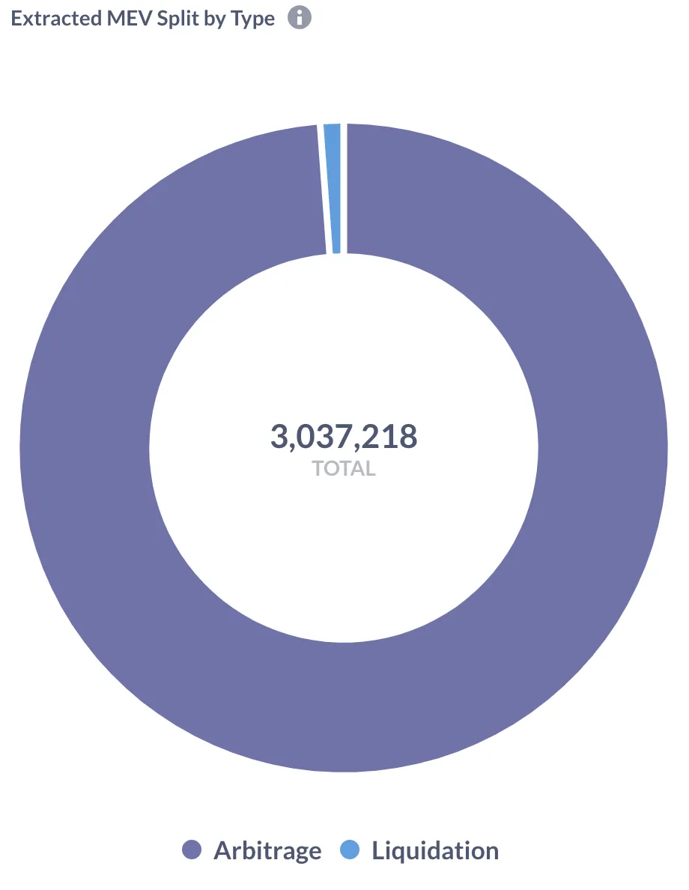

   
   https://explore.flashbots.net/

## DEX 套利

1. 利用交易对之间的价差进行搬砖

   
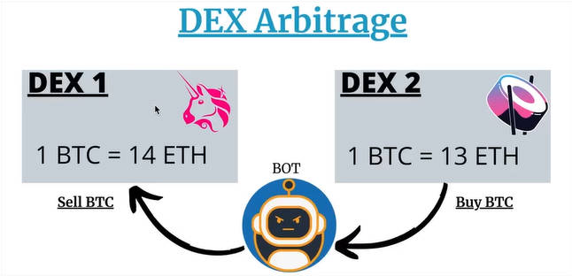

   https://etherworld.co/2022/04/05/mev-research-report/

   
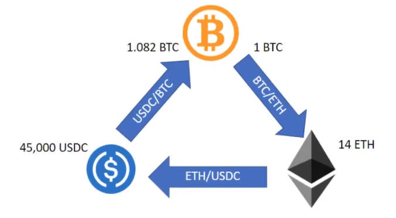

   https://medium.com/coinmonks/triangular-arbitrage-with-crypto-dexs-part-one-add36b136bf1

2. 特性1，Multi-hop：区块链一笔交易中可以连续进行多次 swap 操作，提供了交易的原子性，所以比传统套利更多 hop

   
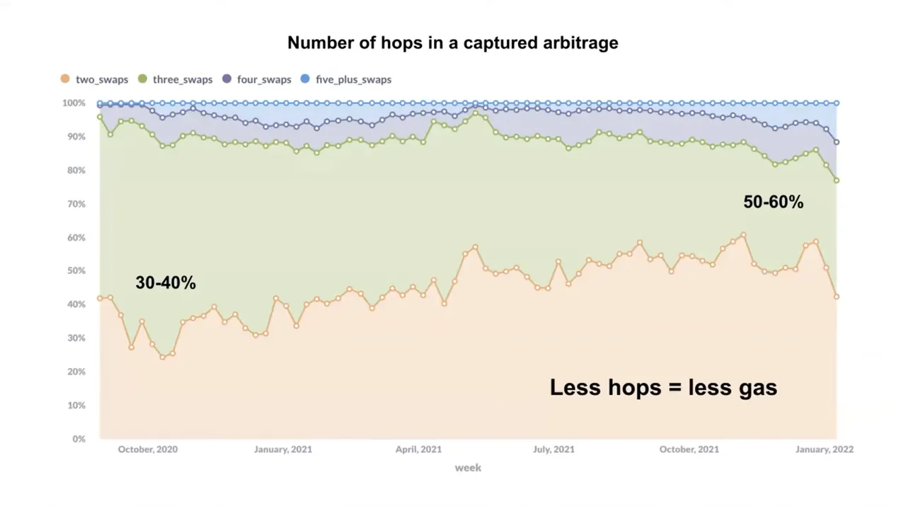

   https://youtu.be/V_wlCeVWMgk

   
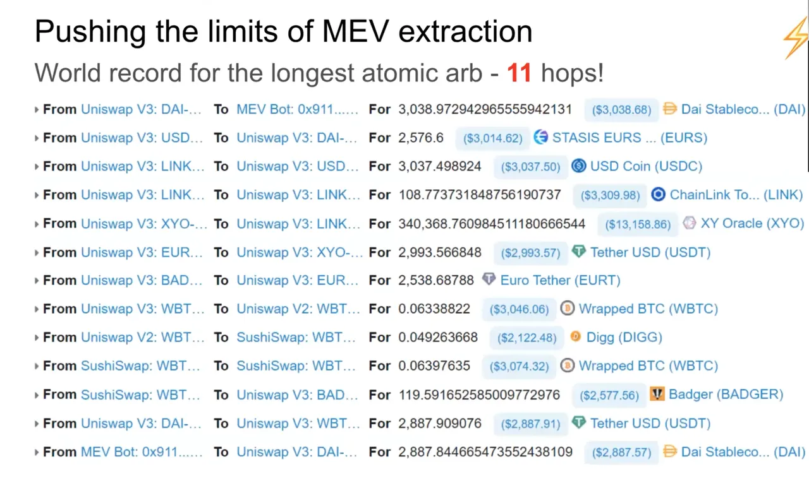

   https://youtu.be/V_wlCeVWMgk
   
   特性2，无本金：Flashloan 提供了在同一笔交易内先借后还的操作，所以可以实现无本金套利
   
   
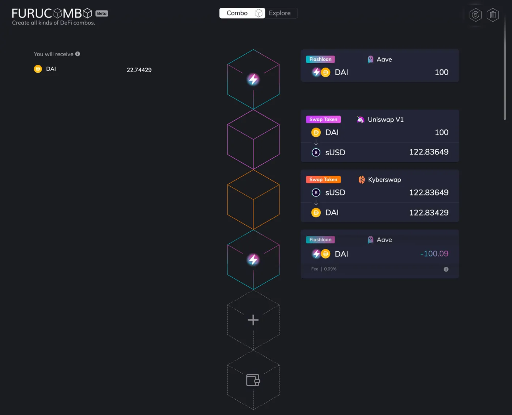

   
   https://medium.com/furucombo/create-flashloan-combo-on-furucombo-c7c3b23267f0

## Liquidations

1. DeFi 借贷：为抵押比例不足的借款人，进行部分债务的清算（卖出部分抵押物以偿还借款），使其抵押比例上升。举例：

   1. BTC 价格 2w U，Alice 抵押 1 BTC 借出 1w U，2 倍抵押

      > Alice 借出了 1 万美元，这时她的抵押倍数为 **2 倍**（抵押价值为借款金额的两倍）。在 DeFi 协议中，抵押倍数越高，越安全，表示 Alice 的抵押品价值足以覆盖借款。若抵押倍数低于清算阈值（通常 1.5 倍），则会触发清算。

   2. BTC 价格跌至 1.5w U，Alice 只剩 1.5 倍抵押，达到清算阈值

      > 当 BTC 价格跌至 1.5 万美元时，Alice 的 1 BTC 抵押品现在价值 1.5 万美元，Alice 的抵押倍数下降到 1.5 倍（1.5 万美元 / 1 万美元借款），达到清算阈值。

   3. 允许任何人为 Alice 偿还一定额度的借款，比如 Bob 为 Alice 偿还 0.3w U

      1. Bob 可以获取当前价格下等额的抵押物，即 0.2 BTC（价值 0.3w U）

      2. Bob 还可以获得额外的抵押物作为奖励，比如 0.01 BTC（5% 奖励）

         > **奖励机制**：为了鼓励清算人，协议会额外给予奖励，比如 Bob 还可以额外获得 0.01 BTC（即 5% 奖励）。

   4. 此时 Alice 还剩 0.79 BTC（价值 1.185w U）抵押物，0.7w U 债务，1.69 倍抵押，回到清算阈值以上

      
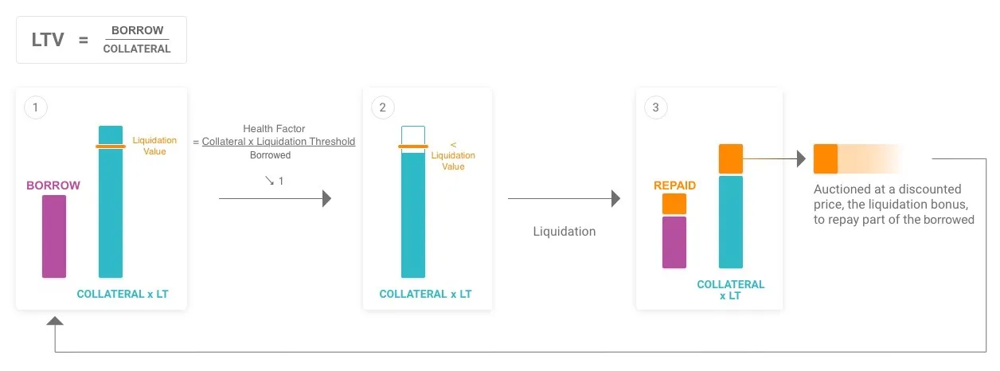

      https://docs.aave.com/risk/asset-risk/risk-parameters

2. 特性 1：达到清算阈值后任意用户可以发起清算，通常是机器人（价格大幅度波动的时候链上也会拥堵）

3. 特性 2：超额抵押，分批次清算（stETH 爆仓事件）

## MEV的影响

1. 正面影响是帮助 DeFi 运行：DEX 的价格及时更新，借贷、稳定币等运行

   
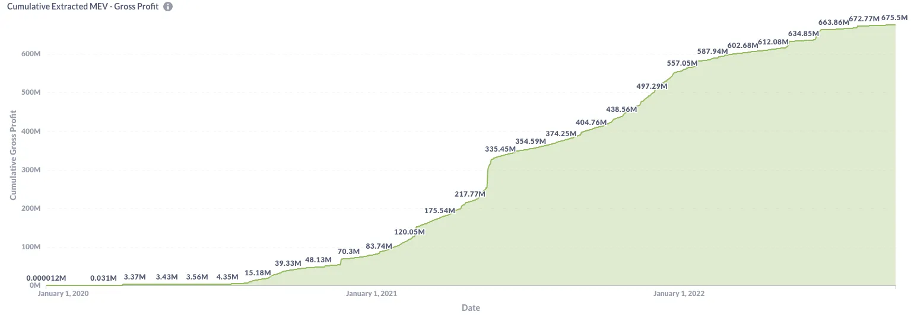

   https://explore.flashbots.net/

   1. 套利者也在其中获得了收入

2. 负面影响有

   1. Gas War：PGA（Priority Gas Auction）交易之间通过 Gas 竞争获得更优先的排序

      1. 链上抢购或价格波动导致大量清算时会发生
      2. 一方面极速拉高 Gas，造成 Gas 不稳定
      3. 另一方面大量失败交易上链，浪费链上空间

   2. Dark Forest：交易进入公开的 Mempool 后容易被攻击，来提取其中的价值

   3. Reorg：Miner 为了 MEV 而进行 Reorg，影响区块链的终局性

      > Reorg（链重组）是指矿工为了追求更高的 MEV 收益，选择放弃当前区块并重组链结构，这会影响区块链的终局性和稳定性：
      >
      > - **重组的动机**：如果矿工发现某一特定交易顺序可以获得大量 MEV 收益，可能会选择重组最近区块，重排交易顺序以捕获这些收益。这个过程会产生不必要的区块链分叉。
      > - **影响终局性**：链重组意味着某些已确认交易可能被取消或重新排序，给用户造成不确定性，尤其是对需要快速确认的交易和应用（如支付、借贷）带来风险。
      > - **系统性风险**：频繁的链重组削弱了区块链的共识稳定性和网络的可信性，矿工为追逐短期收益而牺牲了区块链的长远安全性。

3. 已有的解决方案

   1. EIP-1559：引入 Base Fee 的销毁和弹性的 Block Gas 容量来缓解 **Gas War**

      1. Base Fee 随拥堵情况变化，且幅度限制在 1.125x per block，使 Gas Price 的变化更平滑更好预测
      2. 增加了矿工自己插入交易的成本，减少矿工的 MEV 和影响 Gas 的行为
      3. Block Gas 容量有个 2x 的变化空间，会随着拥堵情况缓慢变化

   2. Flashbots/MEV-boost 引入中心化的 Sequencer

      
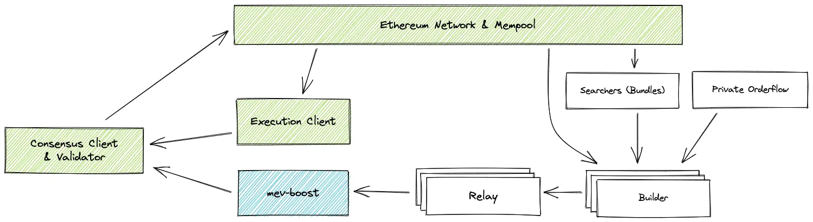

      1. 链下的交易排序竞价（Sealed-price Bid Auction），**Gas War** 转移到了链下完成

         1. 通过在 tx 内部直接支付 ETH 给 Miner 进行 Bid
         2. 中心化的服务完成 Auction，确定要包含的交易及其排序
         3. 失败交易不上链

         
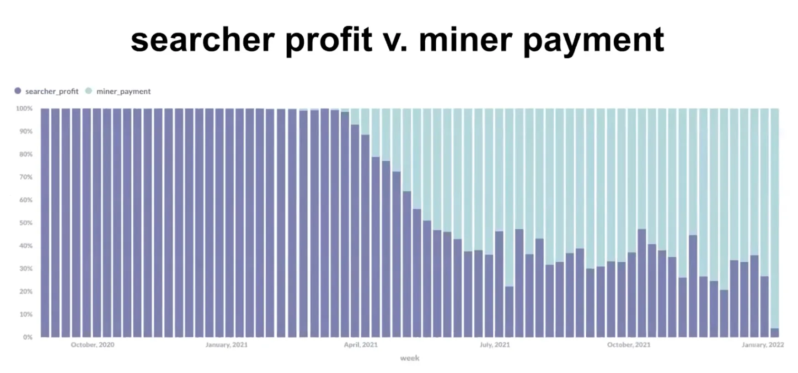

         MEV的收益都给了Miner：https://youtu.be/V_wlCeVWMgk

      2. 提供了 Private Mempool，防止了**黑暗森林**

         
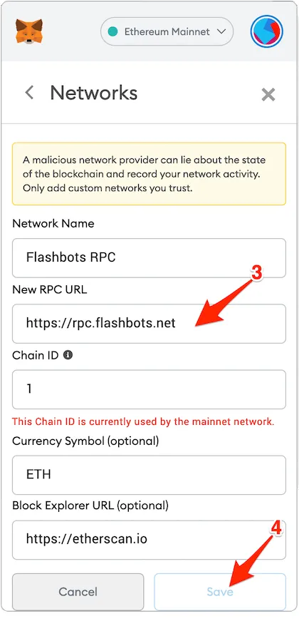

         https://docs.flashbots.net/flashbots-protect/rpc/quick-start/

      3. MEV-Boost 使用现状：https://www.mevboost.org/

         1. 多个服务提供商
         2. 占 20%+ 的出块

   3. Rollups 引入了 Layer2 的 FCFS，使用 Rollup 可以避免 MEV 的所有影响

4. 待实现的解决方案

   
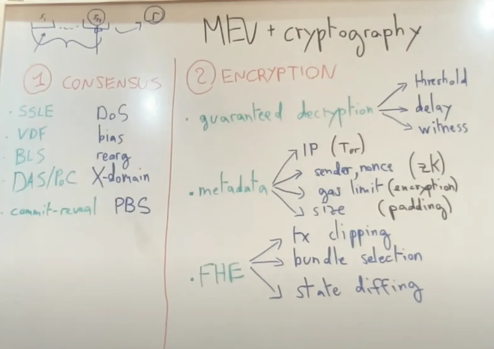

   https://youtu.be/jLHf6yw7b5Y

   1. PBS：去中心化的 Sequencer/Builder
   2. Single-slot Finality：避免 reorg
   3. Fair Sequencing：确定性的交易排序
   4. MEV smoothing：在 Miner 之间平滑 MEV 的收益
   5. Guaranteed Decryption：交易加密后进 Mempool，上链后再解开

# 总结

1. MEV作为区块链去中心化特性下的固有现象，其市场规模会随着DeFi持续发展
2. 链上套利作为新的方向，区别于传统的量化交易，有其独特的方法论和研究空间

https://explore.flashbots.net/