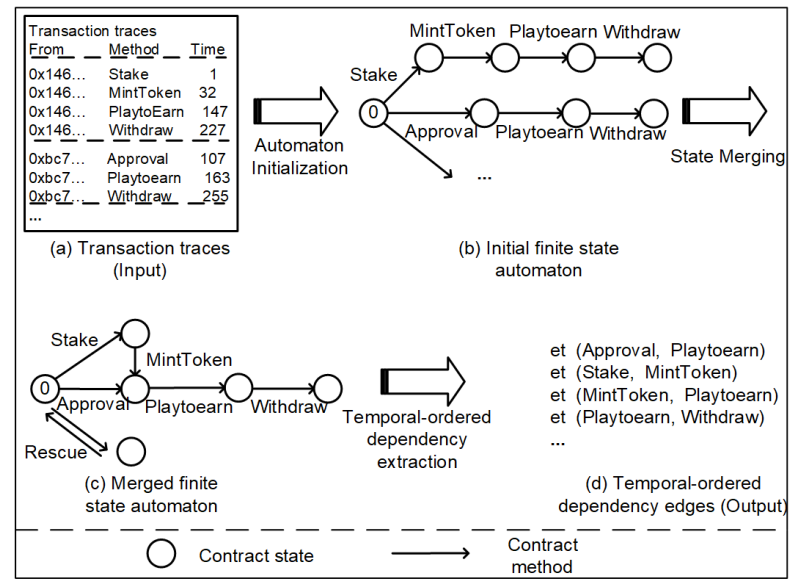
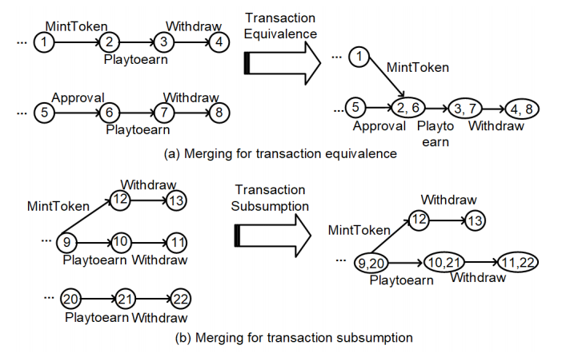
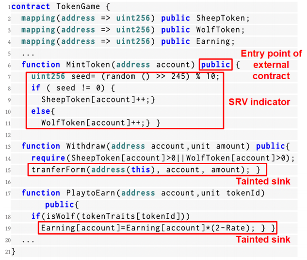
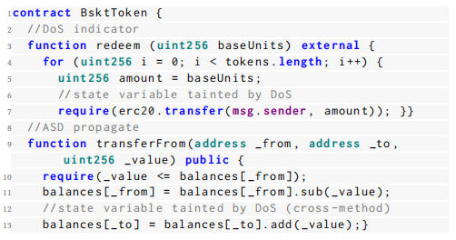
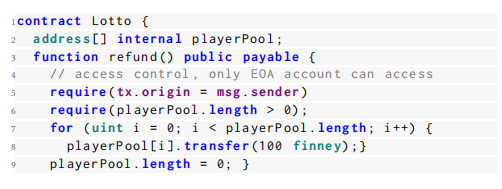

# SmartState：通过细粒度状态依赖分析检测智能合约中的状态回退漏洞

## 摘要

用 Solidity 编写的智能合约广泛应用于不同的区块链平台，如以太坊、波场（TRON）和 BNB 链。Solidity 智能合约中的一个独特设计是其用于错误处理和访问控制的**状态还原机制。**不幸的是，最近的一些安全事件表明，攻击者也利用了这种机制来操控智能合约的关键状态，从而导致诸如**非法获利**和**拒绝服务（DoS）**等安全后果。在本文中，我们将这种漏洞称为**状态还原漏洞（SRV）**。自动识别 SRV 面临独特的挑战，因为这需要深入分析和理解智能合约中的状态依赖关系。

本文提出了 SmartState，这是一个通过细粒度状态依赖分析来检测 Solidity 智能合约中状态还原漏洞（SRV）的新框架。SmartState 集成了一系列新颖的机制以确保其有效性。特别地，SmartState 从**合约字节码和历史交易中提取状态依赖关系**，这两者对于推断与 SRV 相关的依赖关系至关重要。此外，SmartState 将 SRV 的通用模式（即获利和拒绝服务攻击）建模为 SRV 指标，从而基于构建的状态依赖图有效地识别 SRV。为了评估 SmartState 的性能，我们手动注释了一个包含 91 个真实世界 SRV 的地面真实数据集。评估结果显示，SmartState 达到了 87.23% 的准确率和 89.13% 的召回率。此外，SmartState 成功从 47,351 个真实世界智能合约中识别出了 406 个新的 SRV。其中 11 个 SRV 来自交易金额较高（即排名前 2000）的流行智能合约。总的来说，我们报告的 SRV 影响了总价值为 428,600 美元的数字资产。

关键词：漏洞检测，智能合约，静态分析，状态依赖

> 摘要阅读总结：
>
> 本文主要是针对`非法获利`和`拒绝服务攻击`而设计的静态代码分析软件，分析手段是合约源字节码以及历史交易记录状态。

## 引言

智能合约是一种在区块链系统上运行的特定类型的程序。Solidity 是编写智能合约最受欢迎的编程语言之一，广泛应用于主要的区块链平台，如以太坊[4]、波场（TRON）[9]和 BNB 链[2]。智能合约现在支持区块链中的各种去中心化应用（DApps），例如去中心化金融（DeFi）、去中心化游戏（GameFi）和非同质化代币（NFT）。由于大多数区块链系统持有相当数量的数字资产，智能合约的安全性对智能合约所有者（例如 DApp 开发者）和用户都具有重要意义。例如，在著名的 DAO 攻击[31]中，攻击者利用了智能合约中的一个漏洞（即重入漏洞），导致了 6000 万美元的经济损失。

`状态还原及其安全隐患`。在 Solidity 中，状态还原是一种支持错误处理和访问控制的特定机制[7]。更具体地说，如果在交易过程中遇到未满足的条件，**状态还原机制允许智能合约中的状态变量回滚到它们的原始状态**。不幸的是，最近的一些安全事件[1, 6]表明，在实现状态还原时，智能合约可能包含易受攻击的代码模式，使得攻击者能够利用这种机制，**通过伪造交易错误操控某些关键状态**。这类攻击可能会对受害的智能合约造成严重后果，例如`非法获利`[23]和`拒绝服务（DoS）`[18]。在我们的研究中，我们将智能合约中的此类漏洞称为`状态还原漏洞（SRV）`。

鉴于 SRV 的严重影响，针对 SRV 的研究相对有限。具体来说，EOSafe[23] 和 WASAI[13] 分别通过`符号分析`和`模糊测试`来检测**由状态还原引起的回滚漏洞**。此外，eTainter[19] 和 Madmax[20] 基于异常的 Gas 消耗检测由状态还原引起的拒绝服务（DoS）漏洞。然而，这些方法**只能覆盖 SRV 的一种子类型**（即非法获利或DoS，详见第2.2节的讨论）。此外，EOSafe[23] 和 WASAI[13] 均为 WASM 语言中的智能合约设计。由于它们的检测启发式**依赖于语言特定的特性**（即 WASM 中的内联机制），这些方法并不适用于 Solidity 智能合约。

`我们的工作`。在本文中，为了填补上述研究空白，我们提出了 SmartState，这是一个用于检测 Solidity 智能合约中状态还原漏洞的新框架。据我们所知，SmartState 是**第一个在字节码级别以通用方式支持 SRV 检测的工具。**

`本研究的关键挑战`。在于**构建一个细粒度的状态依赖图**，这是确定哪些状态可能会受到攻击者从攻击面（例如，来自其他合约的函数调用）影响或操控的必需步骤。然而，现有的先进方法只能推断有限的状态依赖信息，这不足以检测 SRV。例如，Sailfish[11] 仅涵盖了某些显式依赖关系（即状态读取和写入（R&W）依赖性和控制流依赖性），用于检测智能合约中的状态不一致漏洞。

为了有效检测 SRV，SmartState 识别了先前研究中遗漏的两种状态依赖关系，即`与断言相关的状态依赖（ASD）`和`时间顺序状态依赖（TSD）`。其中，**ASD 指的是与诸如 assert、revert 和 require 等用于访问控制的语句相关的显式依赖关系**，而**TSD则指的是由交易（即函数调用）影响的依赖关系**，这是智能合约所独有的。为此，SmartState 通过分析智能合约字节码及其对应的历史交易来推断这些重要的依赖关系（详见第4.1节和第4.2节）。通过这种方式，SmartState 结合提取的依赖关系并构建了一个细粒度的状态依赖图，以检测 SRV。此外，SmartState 将 SRV 的通用模式（即非法获利和拒绝服务攻击）建模为 SRV 指标。例如，SmartState 检测 SDG 中的关键状态是否缺乏适当的访问控制检查。因此，它能够基于构建的状态依赖图有效地识别 SRV。

为了评估 SmartState 的性能，我们构建了一个手动标注的数据集，该数据集由从公共报告和对最流行的智能合约的手动调查中收集的 91 个 SRV 组成。评估结果显示，SmartState 达到了 87.23% 的准确率和 89.13% 的召回率，这表明它在检测 SRV 方面具有很高的有效性。此外，通过在 2000 个真实世界中流行的智能合约上运行 SmartState，我们的研究成功识别出了 11 个以前研究未能识别的新 SRV。这些 SRV 影响的资产总价值达到了 428,600 美元。

总而言之，本文做出了以下贡献：

* 我们提出了 SmartState，一个基于静态分析的新框架，用于检测状态还原漏洞。据我们所知，SmartState 是首个以通用方式检测 SRV 的工具。

* 我们提出了一套新的机制（即与断言相关的依赖关系和交易顺序依赖关系）来构建智能合约中的细粒度状态依赖图。

* 我们进行了广泛的评估，以展示 SmartState 的有效性。此外，通过对 47,351 个野外智能合约进行大规模研究，SmartState 在真实世界中识别出了 406 个新的 SRV。

* 我们发布了 SmartState 的工件以及手动标注的 SRV 数据集[1]。

> 本文的主要贡献就是编写了 SmartState，并且提出一套启发式规则。
>
> 将软件运行在真实数据集中识别到了新的漏洞，自己构建了一个数据集跟其他工具做了一个对比。

## 背景与动机

在本节中，我们首先介绍一些关于智能合约和合约状态的基本背景知识。然后，我们提出问题陈述并说明我们研究的动机。

### 智能合约与合约状态

智能合约是一种在区块链上运行的特定类型的程序。目前，大多数智能合约是用 Solidity 编写的[7]。通过 Solidity 源代码，智能合约被编译成字节码，并在不同区块链平台（如以太坊[4]、波场（TRON）[9]和BNB链[2]）的虚拟机（VM）上执行。类似于其他编程语言，如 Python 和 Java，智能合约由一组函数和变量组成。函数可以通过智能合约和用户账户的调用来触发。这种函数调用也被称为交易。

合约状态是通过智能合约中的全局变量（即状态变量）存储和访问的持久数据。一次交易（函数调用）实际上会改变相关智能合约的状态，而这一过程会被永久记录在区块链上[7]。由于区块链上存储空间的有限性，**智能合约使用状态变量来存储关键数据**，例如所有者的地址、用户的代币余额等。因此，**如果攻击者能够操控这些关键状态，可能会对合约所有者造成严重的负面影响（例如，财务损失）**。例如，在著名的 Fomo3D 攻击中，攻击者利用了一个`拒绝服务（DoS）漏洞`，**阻止了其他合约用户的购买操作（即回滚了代表购买的状态变量的修改）**，从而导致了 4300 万美元的经济损失[1]。

`状态还原机制。`状态还原是一种用于智能合约中错误处理和访问控制的独特机制。如果在交易过程中遇到未满足的条件，所有与此交易相关的合约状态都可以回滚到交易前的值。这种状态还原机制对于智能合约场景至关重要，因为它确保了智能合约中交易的原子性。在智能合约中，状态还原可以通过调用断言语句（即 `require`、`assert` 和`revert`）来实现。例如，带有 `"require(tx.origin = msg.sender)"` 的智能合约表示该函数只能由外部拥有账户（EOA）调用[5]，如果函数的调用者不是 EOA（例如，合约账户），则该交易中进行的所有其他状态更改都将被回滚。

> 吐槽一下这个部分，说实话我感觉这个地方第一眼看上去我还以为是引言复制粘贴了一次😂😂😂
>
> 解释原文：
>
> In smart contracts, state-reverting can be implemented by invoking the as sertion statement (i.e., require, assert, and revert). For example, a smart contract with *"require(tx.origin == msg.sender)"* indicates that the function can only be invoked by an external owned account (EOA) [5], if the caller of the function is not an EOA (e.g., contract account), all other state changes made in this transaction will be rolled back.
>
> 因为合约是可以相互之间调用交互的，所以检查当前调用函数的用户（msg.sender）是否是发起交易的用户（tx.origin），而 tx.origin  只能是 EOA 用户（因为合约用户没有私钥，无法签名发起交易）

### 问题陈述

在本文中，我们的研究重点是与状态还原机制相关的漏洞。我们将这种类型的漏洞称为状态还原漏洞（SRV）。

`状态还原漏洞（SRV）` 最近的研究和报告[23]表明，状态还原机制经常被攻击者利用，导致严重的攻击和安全事件。更具体地说，在这些攻击中，攻击者使用状态还原机制，使交易回滚，如果交易结果不如预期（例如，不利于攻击者）。状态还原攻击在 GameFi 市场中更为普遍，影响游戏公平性，并给合约所有者[13]或 GameFi 用户带来巨大的财务损失。

`动机示例` 图1展示了一个具有状态还原漏洞的智能合约示例，该漏洞影响了游戏的公平性，同时展示了攻击者如何通过操纵合约状态获得非法利润。在这个示例中，状态变量 SheepToken 和 WolfToken 是两种不同价值的代币（即，WolfToken 比 SheepToken 更贵）。一个随机数（种子）决定了赌博结果，有 90% 的机会获得 SheepToken，10% 的机会获得 WolfToken（第7-11行）。不幸的是，由于缺乏适当的访问控制，攻击者可以在赌博游戏前后随意检查这些代币的余额（第17-19行）。为了在游戏中最大化收益，攻击者使用 require 语句（第21行）在他获得低价值的 SheepToken 时回滚整个交易（即只获得 WolfToken）。通过这种方式，攻击者确保自己总是获得 WolfToken，从而破坏了游戏的公平性并获得了更多利润。

图1：状态回退漏洞的示例及攻击者如何利用其获取利益

图 2 总结了过去三年中由于状态还原攻击所导致的累积财务损失。此类统计数据和相应事件的来源列在[8]中。如图所示，由 SRV 引起的经济损失正在迅速增加，截至 2022 年 4 月已达到 3869 万美元。

图2：近年来由于状态恢复漏洞造成的经济损失汇总。收集事件的来源总结见[8]

`先前研究及其局限性` 尽管有报告指出了由 SRV 引发的攻击事件[1]，但提前识别 SRV 并进一步消除此类损失的研究仍然有限。据我们所知，与本研究最相关的工作可能是 EOSafe[23]和 WASAI[13]，它们主要通过符号执行和模糊测试分别检测回滚攻击。然而，由于这两个框架未考虑智能合约中的重要状态依赖关系，它们只能检测与状态还原相关攻击的一种子类型（即导致非法获利的回滚）。同样地，eTainter[19]和 Madmax[20]提出了一个框架来检测同样由状态还原引发的拒绝服务（DoS）漏洞。此外，EOSafe[23]和 WASAI[13]均是专门为 WASM 语言中的智能合约设计的[10]。由于 Solidity 合约和 WASM 合约之间的根本差异，这些框架无法用于检测 Solidity 中的 SRV。例如，为了检测回滚漏洞，EOSafe[23]依赖于定位 WASM 智能合约中用于调用内联操作的特定语句 send_inline。然而，在 Solidity 中没有这样的内联操作，也没有 send_inline 关键字。

> 这个地方举的一个例子跟我之前看的浙大发的那个随机数漏洞的例子很像，其实我当时就觉得这个东西不能单纯的归结为随机数种子设置不正确的原因，因为实际上哪怕你把随机数设置的再好，回溯机制还是能够使得对方在不利情况下直接回滚交易。
>
> 这里提到的两个工具主要用于检测 WASM 这个跟主流的 Solidity 不太符合，但是我觉得这里也有偷懒的嫌疑，我觉得应该对比浙大的那个工具的，毕竟这个问题浙大也是有提出来的。

### 我们工作的范围

SmartState 被设计为一个通用框架，用于检测 Solidity 智能合约中的状态还原漏洞（SRV）。SmartState 的假设与其他智能合约漏洞检测框架类似，如 SmartDagger[29]和 Slither[18]。更具体地说，SmartState 静态分析智能合约字节码，并准确报告给定智能合约是否包含状态还原漏洞。由于SmartState 在字节码级别而非源代码级别进行分析，因此它适用于许多安全审查场景，如大规模的第三方审计、自我安全检查等。与其他只关注特定区块链平台的研究相比[13, 19, 23]（例如，针对以太坊的 eTainter 和针对 EOSIO 的 EOSafe[3]），SmartState 可以为基于 Solidity 智能合约的更多区块链生态系统提供更大帮助（例如，以太坊[4]、波场[9]和BNB链[2]）。

> 字节码反汇编得到 Solidity 高级语言，再切割为 IR 进行分析，其实我会相对来说比较诟病这种方案，因为这种情况下说精确度不高，召回率不行就是因为反汇编工具垃圾。

## 3 SmartState 的设计

在本节中，我们将介绍 SmartState 的高级设计。我们首先强调检测 SRV 的关键挑战。然后，我们详细说明 SmartState 如何克服这些挑战。

如前所述，SRV 的根本原因在于某些状态变量可以通过状态还原机制被外部调用影响或操控。因此，识别 SRV 的一个直接思路有两个关键步骤：

1. 识别不同状态变量和函数调用之间的状态依赖关系；
2. 根据这些依赖关系的影响识别 SRV。

(1) `识别状态依赖关系`。类似于之前用于识别状态不一致漏洞的研究[11]，我们可以构建一个状态依赖图，表示不同智能合约和函数调用之间的依赖关系。以图 3 中的示例为例，状态变量 SheepToken 和 WolfToken 可以通过函数 MintToken 写入（第9行、第11行），并进一步被函数 Withdraw 的 assert 语句访问（第14行）。在这种情况下，我们可以说函数 MintToken 和 Withdraw 之间存在针对状态变量 SheepToken 和 WolfToken 的状态依赖关系。

(2) `识别SRV`。对于一个特定的安全敏感状态变量，我们可以检查是否存在沿着状态依赖图的有效路径（调用链），允许外部调用任意操控它。再次以图 3 为例，对于在 Withdraw 中修改的状态变量 balance（第15行），由于 MintToken 和 Withdraw 之间的依赖关系，攻击者实际上可以影响它。因此，我们识别出合约 TokenGame 存在状态还原漏洞。

图3：具有两种状态依赖的易受攻击智能合约示例

> 解释：
>
> 首先是`SheepToken` 和 `WolfToken` 是在函数 `MintToken`（第9行和第11行）中写入的（意味着它们的值在此函数中被修改）。在 `Withdraw` 函数（第14行）中的 `require` 断言语句中，这两个状态变量会被访问并检查它们的值是否满足条件。也就是说，这两个状态变量在 `MintToken` 函数和 `Withdraw` 函数之间有依赖关系。
>
> 其次是第15行的 `Withdraw` 函数中修改了一个状态变量 `balance`，这个状态变量实际上可能会受到攻击者的影响。这种影响是由于 `MintToken` 和 `Withdraw` 函数之间的依赖关系导致的。
>
> 由于这种依赖关系，攻击者可以利用外部调用操作这些状态变量，从而导致合约 `TokenGame` 出现状态还原漏洞。

### 挑战与解决方案

随着智能合约复杂性的增加，建立一个有效且完整的状态依赖图（SDG）用于 SRV 检测绝非易事。先前的研究[11]出于其他目的进行了状态依赖分析（例如，Sailfish 用于检测状态不一致漏洞），这些研究仅涵盖了某些显式依赖关系，如状态读取和写入（R&W）关系及相关的控制流，这对于 SRV 检测来说是不够的。我们的工作补充并扩展了先前的研究，通过考虑两种新的依赖类型，即与断言相关的状态依赖（ASD）和时间顺序状态依赖（TSD），使我们能够检测与状态依赖相关的新漏洞（即SRV）。

`C1：提取与断言相关的状态依赖（ASD）` ASD 指的是与访问控制语句相关的依赖关系。Solidity 使用保留关键字，如 assert、revert、require，来实现访问控制，并且某些状态可能会被这些语句显式地（如作为函数参数）或隐式地（如交易回滚）影响。如果状态 S 可以由函数 $𝑓_𝐴$ 写入，并在另一个函数 $𝑓_𝐵$ 的 assert 语句中被进一步访问，那么我们称在状态 S 上，函数 $𝑓_𝐴$ 和 $𝑓_𝐵$ 之间存在 ASD。换句话说，函数 $𝑓_𝐵$ 只有在状态 S 满足所需条件时才能执行，否则，函数 $𝑓_𝐵$ 将失败，并且整个交易将被回滚。先前的研究[30]表明，82.28% 的智能合约使用与断言相关的语句进行访问控制。与其他显式依赖关系（如状态读取和写入）不同，提取 ASD 需要分析与 Solidity 中 assert 语句相关的特定控制流和数据流。例如，在图 3 中，对于状态变量 SheepToken 和 WolfToken，MintToken 和 Withdraw 之间的状态依赖关系是一种与断言相关的状态依赖，因为 Withdraw 函数依赖于 SheepToken 和 WolfToken 这两个状态变量（由于 assert 语句的影响，即控制流），而这些状态变量依赖于函数 MintToken 对它们的写入（即数据流）。

为了解决这一挑战，SmartState 对智能合约字节码进行细粒度的控制流和数据流分析，以恢复程序逻辑。通过这种方式，基于 Solidity 中特定 assert 语句的语义，SmartState 建立了不同函数之间针对不同合约状态的依赖关系。

`C2：提取时间顺序状态依赖（TSD）` 如前所述，智能合约在区块链上作为交易执行。TSD指的是由于智能合约中多个交易的顺序导致的状态依赖关系。更具体地说，由于合约用户通过特定的交易顺序调用合约，某一时刻合约函数产生的状态可能会受到这些交易时间顺序的影响。例如，如图 3 所示，根据该智能合约的交易顺序，我们知道合约用户需要在进行游戏之前铸造代币（即调用 MintToken），然后再进行游戏（即调用 PlaytoEarn）。因此，我们说 MintToken 和 PlaytoEarn 之间存在时间顺序依赖关系。先前的研究[27, 35, 36]强调了 TSD 的重要性，因为操纵特定合约的交易顺序可能会导致严重的漏洞或财务损失。不幸的是，这种跨函数的时间顺序语义在智能合约字节码中难以恢复，因为交易顺序由特定智能合约的应用场景决定，这与其功能相关（例如，用于赌博的智能合约）。

为了解决这一挑战，SmartState 利用了这样一个事实：TSD信息在智能合约的交易历史中得到了很好的保留，因为合约用户通常会按照特定的交易顺序调用合约函数。为此，SmartState 使用有限状态机从历史交易记录中学习智能合约函数的时间顺序，并进一步提取 TSD。

`C3：SRV 识别` 最后一个挑战在于如何基于构建的状态依赖图（SDG）准确识别 SRV。如前所述，以往的方法[19, 20]主要基于临时启发式方法（如异常的 Gas 消耗[20]）来检测与 SRV 相关的漏洞。这些方法并不通用，只能覆盖 SRV 漏洞的一种子类型（例如，由 SRV 引发的 DoS 攻击[19]）。

不同于先前的研究，SmartState 强调 SRV 的根本原因，并将其用作 SRV 指标，以支持通用的漏洞检测。更具体地说，SmartState 将以下两个关键元素作为 SRV 指标：(1) 是否存在安全敏感状态是非确定性的，或者它与其他非确定性状态共享依赖关系。例如，如前面图 1 所述，在存在漏洞的函数 MintToken 中，代币的数量（例如，WolfToken）可能受到用于存储代币值的状态变量的影响，该状态变量可能会受到生成随机数的语句的影响。(2) 该敏感状态是否缺乏适当的访问控制。基于特定状态的状态依赖图，SmartState 检测是否缺少必要的访问控制，例如检查交易的来源地址或检查特定代币的余额。最后，如果可以调用外部合约并到达具有上述 SRV 指标的状态，我们将认为被分析的合约存在漏洞。

> 状态读取和写入（R&W）关系及相关的控制流，这个就是前文中展示的状态还原漏洞。
>
> 说实话我觉得 C1 就是在放屁，你他妈在字节码层面检查，还能查出来 assert、revert、require？这个地方说实话我存疑啊，反编译器有这么牛吗？assert、revert 说实话就是一个条件判断罢了，转成字节码之后就是 jumpi + invalid 或者 jumpi + revert，真的能还原出来吗？
>
> C2 我大致理解他的意思了：就是说在一个合约中，铸币跟取币可能不在同一个函数中完成，可能是两个函数，但是这两个函数存在一个依赖关系，就是说必须先铸币才能取币，但是这种顺序关系只存在于设计层面，在代码层面无法找到直接关联。然后可以借助交易的历史记录来检查函数间的必然联系。这里其实也会有一定的问题：这种方案需要依赖大量的交易，当个时候这个合约的钱都被搬空了。
>
> C3 机制简直是在放屁：不确定的状态和缺乏适当的访问控制，随机数漏洞（你干脆直接报我身份证得了）

### SmartState 的工作流程 

SmartState 以智能合约字节码及其对应的交易记录（即历史数据）作为输入，最终将漏洞报告为一组漏洞痕迹。一个漏洞痕迹包含从存在漏洞的函数到可能受到外部调用影响的受污染状态变量的函数调用。图 4 展示了 SmartState 的工作流程，包含以下步骤：

图4：SmartState的工作流程

`S1. 预处理和 ASD 提取` 类似于之前的研究[29]，SmartState 首先恢复整个智能合约的控制流和数据流，作为预处理步骤。然后，它从智能合约的程序逻辑中识别出与断言相关的状态依赖（ASD）。

`S2. 时间顺序状态依赖提取` 在第二步中，SmartState 分析历史交易记录，并提取时间顺序状态依赖（TSD）。

`S3. 依赖关系组合和图构建` 接下来，SmartState 合并四种类型的依赖关系，即状态读写（R&W）依赖、控制流、ASD 和 TSD，以生成用于 SRV 检测的状态依赖图（SDG）。

`S4. 漏洞检测` 最后，基于构建的 SDG，SmartState 识别出所有 SRV 指标，并根据漏洞特定规则找出漏洞痕迹。

## 方法细节

现在我们详细说明 SmartState 中每个步骤的具体细节。

### 预处理和 ASD 提取

`预处理` SmartState 利用了 SmartDagger[29]这一先进的静态分析工具，从给定智能合约的字节码中恢复控制流和数据流。由于 SmartDagger 是为检测跨合约漏洞设计的，与其他类似工具（如Mythril[15]、Slither[18]）相比，它可以为跨函数（合约）调用构建更完整的控制流和数据流。具体来说， SmartDagger 将智能合约的字节码反编译为中间表示（IR）。然后，基于 IR 和函数调用信息，输出构建的控制流和数据流图。

`ASD 提取` 在恢复程序逻辑后，SmartState 从提取的控制流和数据流中识别 ASD。在此，SmartState 首先采用类似于 Sailfish[11]的方法来提取状态变量的基本读写（R&W）依赖关系。此外，SmartState 通过以下启发式方法提取 ASD：

* 一个函数 $M_r$ 读取状态变量 $S_d$ 作为断言语句中的条件（即 revert、assert、require）；

* 另一个函数 $M_w$  对相同的状态变量 $S_d$  进行写入。

如果上述两个条件都满足，SmartState 确定函数 $M_r$  在函数 $M_s$  上有 ASD。为此，它添加了一个有向边 $e_r(M_r,M_w)$  来表示这种依赖关系。最后，智能合约的所有 ASD 边都可以表示为一组有向边 $E_r={e_r(M_r,M_w)|M_r,M_w∈M}$。

### TSD 提取

SmartState 从智能合约的历史交易记录中提取时间顺序状态依赖（TSD）。以图 5（a）中的交易记录为例。用户 “0x146...” 按特定顺序执行了一组交易（即，MintToken，PlaytoEarn）。假设这些交易信息足够有效，我们可以确定 PlaytoEarn 对 MintToken 存在时间顺序状态依赖（TSD）。显然，实际的交易顺序更加复杂，因此需要一种有效的方法从交易记录中学习 TSD。

图5：有限状态机的详细信息

SmartState 利用有限状态机 (FSM)[28]来提取 TSD。有限状态机是一种数学模型，可以准确描述特定对象的状态转换[17]。在我们的案例中，FSM 用于表示智能合约在交易执行过程中状态的转换。更具体地说，每个节点表示智能合约的一种特定状态，这些状态由一组状态变量组成，每条边表示由交易执行引起的特定状态转换，每条边的值是由交易调用的函数。我们将这个FSM表示为以下元组 $(S,s_0,T_r,M,T)$ ，其中：

\- $S$ 表示合约状态的集合。

\- $s_0∈S$ 表示智能合约的初始状态。

\- $T_r$ 表示智能合约中交易的集合。

\- $M$ 表示对应于交易调用的函数值的集合。

\- $T$ 表示转换关系，表示为 $T:S×T_r→S$。

注意，每个状态转换是由执行前一状态并最终到达后一状态的交易引起的，表示为 $T:S×T_r→ S$。

`FSM构建`。下面我们介绍 FSM 如何用于 TSD 提取。FSM 的输入是一组交易记录。具体来说，每个记录代表一个特定合约账户调用的交易序列，并且每个交易都包含有关用户地址、调用函数和调用时间的信息。FSM 的输出是 TSD 边，也用一组有向边表示，即 $E_t= {e_t(M_t1, M_t2)|M_t1, M_t2 ∈ M}$ 。例如，图5（a）和（d）分别显示了交易记录的示例以及最终提取的 TSD 边。

FSM 通过以下步骤生成此输出：

`(1).初始化`。如图5（b）所示，SmartState 首先将所有交易记录组合成一个树状机器。在该机器中，每个记录对应于树的一个分支。此外，机器上标注了与交易记录中的交易相对应的相关函数。

`(2).状态合并`。然后，SmartState 通过分析不同状态的交易等价性和交易涵盖性来合并初始 FSM 的状态。通过这种方式，FSM 可以简化为足够紧凑的模型。例如，图5（b）和（c）显示了合并过程前后 FSM 的更新。

`(3). TSD 提取`。最后，SmartState 从合并后的 FSM 中提取 TSD。具体来说，SmartState 根据 FSM 中状态转换的时间顺序确定 TSD。例如，图5（d）中的时间顺序状态依赖边。

`状态合并`。SmartState 将初始 FSM 中的所有等价状态和被涵盖的状态合并，以缩小其大小。这个过程与先前研究[17, 28]提出的方法类似。我们用图6中展示的两个额外示例来说明这个过程。如图6（a）所示，交易 s2 和 s6 是等价的，因为它们共享相同的未来函数（即 {Playtoearn, Withdraw}）。因此，交易 [s2, s6]、[s3, s7] 和 [s4, s8] 被合并。类似地，交易涵盖过程在图6（b）中展示。

图6：用于说明事务等价性和事务包含性的示例

### 依赖图构建

SmartState 将之前提取的控制流、状态读写（R&W）依赖、ASD 和 TSD 合并在一起，以构建细粒度的状态依赖图（SDG），从而以更有效的方式促进 SRV 的检测。下面我们将详细介绍 SDG 及其构建过程。

`数据结构`。由 SmartState 构建的 SDG 表示为一个三元组 $G_s=(N_s,E_s,X)$ 。具体来说，SDG 编码了以下信息：(1) SDG 中的节点是一组状态变量和表示程序操作的基本块节点。在这里，S 表示状态变量的集合，B 表示基本块节点的集合。我们将基本块作为 SDG 节点纳入其中，因为基本块提供了与状态变量（即函数调用）相关的重要依赖信息。因此，我们说 $N_s:={S∪B}$。(2) SDG 中的边是一组控制流边、状态 R&W 依赖边、ASD 边和 TSD 边。 $X(E_s)$ → {C,R&W,ASD,TSD} 是一个标签函数，用于将一条边映射到四种类型中的一种。

`SDG 构建`。SmartState 通过逐步添加 ASD 边、TSD 边和状态 R&W 依赖边到控制流图来构建 SDG。对于每个 ASD，SmartState 搜索控制流图并找到源和目标基本块，然后用有向边将它们连接起来。请注意，如果函数 A 对函数 B 具有 ASD，则此类 ASD 的源是函数 B 的结束位置（即，最后一个语句如 `return`），而 ASD 的目标是函数 A 的起始位置。之后，SmartState 为每个 ASD 添加源和目标之间的有向边。同样，SmartState 以相同的方式将 TSD 边添加到图中。对于状态 R&W 依赖边，SmartState 搜索读取或写入状态变量的基本块节点，并为这些基本块和状态变量之间添加有向边。图 7 显示了所构建的 SDG 示例。可以看出，ASD 边和 TSD 边用不同的颜色标记。

图7：用于图3中描述的运行示例的细粒度状态依赖图（SDG）构建过程

### 漏洞检测

`SRV 指标`。不像之前的工作通过识别特定子场景的副作用（例如，识别 gas 是否充足）来检测 SRV，SmartState 根据 SRV 的根本原因采取了一组通用规则来定位易受攻击的函数。更具体地说，对于智能合约中的每个函数，SmartState 仅在以下两种情况下将其识别为 SRV 指标（即，易受攻击的函数）：(1) 状态变量可以产生不确定性或与其他不确定状态存在状态依赖关系，并且 (2) 沿着状态依赖路径，缺乏正确的访问控制。我们将通用规则形式化为漏洞指标，如下所示。
$$
isUncertainty(var_{state})∧isLackOf(C_{acc}) \quad for \quad each \quad f \qquad \qquad \qquad (1)
$$
在这个公式中，$f$ 是智能合约中的函数，$var_{state}$  表示函数 $f$ 中的状态变量，$C_{acc}$  指的是正确的访问控制条件。特别地，前一个条件是场景特定的，而后一个条件适用于所有 SRV 场景。此外，基于上述公式，表 1 总结了 SmartState 覆盖的两个 SRV 子场景的详细分析规则。

表1：用于定位两个 SRV 子场景的漏洞指标规则

|        漏洞类型        |                         漏洞指标规则                         |
| :--------------------: | :----------------------------------------------------------: |
|    R1-非法获利攻击     |        $isRandomness(var_{state})∧isLackOf(C_{acc})$         |
| R2-拒绝服务（DoS）攻击 | $(isInLoop(externalcall)∧isModified(var_{state}))∧isLackOf(C_{acc})$ |

根据上面说明的 SRV 指标，SmartState 采取三个关键步骤来检测 SRV。

步骤1：找到 SRV 指标。首先，SmartState 根据我们提出的通用规则在 SDG 上筛选 SRV 指标。这个过程被建模为一个图查询过程，用于从 SDG 中定位易受攻击的函数。例如，对于非法获利攻击，SmartState 检查是否存在随机修改余额变量的语句（例如，带有 EVM 指令 SSTORE 的语句是否在执行锁中，这取决于随机性）以及是否缺乏禁止任意外部调用的访问控制。

步骤2：找到外部合约的入口路径。在识别出 SRV 指标后，SmartState 搜索每个 SRV 指标的入口路径，并利用污点分析来检查它是否可以被外部攻击者访问。为了对这个执行流建模，SmartState 使污点从合约的入口点（例如，公共函数）传播，并观察污点是否可以传播到漏洞指标。

步骤3：找到受状态还原影响的污点状态变量。在找到入口路径后，SmartState 继续在 SDG 上执行前向污点传播，并计算受影响的状态变量。显然，这些状态变量可能受到漏洞的颠覆性流程的影响。最后，所有受影响的函数和状态变量将作为描述 SRV 的漏洞路径报告。

为了执行污点传播，污点源可以分为两种类型：合约调用者传递的参数和公共函数的参数。SmartState 的污点汇包括外部调用或智能合约的状态变量（包括 SRV 指标）。有关污点源和污点汇的详细信息总结在表 2 中。

表2：由 SmartState 定义的作为污点源和污点汇的 EVM 指令

<table border="1">
  <tr>
    <th></th>
    <th>类型</th>
    <th>EVM 指令或关键字或语句</th>
  </tr>
  <tr>
    <td rowspan="2">源</td>
    <td>(1) 合约调用者传递的参数</td>
    <td>CALLDATALOAD, CALLDATACOPY, CALLER, ORIGIN, CALLVALUE, CALLDATASIZE</td>
  </tr>
  <tr>
    <td>(2) 公共函数的参数</td>
    <td>Public, External</td>
  </tr>
  <tr>
    <td rowspan="2">污点汇</td>
    <td>(1) 外部调用</td>
    <td>CALL, CALLCODE, STATICCALL, DELEGATECALL</td>
  </tr>
  <tr>
    <td>(2) 状态变量</td>
    <td>SSTORE, BALANCE, ADDRESS, SRV 指标</td>
  </tr>
</table>

再次，我们以图 8 中显示的运行示例为例来展示这一过程。对于这个智能合约，SmartState 在 SDG 上搜索 SRV 指标。SmartState 识别出函数 MintToken 满足步骤1，因为 MintToken 使用了一个随机数（种子）来确定对状态变量（即，SheepToken 和 WolfToken）的修改，且没有访问控制。然后，SmartState 执行步骤2，确定 MintToken 是一个可以被外部攻击者访问的公共函数。最后，SmartState 通过数据流分析筛选出受漏洞影响的状态变量，执行步骤3。结果，SmartState 报告了合约 TokenGame 中的漏洞路径如下：(1) MintToken → {SheepToken, WolfToken}，(2) MintToken → Playtoearn → {Earning}，(3) MintToken → Withdraw → {Balance}。

图8：漏洞检测过程的示例

## 评估

在本节中，我们首先介绍我们的实验设置和用于评估的两个数据集（手动标注的 SRV 数据集和大规模智能合约数据集）。然后，我们展示了 SmartState 在手动标注的 SRV 数据集上的评估结果，包括误报和漏报。最后，我们讨论了大规模分析的结果，并在实际环境中识别出了新的 SRV。

### 实现与评估设置

我们使用 Python 3.8.10 实现了约 3,400 行代码的 SmartState。我们所有的评估实验都在一个配备了 Intel i9-10980XE CPU (3.0GHz)、RTX3090 GPU 和 250 GB 内存的 Ubuntu 20.04 服务器上进行。

**数据集和地面真值的建立。** 我们使用以下两个数据集进行评估实验。

手动标注的 SRV 数据集 $(D_{SRV})$ 。该数据集构建了用于评估 SmartState 效果的地面真值。更具体地说，我们手动收集并注释了从 47 份智能合约中收集的共 91 个 SRV[2]。特别是，其中 27 个 SRV 属于非法获利攻击，另外 64 个 SRV 属于 DoS。 在该数据集中，17 个 SRV（来自 11 份智能合约）是基于公开报告的攻击事件收集的。据我们所知，这是从公开资源中最全面的 SRV 收集。我们手动从此类报告中逐一审核确定的 SRV。剩余的 74 个 SRV（来自 36 个智能合约）是通过检查流行 DApp 的金融相关合约（如钱包和博彩）手动收集的。为了避免偏差，三位研究人员参与了注释过程。每位研究人员分别执行注释。只有当三位研究人员一致确认时，才将该漏洞确认为有效的 SRV。我们有选择性地排除了可能造成严重影响（例如，直接经济损失）的金融应用程序，但这并不意味着 SmartState 是专门为金融应用程序设计的，因为 SRV 的模式对所有合约都是通用的。

大规模数据集 $(D_{large})$ 。为了展示 SmartState 在实际环境中发现 SRV 的效果，我们使用了第二个数据集，其中包含 47,351 份智能合约。该数据集是一个公开数据集，已在著名的实证研究中提出[16]。

评估指标。我们总结了以下研究问题 (RQs) 来评估 SmartState。

\- RQ1. SmartState 在检测状态还原漏洞方面的效果如何？

\- RQ2. 对于状态依赖性分析，提取的 ASD 和 TSD 对检测 SRV 有帮助吗？

\- RQ3. 与现有的最先进的检测机制相比，SmartState 的表现如何？

\- RQ4. SmartState 能够从真实世界的智能合约中检测到 SRV 吗？

### SmartState 的有效性

为了解答 RQ1，我们在手动标注的 SRV 数据集 $(D_{SRV})$ 上运行 SmartState 以评估其精度和召回率。例如，我们为数据集中的每个智能合约分配相同的时间预算（即，10 分钟超时）。通过手动检查报告的结果，并将这些结果与  $D_{SRV}$ （即 47 份智能合约中的 91 个漏洞）中的地面真值数据进行比较来计算精度（假阳性）和召回率（假阴性）。

表3 展示了整体结果。可以看出，SmartState 达到了较高的召回率（即 89.13%）和精度（即 87.23%）。

表3：SmartState 在手动标注的 SRV 数据集 $(D_{SRV})$ 上的整体效果

<table style="text-align:center">
    <thead>
        <tr>
            <th>攻击利用 SRV</th>
            <th colspan="3">精确度</th>
            <th colspan="3">召回率</th>
        </tr>
        <tr>
            <th></th>
            <th>TP</th>
            <th>FP</th>
            <th>比例</th>
            <th>TP</th>
            <th>FN</th>
            <th>比例</th>
        </tr>
    </thead>
    <tbody>
        <tr>
            <td>非法获利攻击</td>
            <td>24</td>
            <td>5</td>
            <td>82.76%</td>
            <td>24</td>
            <td>4</td>
            <td>85.71%</td>
        </tr>
        <tr>
            <td>DoS 攻击</td>
            <td>58</td>
            <td>7</td>
            <td>89.23%</td>
            <td>58</td>
            <td>6</td>
            <td>90.63%</td>
        </tr>
        <tr>
            <td>总计</td>
            <td>82</td>
            <td>12</td>
            <td>87.23%</td>
            <td>82</td>
            <td>10</td>
            <td>89.13%</td>
        </tr>
    </tbody>
</table>

`假阳性和假阴性`。我们手动检查了由 SmartState 引入的假阳性和假阴性。在 12 个假阳性中，我们进一步检查发现，大多数是由于 SmartDagger（即 SmartState 中使用的现有分析器）产生的控制流分析限制所导致的。例如，由于 SmartDagger 无法找到函数边界，SmartState 报告了错误的漏洞函数结果。为了解决这些假阳性问题，SmartState 可以通过集成高级字节码分析器来恢复函数边界从而改进。对于 10 个假阴性，其中大多数是因为它们依赖于区块链平台未控制的第三方数据（例如，不受 Oracle 控制的伪随机数）。事实上，像我们这样的静态分析方法无法解决此问题，因为它们需要区块链外部的第三方数据。

### ASD 和 TSD 的有效性

为了解答 RQ2，我们评估了 SmartState 中各个组件（即 ASD 和 TSD）的有效性。如在 4.1 和 4.2 节中提到的，ASD 和 TSD 是 SmartState 所拥有的两个重要优势，确保了漏洞分析的可靠性（即，避免假阴性）。例如，SmartState 可以利用这些优势进行更多的污点跟踪，从而识别出更多的漏洞路径，与那些未考虑 ASD 和 TSD 的方法相比。因此，ASD 和 TSD 的有效性反映在召回率上。我们将当前的设计与两个基线方法进行了比较。更具体地说，SmartState 在不考虑 ASD 和 TSD 的情况下进行比较，以及在不考虑 TSD 的情况下进行比较。我们在 $D_{SRV}$  上运行了这些基线框架。

`与不考虑 TSD 的 SmartState  进行比较`。我们通过将 SmartState 与未考虑 TSD 的基线方法进行比较，评估 TSD 的有效性。表 4 中的第 2 列和第 3 列显示了此比较的召回率。由于忽略了 TSD，未考虑 TSD 的基线方法的总召回率仅为77.17%，非法获利攻击和DoS攻击的召回率显著下降。特别是，非法获利攻击的召回率下降得比DoS攻击更快。相比之下，SmartState在这两种场景中的表现良好（超过85%）。总之，提取的 TSD 有效地帮助 SmartState 提高了 SRV 检测的召回率。特别是，提取的 TSD 对于检测非法获利攻击比检测DoS攻击更为重要。

表4：SmartState 与其他两个基线方法在手动标注的 SRV 数据集 $(D_{SRV})$ 上的比较结果

<table style="text-align:center">
    <thead>
        <tr>
            <th>方法</th>
            <th colspan="3">SmartState 无 ASD 和 TSD</th>
            <th colspan="3">SmartState 无 TSD</th>
            <th colspan="3">SmartState</th>
        </tr>
        <tr>
            <th></th>
            <th>TP</th>
            <th>FN</th>
            <th>召回</th>
            <th>TP</th>
            <th>FN</th>
            <th>召回</th>
            <th>TP</th>
            <th>FN</th>
            <th>召回</th>
        </tr>
    </thead>
    <tbody>
        <tr>
            <td>非法获利攻击</td>
            <td>12</td>
            <td>16</td>
            <td>42.86%</td>
            <td>18</td>
            <td>10</td>
            <td>64.28%</td>
            <td>24</td>
            <td>4</td>
            <td>85.71%</td>
        </tr>
        <tr>
            <td>DoS 攻击</td>
            <td>42</td>
            <td>22</td>
            <td>65.63%</td>
            <td>53</td>
            <td>11</td>
            <td>82.81%</td>
            <td>58</td>
            <td>6</td>
            <td>90.63%</td>
        </tr>
        <tr>
            <td>总计</td>
            <td>54</td>
            <td>38</td>
            <td>58.70%</td>
            <td>71</td>
            <td>21</td>
            <td>77.17%</td>
            <td>82</td>
            <td>10</td>
            <td>89.13%</td>
        </tr>
    </tbody>
</table>

`与不考虑 TSD 和 ASD 的 SmartState 进行比较`。之后，我们通过将 SmartState 与另一个不考虑 ASD 和 TSD 的基线方法进行比较，进一步评估了 ASD 的有效性。表4中的第 1 列和第 3 列显示了此比较的召回率。由于忽略了 ASD 和 TSD，该基线方法的总召回率仅为 58.70%，非法获利攻击和DoS攻击的召回率下降得更快。而且，这种基线方法产生了更多的假阴性（即，总共有17个假阴性）。总的来说，提取的 ASD 还显著帮助 SmartState 提高了 SRV 检测的召回率。

此外，我们手动检查了两个基线方法报告的每个假阴性。检查结果显示，38个假阴性结果中有17个（即，44.74%）可以通过分析 ASD 避免，而 38 个假阴性结果中的 11 个（即，28.95%）可以通过分析 TSD 避免，这些假阴性被这些基线方法忽略。例如，图 9 显示了一个可以通过分析 ASD 来避免的假阴性示例。在这种情况下，不考虑 ASD 和 TSD 的基线方法只能报告函数 redeem 包含 DoS 攻击漏洞，因为它无法识别 redeem 和 transferFrom 函数之间的 ASD。然而，如果我们分析状态依赖性，我们会发现函数 redeem 是一个漏洞指标，它可以污染函数 transferFrom。SmartState 避免了此类假阴性，因为它提取了 ASD 边，从而识别了所有相关的漏洞。

图9：由未考虑 ASD 和 TSD 的 SmartState 报告的假阴性示例，但被 SmartState 有效消除

图10：由 eTainter 和 Madmax 报告的假阳性示例，但被 SmartState 避免

### 漏洞指标分析的有效性

如前所述在 4.4 节中提到的，SmartState 的另一个优势是其在检测过程中处理漏洞指标分析，这有助于提高 SRV 识别的精度。漏洞指标分析的有效性体现在精度率上。为了评估漏洞指标分析的有效性，我们将 SmartState 的精度率与最先进的工具（即 eTainter[19]、Madmax[20]和 Slither[18]）进行比较。由于上述三个工具都不支持识别非法获利攻击漏洞，我们通过将 SmartState 与三个工具在识别 DoS 攻击漏洞方面进行比较，来评估漏洞指标分析的有效性。我们在大规模数据集 $(D_large)$ 上运行了所有这些工具，以评估它们的精度。

如表5所示，SmartState 的精度（即 84.16%）远高于前三个工具。我们进一步的调查发现，大多数由之前工具引入的假阳性可以通过我们提出的漏洞指标分析方法来避免。在图10中，我们举例说明了 SmartState 如何避免 eTainter、Madmax 和 Slither 报告的假阳性。所有之前的工具都错误地认为函数 refund 包含 SRV，因为函数 refund 在循环中调用了外部调用（第7-8行）。实际上，如果我们检查访问控制（第5行），我们会发现该函数只能由外部拥有账户访问，而不是合约账户，这使得函数 refund 是安全的。由于检测方法的不完善，之前的工具未能识别函数的访问控制，因此报告了错误的假阳性结果。相反，SmartState 通过漏洞指标分析对函数 refund 进行多次检查，从而推断该函数具有访问控制，因此是安全的，从而避免了此类假阳性。

表5：不同工具在大规模数据集 $(D_large)$ 上的精度率

<table style="text-align:center">
    <thead>
        <tr>
            <th>工具</th>
            <th colspan="3">精确度</th>
        </tr>
        <tr>
            <th></th>
            <th>TP</th>
            <th>FP</th>
            <th>比率</th>
        </tr>
    </thead>
    <tbody>
        <tr>
            <td>eTainter</td>
            <td>178</td>
            <td>215</td>
            <td>45.29%</td>
        </tr>
        <tr>
            <td>Madmax</td>
            <td>19</td>
            <td>54</td>
            <td>26.03%</td>
        </tr>
        <tr>
            <td>Slither</td>
            <td>151</td>
            <td>2555</td>
            <td>7.08%</td>
        </tr>
        <tr>
            <td>SmartState</td>
            <td>574</td>
            <td>108</td>
            <td>84.16%</td>
        </tr>
    </tbody>
</table>

### 大规模分析以发现 SRVs

为了解答 RQ4，我们通过在大规模数据集 $(D_large)$ 上运行 SmartState 来评估其检测 SRV 的性能。我们的领域专家通过多数投票手动检查这些结果，并确认 SmartState 成功识别出 406 个新的 SRV，这些 SRV 来自 47,351 份真实世界的智能合约。具体来说，SmartState 报告了 771 个警告（包括 651 个 TP 和 120 个 FP 手动确认）。651 个 SRV 中的 245 个可以通过最先进的工具（例如，Madmax[20]、Slither[18]和 eTainter[19]）检测到。因此，SmartState 报告了 406 个（651-245）个新的 SRV。特别是，我们根据交易次数对大规模数据集 (D_large) 进行了排序，并截取了前 2000 个交易次数最多的智能合约作为“流行智能合约”。我们发现这些流行智能合约中存在 11 个 SRV。此外，至本文提交时，这 11 个 SRV 影响的总资产达到 428,600 美元。下面我们讨论两个案例研究以作说明。

`案例研究1：在 0xEB834ae72B30866af20a6ce5440Fa598BfAd3a42` 处。该智能合约来自 GameFi WolfGame，在前1000名市场价值最高的 GameFi 中排名第83。不幸的是，该智能合约包含一个 SRV。此 SRV 的漏洞指标是函数 claimSheepFromBarn，因为它利用一个随机数来确定免税行为的惩罚结果，但未禁止外部合约的调用。因此，恶意玩家可以通过调用特定的调用链（即，从 claimManyFromBarnAndPack 到 claimSheepFromBarn）攻击函数 claimSheepFromBarn。在这种情况下，SmartState 有效地识别了漏洞函数，并利用函数 claimSheepFromBarn 和函数 mint 之间的状态依赖性来确定状态变量 balance 被 SRV 操纵。

`案例研究2：在 0x222222de1914c2b303504e3b035cf46b11fcf6c6` 处。至本文提交时，该智能合约拥有157.41 ETH（即，248,396 美元）的资产，并涉及 15,465 次交易。不幸的是，该智能合约包含 SRV。在这种情况下，漏洞指标是函数 $pay_{royalite}$ ，因为它在循环中调用外部转移，但未禁止外部合约的调用。如果其中一个用户拒绝资金，并通过断言语句使交易失败，整个循环将失败并锁定合约中的所有奖励。在这种情况下，SmartState 有效地定位了漏洞指标，并报告状态变量 withdraw 和 balance 被 SRV 污染。

### 讨论与限制

总而言之，SmartState 展示了其在检测 SRV 方面的优势。(1) 正如评估中所示，SmartState 可以有效地识别智能合约中的 SRV，而之前的工作中只有少数能够支持。(2) SmartState 可以通过分析智能合约的状态依赖性，准确找出 SRV 的根本原因（即 SRV 的指标）并识别被 SRV 污染的状态变量。因此，SmartState 可以更精确地定位漏洞，相对于那些致力于找出漏洞副作用（例如 Gas 不足）的方法来说，其效果更佳且更实用。所有开发者、参与者和第三方机构都可以利用 SmartState 来检查智能合约的安全性。

SmartState 可以在以下几个方面进行改进：(1) 目前，SmartState 可以支持识别两大类 SRV，我们可以进一步扩大其检测范围，以便支持更多新出现的漏洞类型。(2) 为了进一步提高其有效性，SmartState 可以使用更精确和更强大的工具来代替 SmartDagger 进行程序逻辑恢复分析。

下面我们分析 SmartState 所采用的每种设计的健全性和完整性。首先，显式依赖性构建受到程序逻辑恢复（即由 SmartDagger 提供）的限制，导致信息不精确和不完整。其次，TSD 的提取受到交易历史数据多样性的限制，由于有限状态机无法提取所有 TSD，它可能引入不健全性。第三，SDG 的构建和漏洞分析是完整且健全的，因为它既不引入错误信息也不会遗漏有效信息。

## 相关工作

`智能合约的漏洞检测`。目前，已经提出了许多程序分析工具来检测智能合约中的漏洞。与传统的程序分析相似，这些工具可以分为静态分析工具和动态分析工具。具体而言，静态分析工具包括 Oyente[31]、Osiris[38]、Zeus[26]、Sailfish[11]、SmartDagger[29]、EOSafe[23]、Ethainter[12]、Clairvoyance[40]、MadMax[20]、Manian[33]、Securify[39]等。其他工具如 ContractFuzzer[25]、Sereum[34]、EOSFuzzer[24]、Echidna[21]、echidna-parade[22]、sFuzz[32]、TXSPECTOR[41]、SMARTIAN[14]、WASAI[13]和 RLF[36]则基于动态测试或分析。然而，这些工具在检测 SRV 方面的效果不足，因为它们没有考虑用于漏洞检测的细粒度状态依赖性。当最近的工作（例如，Sailfish[11]）集中于通过分析状态依赖性检测状态不一致性时，Sailfish 构建的 SDG 只能覆盖一部分状态依赖性（即控制流和状态 R&W 依赖性），这不能覆盖 SRV 检测中遇到的状态依赖性。

`状态还原漏洞`。与 SRV 密切相关的工作有限。EOSafe[23]和 WASAI[13]主要集中在检测回滚攻击（即回滚导致的非法获利）上，适用于 WASM 语言编写的智能合约。然而，由于这两个框架主要通过分析启发式模式来识别漏洞而没有考虑智能合约中重要的状态依赖性，它们只能覆盖 SRV 的一部分（即非法获利）。此外，它们在检测这种类型的状态还原相关攻击方面效果不足。而用于检测 SRV 的两步（第3节中介绍）是基于启发式的，我们提出的 SRV 指标更加通用和基础。此外，SmartCheck[37]、Slither[18]、eTainter[19]和 Madmax[20]倾向于检测由于状态还原引起的 DoS 漏洞。然而，DoS 只是 SRV 的一个子类型，eTainter[19]中的检测依赖于特定的启发式，如检测 Gas 不足或耗尽。这种设计不足以有效且通用于所有 SRV（例如，未经授权的状态更改）。

## 结论

本文提出了 SmartState，这是一种静态分析框架，用于识别智能合约中的状态还原漏洞。SmartState 主要分为两个过程。首先，SmartState 从智能合约的字节码和历史交易中提取状态依赖性，并进一步将这些依赖性作为细粒度状态依赖图进行分析。其次，SmartState 利用基于污点分析的独特漏洞检测方法，根据我们提出的指标分析，在状态依赖图上找出状态还原漏洞。我们在手动标注的 47 个智能合约的数据集和一个包含 47,398 个真实世界智能合约的大规模数据集上评估了 SmartState。评估结果表明，SmartState 在检测状态还原漏洞方面表现出高精度（87.23%）和高召回率（89.13%）。此外，SRV 在真实世界的智能合约中普遍存在。特别是，我们发现 11 个 SRV 存在于频繁使用的智能合约中，影响的总资产为 428,600 美元。