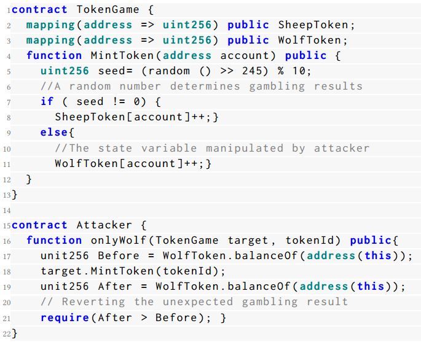
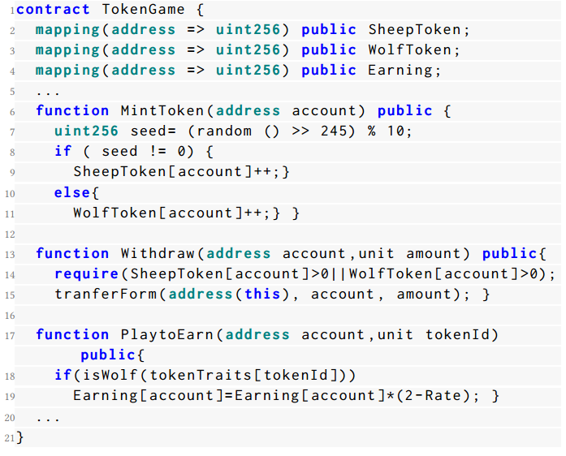
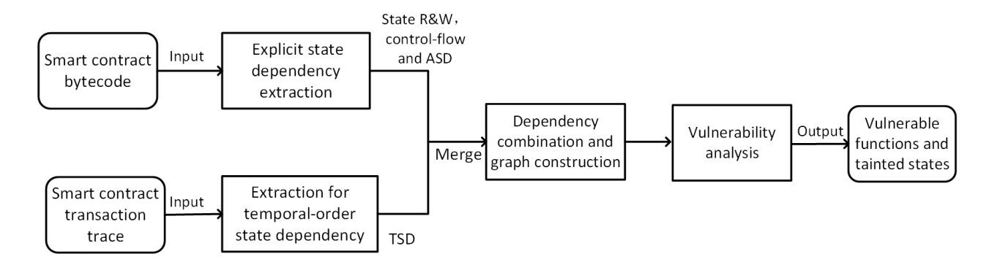

# SmartState：通过细粒度状态依赖分析检测智能合约中的状态回退漏洞

## 摘要

用 Solidity 编写的智能合约广泛应用于不同的区块链平台，如以太坊、波场（TRON）和 BNB 链。Solidity 智能合约中的一个独特设计是其用于错误处理和访问控制的**状态还原机制。**不幸的是，最近的一些安全事件表明，攻击者也利用了这种机制来操控智能合约的关键状态，从而导致诸如**非法获利**和**拒绝服务（DoS）**等安全后果。在本文中，我们将这种漏洞称为**状态还原漏洞（SRV）**。自动识别 SRV 面临独特的挑战，因为这需要深入分析和理解智能合约中的状态依赖关系。

本文提出了 SmartState，这是一个通过细粒度状态依赖分析来检测 Solidity 智能合约中状态还原漏洞（SRV）的新框架。SmartState 集成了一系列新颖的机制以确保其有效性。特别地，SmartState 从**合约字节码和历史交易中提取状态依赖关系**，这两者对于推断与 SRV 相关的依赖关系至关重要。此外，SmartState 将 SRV 的通用模式（即获利和拒绝服务攻击）建模为 SRV 指标，从而基于构建的状态依赖图有效地识别 SRV。为了评估 SmartState 的性能，我们手动注释了一个包含 91 个真实世界 SRV 的地面真实数据集。评估结果显示，SmartState 达到了 87.23% 的准确率和 89.13% 的召回率。此外，SmartState 成功从 47,351 个真实世界智能合约中识别出了 406 个新的 SRV。其中 11 个 SRV 来自交易金额较高（即排名前 2000）的流行智能合约。总的来说，我们报告的 SRV 影响了总价值为 428,600 美元的数字资产。

关键词：漏洞检测，智能合约，静态分析，状态依赖

> 摘要阅读总结：
>
> 本文主要是针对`非法获利`和`拒绝服务攻击`而设计的静态代码分析软件，分析手段是合约源字节码以及历史交易记录状态。

## 引言

智能合约是一种在区块链系统上运行的特定类型的程序。Solidity 是编写智能合约最受欢迎的编程语言之一，广泛应用于主要的区块链平台，如以太坊[4]、波场（TRON）[9]和 BNB 链[2]。智能合约现在支持区块链中的各种去中心化应用（DApps），例如去中心化金融（DeFi）、去中心化游戏（GameFi）和非同质化代币（NFT）。由于大多数区块链系统持有相当数量的数字资产，智能合约的安全性对智能合约所有者（例如 DApp 开发者）和用户都具有重要意义。例如，在著名的 DAO 攻击[31]中，攻击者利用了智能合约中的一个漏洞（即重入漏洞），导致了 6000 万美元的经济损失。

`状态还原及其安全隐患`。在 Solidity 中，状态还原是一种支持错误处理和访问控制的特定机制[7]。更具体地说，如果在交易过程中遇到未满足的条件，**状态还原机制允许智能合约中的状态变量回滚到它们的原始状态**。不幸的是，最近的一些安全事件[1, 6]表明，在实现状态还原时，智能合约可能包含易受攻击的代码模式，使得攻击者能够利用这种机制，**通过伪造交易错误操控某些关键状态**。这类攻击可能会对受害的智能合约造成严重后果，例如`非法获利`[23]和`拒绝服务（DoS）`[18]。在我们的研究中，我们将智能合约中的此类漏洞称为`状态还原漏洞（SRV）`。

鉴于 SRV 的严重影响，针对 SRV 的研究相对有限。具体来说，EOSafe[23] 和 WASAI[13] 分别通过`符号分析`和`模糊测试`来检测**由状态还原引起的回滚漏洞**。此外，eTainter[19] 和 Madmax[20] 基于异常的 Gas 消耗检测由状态还原引起的拒绝服务（DoS）漏洞。然而，这些方法**只能覆盖 SRV 的一种子类型**（即非法获利或DoS，详见第2.2节的讨论）。此外，EOSafe[23] 和 WASAI[13] 均为 WASM 语言中的智能合约设计。由于它们的检测启发式**依赖于语言特定的特性**（即 WASM 中的内联机制），这些方法并不适用于 Solidity 智能合约。

`我们的工作`。在本文中，为了填补上述研究空白，我们提出了 SmartState，这是一个用于检测 Solidity 智能合约中状态还原漏洞的新框架。据我们所知，SmartState 是**第一个在字节码级别以通用方式支持 SRV 检测的工具。**

`本研究的关键挑战`。在于**构建一个细粒度的状态依赖图**，这是确定哪些状态可能会受到攻击者从攻击面（例如，来自其他合约的函数调用）影响或操控的必需步骤。然而，现有的先进方法只能推断有限的状态依赖信息，这不足以检测 SRV。例如，Sailfish[11] 仅涵盖了某些显式依赖关系（即状态读取和写入（R&W）依赖性和控制流依赖性），用于检测智能合约中的状态不一致漏洞。

为了有效检测 SRV，SmartState 识别了先前研究中遗漏的两种状态依赖关系，即`与断言相关的状态依赖（ASD）`和`时间顺序状态依赖（TSD）`。其中，**ASD 指的是与诸如 assert、revert 和 require 等用于访问控制的语句相关的显式依赖关系**，而**TSD则指的是由交易（即函数调用）影响的依赖关系**，这是智能合约所独有的。为此，SmartState 通过分析智能合约字节码及其对应的历史交易来推断这些重要的依赖关系（详见第4.1节和第4.2节）。通过这种方式，SmartState 结合提取的依赖关系并构建了一个细粒度的状态依赖图，以检测 SRV。此外，SmartState 将 SRV 的通用模式（即非法获利和拒绝服务攻击）建模为 SRV 指标。例如，SmartState 检测 SDG 中的关键状态是否缺乏适当的访问控制检查。因此，它能够基于构建的状态依赖图有效地识别 SRV。

为了评估 SmartState 的性能，我们构建了一个手动标注的数据集，该数据集由从公共报告和对最流行的智能合约的手动调查中收集的 91 个 SRV 组成。评估结果显示，SmartState 达到了 87.23% 的准确率和 89.13% 的召回率，这表明它在检测 SRV 方面具有很高的有效性。此外，通过在 2000 个真实世界中流行的智能合约上运行 SmartState，我们的研究成功识别出了 11 个以前研究未能识别的新 SRV。这些 SRV 影响的资产总价值达到了 428,600 美元。

总而言之，本文做出了以下贡献：

* 我们提出了 SmartState，一个基于静态分析的新框架，用于检测状态还原漏洞。据我们所知，SmartState 是首个以通用方式检测 SRV 的工具。

* 我们提出了一套新的机制（即与断言相关的依赖关系和交易顺序依赖关系）来构建智能合约中的细粒度状态依赖图。

* 我们进行了广泛的评估，以展示 SmartState 的有效性。此外，通过对 47,351 个野外智能合约进行大规模研究，SmartState 在真实世界中识别出了 406 个新的 SRV。

* 我们发布了 SmartState 的工件以及手动标注的 SRV 数据集[1]。

> 本文的主要贡献就是编写了 SmartState，并且提出一套启发式规则。
>
> 将软件运行在真实数据集中识别到了新的漏洞，自己构建了一个数据集跟其他工具做了一个对比。

## 背景与动机

在本节中，我们首先介绍一些关于智能合约和合约状态的基本背景知识。然后，我们提出问题陈述并说明我们研究的动机。

### 智能合约与合约状态

智能合约是一种在区块链上运行的特定类型的程序。目前，大多数智能合约是用 Solidity 编写的[7]。通过 Solidity 源代码，智能合约被编译成字节码，并在不同区块链平台（如以太坊[4]、波场（TRON）[9]和BNB链[2]）的虚拟机（VM）上执行。类似于其他编程语言，如 Python 和 Java，智能合约由一组函数和变量组成。函数可以通过智能合约和用户账户的调用来触发。这种函数调用也被称为交易。

合约状态是通过智能合约中的全局变量（即状态变量）存储和访问的持久数据。一次交易（函数调用）实际上会改变相关智能合约的状态，而这一过程会被永久记录在区块链上[7]。由于区块链上存储空间的有限性，**智能合约使用状态变量来存储关键数据**，例如所有者的地址、用户的代币余额等。因此，**如果攻击者能够操控这些关键状态，可能会对合约所有者造成严重的负面影响（例如，财务损失）**。例如，在著名的 Fomo3D 攻击中，攻击者利用了一个`拒绝服务（DoS）漏洞`，**阻止了其他合约用户的购买操作（即回滚了代表购买的状态变量的修改）**，从而导致了 4300 万美元的经济损失[1]。

`状态还原机制。`状态还原是一种用于智能合约中错误处理和访问控制的独特机制。如果在交易过程中遇到未满足的条件，所有与此交易相关的合约状态都可以回滚到交易前的值。这种状态还原机制对于智能合约场景至关重要，因为它确保了智能合约中交易的原子性。在智能合约中，状态还原可以通过调用断言语句（即 `require`、`assert` 和`revert`）来实现。例如，带有 `"require(tx.origin = msg.sender)"` 的智能合约表示该函数只能由外部拥有账户（EOA）调用[5]，如果函数的调用者不是 EOA（例如，合约账户），则该交易中进行的所有其他状态更改都将被回滚。

> 吐槽一下这个部分，说实话我感觉这个地方第一眼看上去我还以为是引言复制粘贴了一次😂😂😂
>
> 解释原文：
>
> In smart contracts, state-reverting can be implemented by invoking the as sertion statement (i.e., require, assert, and revert). For example, a smart contract with *"require(tx.origin == msg.sender)"* indicates that the function can only be invoked by an external owned account (EOA) [5], if the caller of the function is not an EOA (e.g., contract account), all other state changes made in this transaction will be rolled back.
>
> 因为合约是可以相互之间调用交互的，所以检查当前调用函数的用户（msg.sender）是否是发起交易的用户（tx.origin），而 tx.origin  只能是 EOA 用户（因为合约用户没有私钥，无法签名发起交易）

### 问题陈述

在本文中，我们的研究重点是与状态还原机制相关的漏洞。我们将这种类型的漏洞称为状态还原漏洞（SRV）。

`状态还原漏洞（SRV）` 最近的研究和报告[23]表明，状态还原机制经常被攻击者利用，导致严重的攻击和安全事件。更具体地说，在这些攻击中，攻击者使用状态还原机制，使交易回滚，如果交易结果不如预期（例如，不利于攻击者）。状态还原攻击在 GameFi 市场中更为普遍，影响游戏公平性，并给合约所有者[13]或 GameFi 用户带来巨大的财务损失。

`动机示例` 图1展示了一个具有状态还原漏洞的智能合约示例，该漏洞影响了游戏的公平性，同时展示了攻击者如何通过操纵合约状态获得非法利润。在这个示例中，状态变量 SheepToken 和 WolfToken 是两种不同价值的代币（即，WolfToken 比 SheepToken 更贵）。一个随机数（种子）决定了赌博结果，有 90% 的机会获得 SheepToken，10% 的机会获得 WolfToken（第7-11行）。不幸的是，由于缺乏适当的访问控制，攻击者可以在赌博游戏前后随意检查这些代币的余额（第17-19行）。为了在游戏中最大化收益，攻击者使用 require 语句（第21行）在他获得低价值的 SheepToken 时回滚整个交易（即只获得 WolfToken）。通过这种方式，攻击者确保自己总是获得 WolfToken，从而破坏了游戏的公平性并获得了更多利润。

图1：状态回退漏洞的示例及攻击者如何利用其获取利益

图 2 总结了过去三年中由于状态还原攻击所导致的累积财务损失。此类统计数据和相应事件的来源列在【8】中。如图所示，由 SRV 引起的经济损失正在迅速增加，截至 2022 年 4 月已达到 3869 万美元。

图2：近年来由于状态恢复漏洞造成的经济损失汇总。收集事件的来源总结见[8]

`先前研究及其局限性` 尽管有报告指出了由 SRV 引发的攻击事件【1】，但提前识别 SRV 并进一步消除此类损失的研究仍然有限。据我们所知，与本研究最相关的工作可能是 EOSafe【23】和 WASAI【13】，它们主要通过符号执行和模糊测试分别检测回滚攻击。然而，由于这两个框架未考虑智能合约中的重要状态依赖关系，它们只能检测与状态还原相关攻击的一种子类型（即导致非法获利的回滚）。同样地，eTainter【19】和 Madmax【20】提出了一个框架来检测同样由状态还原引发的拒绝服务（DoS）漏洞。此外，EOSafe【23】和 WASAI【13】均是专门为 WASM 语言中的智能合约设计的【10】。由于 Solidity 合约和 WASM 合约之间的根本差异，这些框架无法用于检测 Solidity 中的 SRV。例如，为了检测回滚漏洞，EOSafe【23】依赖于定位 WASM 智能合约中用于调用内联操作的特定语句 send_inline。然而，在 Solidity 中没有这样的内联操作，也没有 send_inline 关键字。

> 这个地方举的一个例子跟我之前看的浙大发的那个随机数漏洞的例子很像，其实我当时就觉得这个东西不能单纯的归结为随机数种子设置不正确的原因，因为实际上哪怕你把随机数设置的再好，回溯机制还是能够使得对方在不利情况下直接回滚交易。
>
> 这里提到的两个工具主要用于检测 WASM 这个跟主流的 Solidity 不太符合，但是我觉得这里也有偷懒的嫌疑，我觉得应该对比浙大的那个工具的，毕竟这个问题浙大也是有提出来的。

### 我们工作的范围

SmartState 被设计为一个通用框架，用于检测 Solidity 智能合约中的状态还原漏洞（SRV）。SmartState 的假设与其他智能合约漏洞检测框架类似，如 SmartDagger【29】和 Slither【18】。更具体地说，SmartState 静态分析智能合约字节码，并准确报告给定智能合约是否包含状态还原漏洞。由于SmartState 在字节码级别而非源代码级别进行分析，因此它适用于许多安全审查场景，如大规模的第三方审计、自我安全检查等。与其他只关注特定区块链平台的研究相比【13, 19, 23】（例如，针对以太坊的 eTainter 和针对 EOSIO 的 EOSafe【3】），SmartState 可以为基于 Solidity 智能合约的更多区块链生态系统提供更大帮助（例如，以太坊【4】、波场【9】和BNB链【2】）。

> 字节码反汇编得到 Solidity 高级语言，再切割为 IR 进行分析，其实我会相对来说比较诟病这种方案，因为这种情况下说精确度不高，召回率不行就是因为反汇编工具垃圾。

## 3 SmartState 的设计

在本节中，我们将介绍 SmartState 的高级设计。我们首先强调检测 SRV 的关键挑战。然后，我们详细说明 SmartState 如何克服这些挑战。

如前所述，SRV 的根本原因在于某些状态变量可以通过状态还原机制被外部调用影响或操控。因此，识别 SRV 的一个直接思路有两个关键步骤：

1. 识别不同状态变量和函数调用之间的状态依赖关系；
2. 根据这些依赖关系的影响识别 SRV。

(1) `识别状态依赖关系`。类似于之前用于识别状态不一致漏洞的研究【11】，我们可以构建一个状态依赖图，表示不同智能合约和函数调用之间的依赖关系。以图 3 中的示例为例，状态变量 SheepToken 和 WolfToken 可以通过函数 MintToken 写入（第9行、第11行），并进一步被函数 Withdraw 的 assert 语句访问（第14行）。在这种情况下，我们可以说函数 MintToken 和 Withdraw 之间存在针对状态变量 SheepToken 和 WolfToken 的状态依赖关系。

(2) `识别SRV`。对于一个特定的安全敏感状态变量，我们可以检查是否存在沿着状态依赖图的有效路径（调用链），允许外部调用任意操控它。再次以图 3 为例，对于在 Withdraw 中修改的状态变量 balance（第15行），由于 MintToken 和 Withdraw 之间的依赖关系，攻击者实际上可以影响它。因此，我们识别出合约 TokenGame 存在状态还原漏洞。

图3：具有两种状态依赖的易受攻击智能合约示例

> 解释：
>
> 首先是`SheepToken` 和 `WolfToken` 是在函数 `MintToken`（第9行和第11行）中写入的（意味着它们的值在此函数中被修改）。在 `Withdraw` 函数（第14行）中的 `require` 断言语句中，这两个状态变量会被访问并检查它们的值是否满足条件。也就是说，这两个状态变量在 `MintToken` 函数和 `Withdraw` 函数之间有依赖关系。
>
> 其次是第15行的 `Withdraw` 函数中修改了一个状态变量 `balance`，这个状态变量实际上可能会受到攻击者的影响。这种影响是由于 `MintToken` 和 `Withdraw` 函数之间的依赖关系导致的。
>
> 由于这种依赖关系，攻击者可以利用外部调用操作这些状态变量，从而导致合约 `TokenGame` 出现状态还原漏洞。

### 挑战与解决方案

随着智能合约复杂性的增加，建立一个有效且完整的状态依赖图（SDG）用于 SRV 检测绝非易事。先前的研究【11】出于其他目的进行了状态依赖分析（例如，Sailfish 用于检测状态不一致漏洞），这些研究仅涵盖了某些显式依赖关系，如状态读取和写入（R&W）关系及相关的控制流，这对于 SRV 检测来说是不够的。我们的工作补充并扩展了先前的研究，通过考虑两种新的依赖类型，即与断言相关的状态依赖（ASD）和时间顺序状态依赖（TSD），使我们能够检测与状态依赖相关的新漏洞（即SRV）。

`C1：提取与断言相关的状态依赖（ASD）` ASD 指的是与访问控制语句相关的依赖关系。Solidity 使用保留关键字，如 assert、revert、require，来实现访问控制，并且某些状态可能会被这些语句显式地（如作为函数参数）或隐式地（如交易回滚）影响。如果状态 S 可以由函数 $𝑓_𝐴$ 写入，并在另一个函数 $𝑓_𝐵$ 的 assert 语句中被进一步访问，那么我们称在状态 S 上，函数 $𝑓_𝐴$ 和 $𝑓_𝐵$ 之间存在 ASD。换句话说，函数 $𝑓_𝐵$ 只有在状态 S 满足所需条件时才能执行，否则，函数 $𝑓_𝐵$ 将失败，并且整个交易将被回滚。先前的研究【30】表明，82.28% 的智能合约使用与断言相关的语句进行访问控制。与其他显式依赖关系（如状态读取和写入）不同，提取 ASD 需要分析与 Solidity 中 assert 语句相关的特定控制流和数据流。例如，在图 3 中，对于状态变量 SheepToken 和 WolfToken，MintToken 和 Withdraw 之间的状态依赖关系是一种与断言相关的状态依赖，因为 Withdraw 函数依赖于 SheepToken 和 WolfToken 这两个状态变量（由于 assert 语句的影响，即控制流），而这些状态变量依赖于函数 MintToken 对它们的写入（即数据流）。

为了解决这一挑战，SmartState 对智能合约字节码进行细粒度的控制流和数据流分析，以恢复程序逻辑。通过这种方式，基于 Solidity 中特定 assert 语句的语义，SmartState 建立了不同函数之间针对不同合约状态的依赖关系。

`C2：提取时间顺序状态依赖（TSD）` 如前所述，智能合约在区块链上作为交易执行。TSD指的是由于智能合约中多个交易的顺序导致的状态依赖关系。更具体地说，由于合约用户通过特定的交易顺序调用合约，某一时刻合约函数产生的状态可能会受到这些交易时间顺序的影响。例如，如图 3 所示，根据该智能合约的交易顺序，我们知道合约用户需要在进行游戏之前铸造代币（即调用 MintToken），然后再进行游戏（即调用 PlaytoEarn）。因此，我们说 MintToken 和 PlaytoEarn 之间存在时间顺序依赖关系。先前的研究【27, 35, 36】强调了 TSD 的重要性，因为操纵特定合约的交易顺序可能会导致严重的漏洞或财务损失。不幸的是，这种跨函数的时间顺序语义在智能合约字节码中难以恢复，因为交易顺序由特定智能合约的应用场景决定，这与其功能相关（例如，用于赌博的智能合约）。

为了解决这一挑战，SmartState 利用了这样一个事实：TSD信息在智能合约的交易历史中得到了很好的保留，因为合约用户通常会按照特定的交易顺序调用合约函数。为此，SmartState 使用有限状态机从历史交易记录中学习智能合约函数的时间顺序，并进一步提取 TSD。

`C3：SRV 识别` 最后一个挑战在于如何基于构建的状态依赖图（SDG）准确识别 SRV。如前所述，以往的方法【19, 20】主要基于临时启发式方法（如异常的 Gas 消耗【20】）来检测与 SRV 相关的漏洞。这些方法并不通用，只能覆盖 SRV 漏洞的一种子类型（例如，由 SRV 引发的 DoS 攻击【19】）。

不同于先前的研究，SmartState 强调 SRV 的根本原因，并将其用作 SRV 指标，以支持通用的漏洞检测。更具体地说，SmartState 将以下两个关键元素作为 SRV 指标：(1) 是否存在安全敏感状态是非确定性的，或者它与其他非确定性状态共享依赖关系。例如，如前面图 1 所述，在存在漏洞的函数 MintToken 中，代币的数量（例如，WolfToken）可能受到用于存储代币值的状态变量的影响，该状态变量可能会受到生成随机数的语句的影响。(2) 该敏感状态是否缺乏适当的访问控制。基于特定状态的状态依赖图，SmartState 检测是否缺少必要的访问控制，例如检查交易的来源地址或检查特定代币的余额。最后，如果可以调用外部合约并到达具有上述 SRV 指标的状态，我们将认为被分析的合约存在漏洞。

> 状态读取和写入（R&W）关系及相关的控制流，这个就是前文中展示的状态还原漏洞。
>
> 说实话我觉得 C1 就是在放屁，你他妈在字节码层面检查，还能查出来 assert、revert、require？这个地方说实话我存疑啊，反编译器有这么牛吗？assert、revert 说实话就是一个条件判断罢了，转成字节码之后就是 jumpi + invalid 或者 jumpi + revert，真的能还原出来吗？
>
> C2 我大致理解他的意思了：就是说在一个合约中，铸币跟取币可能不在同一个函数中完成，可能是两个函数，但是这两个函数存在一个依赖关系，就是说必须先铸币才能取币，但是这种顺序关系只存在于设计层面，在代码层面无法找到直接关联。然后可以借助交易的历史记录来检查函数间的必然联系。这里其实也会有一定的问题：这种方案需要依赖大量的交易，当个时候这个合约的钱都被搬空了。
>
> C3 机制简直是在放屁：不确定的状态和缺乏适当的访问控制，随机数漏洞（你干脆直接报我身份证得了）

### SmartState 的工作流程 

SmartState 以智能合约字节码及其对应的交易记录（即历史数据）作为输入，最终将漏洞报告为一组漏洞痕迹。一个漏洞痕迹包含从存在漏洞的函数到可能受到外部调用影响的受污染状态变量的函数调用。图 4 展示了 SmartState 的工作流程，包含以下步骤：

图4：SmartState的工作流程

`S1. 预处理和 ASD 提取` 类似于之前的研究【29】，SmartState 首先恢复整个智能合约的控制流和数据流，作为预处理步骤。然后，它从智能合约的程序逻辑中识别出与断言相关的状态依赖（ASD）。

`S2. 时间顺序状态依赖提取` 在第二步中，SmartState 分析历史交易记录，并提取时间顺序状态依赖（TSD）。

`S3. 依赖关系组合和图构建` 接下来，SmartState 合并四种类型的依赖关系，即状态读写（R&W）依赖、控制流、ASD 和 TSD，以生成用于 SRV 检测的状态依赖图（SDG）。

`S4. 漏洞检测` 最后，基于构建的 SDG，SmartState 识别出所有 SRV 指标，并根据漏洞特定规则找出漏洞痕迹。

## 方法细节

现在我们详细说明 SmartState 中每个步骤的具体细节。

### 预处理和 ASD 提取

`预处理` SmartState 利用了 SmartDagger【29】这一先进的静态分析工具，从给定智能合约的字节码中恢复控制流和数据流。由于 SmartDagger 是为检测跨合约漏洞设计的，与其他类似工具（如Mythril【15】、Slither【18】）相比，它可以为跨函数（合约）调用构建更完整的控制流和数据流。具体来说， SmartDagger 将智能合约的字节码反编译为中间表示（IR）。然后，基于 IR 和函数调用信息，输出构建的控制流和数据流图。

`ASD 提取` 在恢复程序逻辑后，SmartState 从提取的控制流和数据流中识别 ASD。在此，SmartState 首先采用类似于 Sailfish【11】的方法来提取状态变量的基本读写（R&W）依赖关系。此外，SmartState 通过以下启发式方法提取 ASD：
