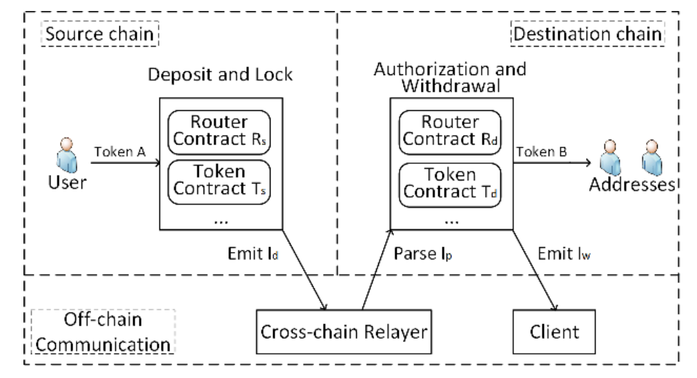
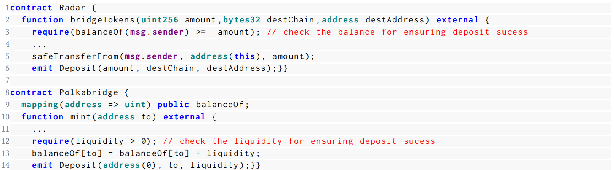
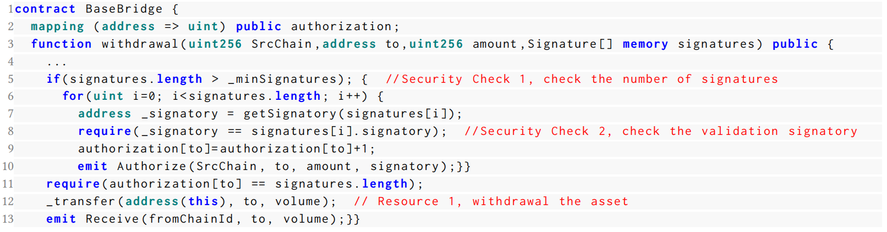
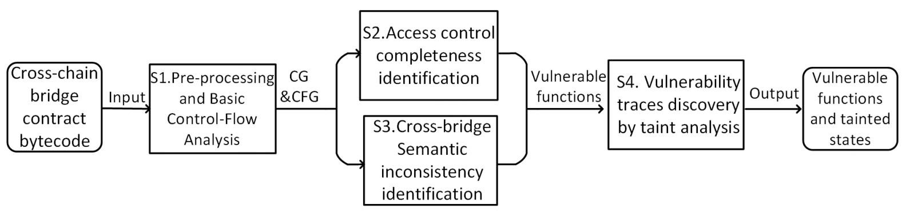

# SmartAxe：基于细粒度静态分析检测桥接智能合约中的跨链漏洞

随着区块链的日益普及，不同的区块链平台在生态系统中共存（如以太坊、BNB、EOSIO等），这促使了对跨链通信的高需求。跨链桥接是跨不同区块链平台进行资产交换的一种特定去中心化应用。由于最近发生了多起因桥接智能合约漏洞引发的安全事故，造成了严重的财务损失，确保跨链桥接智能合约的安全成为了当务之急。我们称这些漏洞为`跨链漏洞（CCVs）`。然而，自动识别智能合约中的 CCVs 面临着独特的挑战。特别是，要做到以下两点并非易事：（1）识别资产交换所需的特定应用程序访问控制约束；（2）识别跨链桥接两端的跨链语义不一致性。

在本文中，我们提出了 SmartAxe，一种用于识别桥接智能合约中漏洞的新框架。`特别地，SmartAxe 旨在识别具有访问控制不完备性的漏洞函数。` SmartAxe 通过概率模式推断对访问控制的不同实现进行建模，找到智能合约中必要的安全检查。此外，SmartAxe 构建了跨链控制流图（xCFG）和数据流图（xDFG），以帮助在跨链数据通信过程中找到语义不一致性。为了评估 SmartAxe，我们收集并标注了来自真实跨链桥接智能合约的 88 个 CCV 数据集。评估结果表明，SmartAxe 的精度为 84.95%，召回率为 89.77%。此外，SmartAxe 成功识别了 232 新的或未知的 CCVs，这些漏洞来自 129 个真实跨链桥接应用程序中的 1,703 个智能合约。这些被识别的 CCVs 影响的数字资产总价值达到了 1,885,250 美元。

**CCS 主题概念**：

• 软件及其工程学 → 软件创建与管理；

• 软件创建与管理 → 软件验证与确认；

**附加关键词和短语**：智能合约，静态分析，跨链桥接，漏洞发现

## 引言

区块链的兴起促使了广泛的区块链平台（例如，以太坊 [Ethereum 2015]、BNB [Binance 2022]）和加密资产（例如，比特币 [Bitcoin 2009]、非同质化代币 [Wikipedia 2023]）的发展。在如此高度多样化且分散的生态系统中，跨越不同区块链平台的数据通信需求（例如，以太币和比特币的交换）变得至关重要。

跨链桥接是一种特定类型的应用程序，作为跨不同区块链进行信息交换（例如，数字资产）的中介。例如，Polygon 网络桥接 [Polygon 2023] 是最流行的跨链桥接之一，持有超过 20 亿美元的资产，允许用户在不依赖不受信任第三方的情况下在 Polygon 和以太坊区块链之间转移代币。尽管获得了数十亿美元的市值 [Chainspot 2023]，跨链桥接仍面临新兴的安全问题。我们的调查显示，在过去两年里，跨链桥接经历了超过 29 起安全事件。大部分跨链桥接的安全事件是由智能合约中的漏洞引起的。例如，PolyNetwork [Network 2020] 就因访问控制漏洞而被利用，导致 6 亿美元的损失 [Wikipedia contributors 2022]。

在本文中，我们将特定于跨链桥接智能合约的漏洞称为 **跨链漏洞** （Cross-Chain Vulnerability, CCV）。CCV 是跨链场景中独有的漏洞（即资产交换）并由智能合约实现。例如，尽管 CCV 的根本原因可能是缺乏细粒度的访问控制，但在其他传统智能合约中，访问控制的执行并非必要。另一个例子是，CCV 可能由桥接两端的语义不一致引起（参见第 2.2 节了解更多细节）。

鉴于 CCV 的严重影响，目前针对 CCV 的研究非常有限，更不用说针对保护跨链桥接的系统化检测框架了。更具体地，已有研究 [Duan et al. 2023; Lee et al. 2023] 旨在理解跨链攻击的关键模式。基于他们的观察和发现，提出了一系列对跨链开发者的缓解建议。然而，不幸的是，这些建议无法直接应用，也无法通过现有的跨链桥接进行强制实施。目前最相关的工作是 Xscope [Zhang et al. 2022]，它可以通过异常检测识别 CCV。然而，Xscope 需要分析链上交易的统计数据。在此条件下，它只能检测已经被攻击者利用的 CCV。

**我们的工作**

在本文中，我们提出了 SmartAxe，这是一种新的静态分析框架，用于检测跨链桥接智能合约中的 CCVs。根据我们所知，SmartAxe 是首个通过字节码级别的程序分析来检测 CCVs 的工具。通过这一功能，SmartAxe 可以在跨链桥接应用部署之前进行自动化的安全审核，从而提高其安全性，并减少可能导致严重损害（如财务损失）的潜在风险。

CCVs 的根本原因有两个方面：1）访问控制不完整性；2）跨链语义不一致性。识别桥接合约中的 CCVs 在静态分析方面面临以下两个独特的挑战：

* 首先，识别访问控制不完整性依赖于对访问控制约束的精确提取。访问控制约束包括对特定资源（例如，智能合约中的关键状态变量）进行适当的安全检查。不幸的是，这些安全检查在桥接合约中是异构实现的。此外，将相关资源与这些安全检查关联起来也带来了很大的复杂性。
* 其次，识别跨链语义不一致性很大程度上依赖于对跨链通信相关的细粒度上下文信息进行分析。例如，检查跨多个区块链的控制流和数据流依赖性。大多数现有框架 [Liao et al. 2023; Liu et al. 2021; Tsankov et al. 2018] 在检测智能合约漏洞时忽视了这些信息。

为了实现这一目标，SmartAxe 在其静态分析过程中集成了两个关键设计来检测 CCV。首先，SmartAxe 建模了桥接合约中访问控制的异构实现形式，将其转化为规范形式，以识别跨链桥接中所需的安全检查。同时，SmartAxe 通过概率模式推断，精准定位需要安全检查的跨链相关资源（参见 4.2 节）。通过这种方式，SmartAxe 能够有效发现具有访问控制不完整性的漏洞函数。其次，为了建模上下文信息，SmartAxe 对桥接两端的控制流和数据流进行对齐，并进一步构建了跨链控制流图（xCFG）和数据流图（xDFG）（参见 4.3 节）。通过这些构建的图，SmartAxe 定位了跨链数据通信中包含语义不一致的漏洞函数。最后，SmartAxe 分析了漏洞函数的可访问性（即入口点）和颠覆性（即受影响的状态变量），并报告了漏洞跟踪（参见 4.4 节）。

为了评估 SmartAxe 的有效性，我们首先构建了一个基于 22 个公共报告的手动标注数据集（记作 $D_manual$ ），这些报告讨论了 CCV。该数据集由 16 个跨链桥接应用组成，包含来自 203 个智能合约的 88 个 CCV。我们的实验表明，SmartAxe 在该数据集上的 CCV 检测精度为 84.95%，召回率为 89.77%。实验结果表明，SmartAxe 能够有效地检测到大部分导致实际世界损害的 CCV。

**在现实环境中检测 CCV**。借助 SmartAxe，我们对 1,703 个智能合约（来自 129 个真实跨链桥接应用）进行了大规模的安全审查。据我们所知，这是目前为止最全面的现实环境中的跨链桥接智能合约集合。最终，SmartAxe 报告了 232 个此前研究未发现的 CCV。这些 CCV 影响的数字资产总额达到 1,885,250 美元。

总结而言，本文的贡献如下：

* 我们指出了跨链漏洞的根本原因（参见第 2.2 节），包括访问控制不完整性和跨链语义不一致性。
* 我们提出了 SmartAxe，这是第一个用于检测跨链桥接智能合约中 CCVs 的静态分析框架。
* 我们进行了广泛的评估以展示 SmartAxe 的有效性。此外，通过对 1,703 个现实环境中的跨链桥接智能合约进行大规模研究，SmartAxe 在现实环境中识别出了 232 个新的 CCVs。
* 我们构建了首个跨链桥接漏洞的手动标注数据集，同时也是目前最全面的跨链桥接应用/智能合约数据集。为了推动未来研究的发展，我们公开了 SmartAxe 的工件及相应的数据集¹。

## 背景与动机

### 智能合约与跨链桥接

智能合约是一种在区块链上运行的特定类型的程序。这些程序支持各种功能以实现新的商业模式 [Zheng et al. 2020]，例如去中心化金融（DeFi）、去中心化游戏（GameFi）以及跨链桥接。

跨链桥接作为不同区块链平台上资产交换的中介。图 1 展示了跨链桥接的关键架构。典型的跨链桥接可以分为三个部分：源链、跨链中继器和目标链。跨链桥接在源链和目标链上部署智能合约。中继器则设计用于支持源链和目标链之间的信息交换。通过跨链桥接，用户可以在源链上存入资产并在目标链上提取资产。例如，图 1 中显示了用代币 A 交换代币 B 的场景。具体来说，该过程包括以下三个步骤：

1.	在源链上存入资产。当接收到用户的资产交换请求时，源链的路由合约 $R_s$ 调用代币合约 $T_s$ 锁定代币A。然后， $R_s$ 触发一个存入事件 $I_d$ ，作为锁定资产的确认，该事件包含了详细的存入信息（例如，类型和数量）。在此之后，用户的资产将被转移到路由合约 $R_s$ 。
2.	通过链下中继器进行跨链通信。一旦存入事件 $I_d$ 被触发，链下中继器验证该存入事件是否在源链上有效。如果验证通过，中继器将信息 $I_p$ 传输给目标链的路由合约 $R_d$。
3.	在目标链上提取资产。一旦 $I_p$ 被传递到目标链，路由合约 $R_d$ 验证来自 $I_p$ 的各种证明以进行授权。验证通过后， $R_d$ 触发提取事件 $I_w$ ，并调用代币合约 $T_d$ 从目标链上的用户指定地址中提取代币B。

图1. 跨链桥的工作流程

### 定义与问题陈述

`跨链漏洞（Cross-Chain Vulnerability, CCV）`。跨链漏洞是一种特定类型的跨链桥接智能合约中的漏洞。在大多数情况下，当在两个区块链之间交换资产时，跨链桥接合约可能会引入不完整的访问控制或跨链语义不一致性。在接下来的部分中，我们使用两个实际的例子（图 2）来说明 CCV。这些例子是从两个被攻击者利用的真实世界桥接合约中收集的（即，ChainSwap [Sam Cooling 2021] 和 ThORChain [Sebastian Sinclair 2021]）。为了更好地说明问题，我们重新组织了原始的合约代码。

图 2. 两个跨链漏洞（CCV）的典型示例

* `访问控制不完整性`。跨链桥接合约可能会省略关键的安全检查，或包含不正确的访问控制实现。如图 2(a) 所示，合约 `ContextUpgradeSafe` 中的变量 `Quota` 代表签名验证（第 2 行），该验证应在资产授权与提取之前进行。然而，函数 `Receive` 设计用于资产授权与提取，但它仅检查签名而不验证签名者（即，检查 `Quota`，见第 6 和第 7 行的红色虚线框）。因此，该合约引入了一个可利用的 CCV。如路径 $P_c$ 所示，要攻击该跨链桥接，攻击者可以伪造虚假中继器（即签名者）进行签名（ $P_c-1$ ），并由于缺乏签名验证而绕过授权检查（ $P_c-3$ ），最终提取资产（ $P_c-4$ ）。在实际应用中，可以在第 6 到第 7 行之间添加语句（例如 `require (Quota[signatory] > 0)`）来避免此漏洞。
* `跨链语义不一致性`。理想情况下，源链和目标链的程序语义应保持一致，例如交换资产的类型和数量。图 2(b) 显示了由于错误的代币类型解析引起的语义不一致的一个示例。对于合约 `Chain_Router`，函数 `Deposit` 在源链上发出一条记录（第 4 行），表示代币类型为“ERC-20”。然而，函数 `Withdrawal` 中预期的默认代币类型为“ETH”（第 6 行）。虽然可以通过 `getTokenMeta(token)` 更新实际代币类型，但目标链上的智能合约并未仔细处理和检查异常情况。特别是，攻击者可以故意传递错误的代币地址（即 0x0000x）以使代币类型被错误地解析为默认值（“ETH”），而不考虑源链上实际代币类型。由于 ETH 的价值高于 ERC-20，攻击者可以从此类价值差异的资产交换中获益。

`现有工作及其局限性`。尽管 CCVs 已被广泛利用，但目前关于在攻击发生前识别此类漏洞并进一步消除相应损失的工作仍然有限。据我们所知，最相关的跨链攻击识别工作是 Xscope [Zhang et al. 2022]。然而，Xscope 是一个用于分析跨链交易的异常检测工具，并且不支持在智能合约层面检测 CCV。

此外，由于智能合约在部署后难以支持补丁更新，这样的框架无法避免攻击的发生，也无法进一步消除经济损失。此外，Duan 等人 [Duan et al. 2023] 和 Lee 等人 [Lee et al. 2023] 对跨链攻击进行了调研，并提出了跨链系统设计方面的建议，因此这两项研究都无法从根本上检测 CCV。

### 我们工作的范围

SmartAxe 被设计为一种通用框架，用于检测跨链桥接中由漏洞智能合约引起的 CCVs。SmartAxe 关注于桥接的上层应用（例如，桥接 Dapp），而非桥接的底层协议（例如，跨区块链通信协议 (IBC)）。作为一个程序分析框架，SmartAxe 能够涵盖 29 起跨链安全攻击中的 20 起 CCV 攻击，但不包括其他 9 种与智能合约代码无关的跨链漏洞利用，例如私钥泄露 [Rubic 2022]、DNS 劫持 [CelerNetwork 2022] 以及可信根泄露 [Behnke 2022]。在一组跨链桥接应用程序的智能合约上，SmartAxe 对字节码进行静态分析，并进一步报告该智能合约是否包含 CCV。由于 SmartAxe 针对字节码而非源代码进行分析，因此其适用于大规模第三方审计等多种安全审查场景。

## SmartAxe 设计

### 挑战与解决方案

随着跨链智能合约复杂性的增加，识别 CCVs 绝非易事。尽管此前的研究对智能合约中的访问控制漏洞进行了分析（例如，Ethairter [Brent et al. 2020]、SPCon [Liu et al. 2022]、AChecker [Ghaleb et al. 2023]），但这些研究从未考虑跨链场景下的安全假设，因此难以检测到 CCV。以下是 SmartAxe 遇到的挑战以及相应的解决方案。

`C1：提取访问控制约束`。典型的访问控制约束通常由智能合约中特定资源的安全检查组成。具体而言，安全检查可以是条件语句或比较语句（例如 `require`、`assert` 和 `if`），资源可以是对重要操作语句（例如，状态变量的读写、方法调用）的依赖。从这一角度看，提取访问控制约束的挑战可以分为两个方面。

图 3. 存款成功的安全检查多样性示例（即，第 3 行和第 12 行），该多样性是由不同实现方式和非标准检查引起的，并且无法通过 Ethainter [Brent et al. 2020]、SPCon [Liu et al. 2022] 和 AChecker [Ghaleb et al. 2023] 来解决。

第一个方面是安全检查的多样性，这种多样性由不同实现方式和非标准检查引起。例如，图 3 展示了不同跨链桥接中安全检查的多样实现方式。如图所示，为检查存款是否成功，合约 `Radar` 比较用户余额和存款金额（第 3 行），而合约 `Polkabridge` 将桥接的流动性与阈值进行比较（第 12 行）。然而，先前的研究（例如，Ethairter [Brent et al. 2020]、SPCon [Liu et al. 2022]、AChecker [Ghaleb et al. 2023]）无法解决这种多样性，因为它们的检测模式在没有考虑桥接语义的情况下是不完整的。

图 4. 一个展示将资源与安全检查关联时复杂性的示例

第二个方面是将资源与安全检查链接起来的内在复杂性。我们以图 4 为例。对于第 12 行的资源，以往的研究 [Brent et al. 2020; Ghaleb et al. 2023; Liu et al. 2022] 将该资源与依赖第 5 行的安全检查相关联，而忽略了第 8 行的检查，这导致了错误的结果。实际上，通过对这些语义的分析，我们发现第 14 行的资源转移了授权签名的控制权，第 5 行的检查对应授权签名，第 7 行的检查则对应授权检查，因此第 5 和第 7 行的所有检查都应该与第 12 行的资源相关联。或者，通过分析第 8、9 和 11 行的依赖关系，我们也可以确定第 7 行的检查应该与第 12 行的资源相关联。然而，自动识别这些检查绝非易事，因为这需要对复杂的模式和数据依赖关系进行深入分析。

为了解决这一挑战，为识别安全检查，我们审查了前 100 个跨链桥接的文档和程序代码，并将跨链桥接的访问控制建模为规范形式（详见表 1 和第 4.2 节）。为了将资源与安全检查关联起来，SmartAxe 使用了概率模式推断方法（详见表 2 和第 4.2 节）。具体而言，SmartAxe 利用了一组预定义模式，这些模式考虑了资源与安全检查之间在控制流、数据流和语义上的依赖关系，从而确定它们之间的关联关系。

此外，基于提取的访问控制约束，SmartAxe 识别桥接合约的访问控制不完整性。

`C2: 识别跨链语义不一致性`。与单个区块链上的漏洞分析不同，跨链语义不一致性 CCV 的识别在很大程度上依赖于对跨链数据传输过程中上下文信息的建模（例如，发出 $I_d$ ，中继器告知 $I_p$ ）。识别上下文信息绝非易事，因为这需要跨链桥接两端的控制流和数据流的精确对齐，而这在现有的研究中尚未被充分支持。此外，很难识别控制流和数据流对齐的位置，因为定位对齐点需要进行细粒度的语义和控制流分析。

为了解决第二个挑战，SmartAxe 通过细粒度的语义和控制流分析，识别了两种类型的函数作为对齐点，即：（1）实现存入和锁定的函数；（2）实现授权和提取的函数。随后，SmartAxe 对相应的对齐点进行对齐，并构建了跨链控制流图（xCFG）。为了便于检测 CCV 的跨链语义一致性，SmartAxe 对 xCFG 进行数据流分析，从而构建跨链数据流图（xDFG）。

此外，基于构建的 xCFG 和 xDFG，SmartAxe 识别了桥接合约中跨链语义不一致的 CCV。

### SmartAxe 的工作流程

SmartAxe 以跨链桥接合约的字节码作为输入，最终报告其是否包含 CCV 及相应的漏洞追踪。漏洞追踪包含从漏洞函数到受污染的状态变量的函数调用，这些状态变量可能受到外部调用的影响。图 5 展示了 SmartAxe 的工作流程。

图 5. SmartAxe 的工作流程

S1. `基本控制流分析`。作为静态分析的典型过程，SmartAxe 分别恢复跨链桥接两端智能合约的控制流，作为预处理步骤，通过现有的分析器（例如，我们研究中的 SmartDagger [Liao et al. 2022]）来实现。

S2. `访问控制完整性识别`。在第二步中，SmartAxe 基于基本的控制流信息识别所有访问控制约束。特别地，SmartAxe 对桥接合约的访问控制进行建模，并将不同的检查规范化为标准形式。然后，SmartAxe 执行概率模式推断，将资源与安全检查关联起来。基于提取的访问控制约束，SmartAxe 识别出包含访问控制不完整性的漏洞函数。

S3. `跨链语义不一致性识别`。SmartAxe 对源链和目标链之间智能合约的控制流进行对齐，以构建跨链控制流图（xCFG）。进一步地，SmartAxe 执行数据流分析以构建跨链数据流图（xDFG）。基于构建的图，SmartAxe 识别出包含语义不一致的漏洞函数。

S4. `通过污点分析发现漏洞追踪`。最后，基于 S3 和 S4 中报告的漏洞函数，SmartAxe 通过污点分析识别所有的漏洞追踪。

## 方法细节

在本节中，我们展示了 SmartAxe 中每个步骤的具体细节。同时，我们使用一个运行示例（即图 2）来说明 SmartAxe 如何准确识别 CCV。

### 基本控制流分析

SmartAxe 通过利用最先进的静态分析工具 SmartDagger，分别从给定跨链桥接两端的智能合约字节码中构建基本控制流。SmartAxe 使用 SmartDagger，该工具专为识别跨合约漏洞而开发，因为 SmartDagger 能够比其他静态分析工具（例如，Slither [Feist et al. 2019] 和 Mythril [Consensys 2017]）构建更完整的跨函数（合约）调用控制流。具体而言，对于跨链桥接的每一端，SmartDagger 从桥接合约的字节码中构建控制流图。

### 访问控制不完整性识别

在本小节中，SmartAxe 通过对访问控制的安全检查进行建模，并将资源与安全检查关联起来，从而提取访问控制约束。基于提取的访问控制约束，SmartAxe 识别了访问控制的不完整性。

`建模异构安全检查`。如前所述，跨链桥接的工作流由三个步骤组成：（1）资产存入与锁定；（2）跨链通信；（3）资产授权与提取。桥接合约的安全检查本质上是根据这三个工作流来强制执行用户的权限。然而，跨链桥接中安全检查的实现方式实际上更加多样化。这是因为不同的跨链桥接通常使用不同类型的安全特性，这些安全特性与这些工作流相关联，从而实现访问控制的安全检查。因此，我们需要识别、建模并规范所有这些各种形式的访问控制检查，以便进行比较。

安全检查的建模基于以下事实：尽管大多数安全检查在语法形式上有所不同，但在提供的保护方面，它们在语义上是等效的。SmartAxe 采用了此前研究 [Aafer et al. 2018] 中提出的等效性定义。我们对等效性的定义是关于安全检查所提供的保护，即安全检查所防范的恶意行为。我们参考图 3 以说明这一点，第 3 行和第 12 行的安全检查从语法形式上来看是不同的。然而，从它们提供的保护角度来看，它们是等效的，因为第 3 行的检查确保了存款成功所需的足够余额，而第 12 行的检查则确保了存款成功所需的足够流动性。

为了在跨链桥接智能合约中建立必要的访问控制机制，我们从 Chainspot [Chainspot 2023] 收集了前 100 名桥接 Dapp，这是一个区块链桥接聚合的网站。我们的领域专家仔细审查了这些 Dapp，以辨别其智能合约中嵌入的所有安全检查。根据桥接的工作流，我们的领域专家相应地对这些安全检查进行分类。对于每个类别，他们进一步根据目标保护区域对其进行区分层次化处理。随后，他们提供了相应安全特性及其应用的综合摘要。

表 1 展示了我们总结的访问控制安全检查模型。SmartAxe 将访问控制的安全检查分为三类：（1）特定于资产存入与锁定的类别，（2）特定于跨链中继的类别，以及（3）特定于资产授权与提取的类别（即第一列）。因此，我们提出了对桥接合约安全检查进行如下建模：
$$
BridgeCheck := [DepositandLock, CrosschainRouter, Authorizationandwithdrawal] (1)
$$

<table border="1">
    <caption>表 1. 跨链桥合约访问控制的安全检查模型</caption>
    <tr>
        <th>类别</th>
        <th>视角</th>
        <th>安全特性</th>
        <th>使用示例</th>
    </tr>
    <tr>
        <td rowspan="5">C1. 资产存入和锁定</td>
        <td rowspan="3">P1. 存款成功检查</td>
        <td>存款后的桥接余额</td>
        <td>与存款前的余额对比</td>
    </tr>
    <tr>
        <td>用户余额</td>
        <td>与存款金额比较</td>
    </tr>
    <tr>
        <td>桥接流动性</td>
        <td>与存款阈值比较</td>
    </tr>
    <tr>
        <td rowspan="2">P2. 用户参数验证检查</td>
        <td>公共函数的参数</td>
        <td>与逻辑条件比较</td>
    </tr>
    <tr>
        <td>用户消息的参数</td>
        <td>与逻辑条件比较</td>
    </tr>
    <tr>
        <td rowspan="2">C2. 跨链中继</td>
        <td rowspan="2">P3. 跨链中继正确性检查</td>
        <td>桥接支持的代币/链</td>
        <td>与目标链 ID 比较</td>
    </tr>
    <tr>
        <td>外部调用地址</td>
        <td>与 0 地址比较</td>
    </tr>
    <tr>
        <td rowspan="4">C3. 资产授权与提取</td>
        <td rowspan="2">P4. 验证检查</td>
        <td>签名与签名者</td>
        <td>与跨链消息比较</td>
    </tr>
    <tr>
        <td>签名超时时间</td>
        <td>与链上时间状态比较（例如时间戳、区块号）</td>
    </tr>
    <tr>
        <td>P5. 重复提取检查</td>
        <td>提取记录列表</td>
        <td>查询列表（即映射变量）</td>
    </tr>
    <tr>
        <td>P6. 释放正确性检查</td>
        <td>接收者地址</td>
        <td>与用户指定地址或 0 地址比较</td>
    </tr>
</table>

`类别 1 - 资产存入与锁定`：该类别包括存入和锁定的成功检查，以及用户传递的参数的验证检查（即第二列的前两个条目）。具体来说，存款的成功检查用于确认存款已转移到跨链桥接中，从而防止伪造存款。用户传递参数的验证检查用于防止用户传递恶意参数，这些参数可能会对合约状态进行恶意修改。如第三列前三个条目所示，每个视角的安全检查可以采用多种形式，例如比较存款前后桥接的余额、比较用户余额与存款金额、或将桥接的流动性与存款阈值进行比较。尽管这三种安全检查在语法形式上有所不同，但在确认存款成功方面，它们在语义上是等效的，因此它们之间存在一种析取关系。此外，在第三列的第四和第五个条目中，参数的验证检查可以通过检查公共函数和消息调用的参数（例如 `msg.sender`, `msg.value`）来实现。同样，这两种类型的安全检查在语义上是等效的，因此它们之间也存在一种析取关系。我们进一步将上述理解表述如下。

$$
DepositandLock := [DepositSuccess, Argument] (2)
$$

$$
DepositSuccess := check(BridgeBalance) ∧ check(UserBalance) ∧ check(AssetOwnership) (3)
$$

$$
Argument := check(FunctionArgument) ∧ check(MessageArgument) (4)
$$

`类别 2 - 跨链中继`：该类别主要检查跨链中继的正确性，如第二列第三个条目所示。跨链中继的正确性检查用于防止跨链数据传输中的意外逻辑或错误。这种类型的检查可以通过以下两种方式实现：（1）检查桥接的支持情况（例如，代币 ID、链 ID）；（2）检查外部调用的错误情况（例如，0 地址可能导致外部调用失败）。显然，这两种检查在语义上并不等效，因此 SmartAxe 采用了合取关系来处理它们。我们将该理解表述如下。

$$
CrosschainRouter := [Correctness] (5)
$$

$$
Correctness := check(Support) ∨ check(ExternalAddress) (6)
$$

`类别 3 - 资产授权与提取`：该类别包括授权验证检查、重复提取检查和提取正确性检查（如第二列的第四、第五和第六个条目所示）。具体来说，授权验证检查用于确保跨链交易已由中继器签名和证明。为此，此类验证检查通过检查签名或签名者的正确性和超时来实现。由于它们在语义上并不等效，因此我们采用合取运算来度量它们。重复提取检查用于防止用户重复从跨链桥接中接收代币。为此，检查通过查看用于记录提取的特定列表（例如，映射变量）来实现。此外，提取正确性检查用于确保转移目标是有效的。此类安全检查可以通过检查接收者地址来实现。

$$
Authorizationandwithdrawal := [AvoidanceofRepetition, AuthorizationVerification, withdrawalCorrectness] (7)
$$

$$
AvoidanceofRepetition := check(RecordedList) (8)
$$

$$
AuthorizationVerification := check(Signature) ∨ check(Timeout) (9)
$$

$$
withdrawalCorrectness := check(ReceiverAddress) (10)
$$

进一步地，通过将控制流与我们的安全检查模型（表 1）进行比较，SmartAxe 提取了桥接合约中所有访问控制的安全检查。

`资源与安全检查的关联`。在提取安全检查后，SmartAxe 识别了访问控制约束的资源，并通过概率模式推断方法将这些资源与相应的安全检查关联起来。

SmartAxe 将访问控制约束的资源分为四种类型：（1）字段访问（FieldAccess），表示为 \( f \)；（2）内部方法（Internal method），表示为 \( m \)；（3）应用二进制接口（ABI），表示为 \( a \)；（4）事件发出语句（event emitting statement），表示为 \( e \)。进一步地，\( f \) 代表在状态变量（例如，智能合约中的全局变量）上的读写语句。\( m \) 代表调用内部方法的语句（例如，跨链桥接合约中的私有函数）。\( a \) 代表合约中调用外部接口（例如，公共函数）的语句。\( e \) 代表发出跨链数据传输记录（例如，存款记录 $I_d$ ）的事件发出语句。对于这四种类型的资源，前三种类型的资源在现有研究 [El-Rewini et al. 2022] 中已被充分讨论。与这些研究不同，SmartAxe 引入了专门用于跨链桥接场景的资源类型（即事件发出语句），因为跨链交易的最重要信息由此类事件语句记录。

在将资源与安全检查关联之前，SmartAxe 首先收集基本事实。具体而言，给定跨链合约中的资源 $R={r_1,r_2,...,r_{n1}}$ ，对于每个资源  $r_i$ ，SmartAxe 利用路径敏感分析来计算所有可达路径  $P={p_1,p_2,...,p_{n2}}$ 。然后，对于每个可达路径 $p_j$ ，SmartAxe 找到与访问控制约束相关的安全检查 $C={c_1,c_2,...,c_{n3}}$ 。因此，资源 $r_i$ 和安全检查 $c_k$ 之间的关联关系可以表示为 $Association(c_k,p_j,r_i)$ 。

然后，SmartAxe 引入了先验概率来表示关联 $Association(c_k,p_j,r_i)$ 的置信度。先验概率是一个介于 0 和 1 之间的值，表示我们对关联 $Association(c_k,p_j,r_i)$ 的信任程度。此外，SmartAxe 通过分析访问控制属性（例如，控制流、数据流和资源与访问控制检查之间的语义关系）来确定先验概率。受之前研究 [El-Rewini et al. 2022] 的启发，我们总结了跨链桥接合约中资源与安全检查之间的专用关联模式及其相应的先验概率，如表 2 所示。

表 2. 关联资源与安全检查的概率推断模式

| 模式 |                   条件                    |                           概率分配                           |
| :--: | :---------------------------------------: | ---------------------------------------------------------- |
|  P1  |     $ControlFlowDependency(c,\{r\})$      |               $Association(c,p,r)=true(0.95)$                |
|  P2  | $ControlFlowDependency(c,R) \vee r \in R$ |               $Association(c,p,r)=true(0.60)$                |
|  P3  |           $SameBlock(r_1,r_2)$            | $\text{Association}(c,p_1,r_2)\overset{0.60}{\longrightarrow}\text{Association}(c, p_1, r_1)$ |
|  P4  |      $SemanticCorrelation(r_1,r_2)$       | $\text{Association}(c,p_2,r_2)\overset{0.70}{\longrightarrow}\text{Association}(c, p_1, r_1)$ |
|  P5  |       $DataFlowDependency(r_1,r_2)$       | $\text{Association}(c,p_2,r_2)\overset{0.80}{\longrightarrow}\text{Association}(c,p_1,r_1)$ |

`检测访问控制不完整性`。鉴于提取的跨链桥接访问控制约束，如果检测到以下任意一种情况，SmartAxe 识别包含访问控制不完整性 CCV 的桥接合约，并输出相关的漏洞函数。

1. `访问控制遗漏`。SmartAxe 通过将提取的访问控制约束与安全检查模型（表 1）进行比较来检测访问控制遗漏。如果 SmartAxe 发现某个类别（或视角）中存在安全检查遗漏，则 SmartAxe 会报告相应的漏洞函数。

2. `访问控制违规路径`。类似于之前用于识别 Android 应用程序中访问控制策略不一致的研究 [Shao et al. 2016]，此部分用于识别允许用户在没有足够权限的情况下访问敏感资源的访问控制违规路径。对于桥接合约的入口点，SmartAxe 通过成对比较它们的子控制流图，以识别可能到达相同敏感资源但执行不同安全检查（例如，一个路径包含检查而另一个不包含检查）的路径。SmartAxe 在访问控制违规路径上输出所有的漏洞函数。

### 跨链语义不一致性识别

在本小节中，SmartAxe 通过对单链控制流图（xCFG）和数据流图（xDFG）进行对齐和连接来构建跨链控制流图。基于构建的图，SmartAxe 识别了语义不一致性的 CCV。

`图构建`。SmartAxe 构建的 xCFG 可表示为 $G_c=(N_c,E_c,X_e)$ 。具体来说，SmartAxe 编码了以下信息：（1）xCFG 的节点集是由程序操作的基本块节点、表示跨链数据传输的中继节点（relayer node）以及表示跨链桥接客户端的客户端节点（client node）组成。这里， $N_b$ 表示基本块节点， $N_r$ 表示中继节点， $N_l$ 表示客户端节点。因此，我们有 $N_c:=\{N_b$ $\cup$ $N_r $\cup$ $N_l\}$ ；（2）xCFG 的边由控制流边 $E_f$ 、事件发出边 $E_e$ 和信息传递边 $E_i$ 组成。这里， $E_e$ 表示中继器和客户端监视已发出的事件（即，中继器监视源链上发出的存款事件或客户端监视目标链上的提取事件）。 $E_i$ 表示中继器将信息传递给目标链合约以执行授权和提取的流向。同样地，我们有 $E_c:=\{E_f$ $\cup$ $E_e$ $\cup$ $E_i\}$ ；（3） $X_e(E_c)$ $\rightarrow$ $\{CF,Emitting,Informing\}$ 是一个将边映射到三种类型之一的标记函数。 

此外，SmartAxe 通过对 xCFG 进行数据流分析来构建 xDFG。因此，就数据结构而言，SmartAxe 构建的 xDFG 类似于传统的数据流图。xDFG 可以表示为 $G_d=(N_d, E_d)$ 。这里， $N_d$ 表示桥接合约的不同程序操作， $E_d$ 表示程序操作之间的数据依赖关系。

为了构建上述图，SmartAxe 使用了两步跨链过程分析。

SmartAxe 通过向单链控制流图添加发出边和信息边来构建 xCFG。具体来说，添加发出边时，代表中继器监视源链上发出的存款事件，SmartAxe 搜索源链控制流图中存款和锁定事件的发出语句作为发出边的源，并将中继器节点作为发出边的目标，将它们通过有向边连接起来。同样地，为了表示客户端监视目标链上提取事件，SmartAxe 连接另一个发出边。对于这样的边，源节点是目标链控制流图中授权和提取事件的发出语句，目标是客户端节点。添加信息边时，为了表示中继器向目标链的合约传递授权和提取信息，SmartAxe 将中继器节点设为源，进一步搜索授权语句作为信息边的目标，并将它们通过有向边连接。

然后，SmartAxe 通过我们提出的专用数据流分析方法构建 xDFG。与传统的数据流分析类似，SmartAxe 对控制流边执行前向数据流分析。与传统数据流分析不同，对于发出边，只有跨链数据的源事件的参数才能通过发出边传播，因为只有这些参数记录在传递给中继器的跨链数据中。在信息边中，只有由授权方法调用的参数可以通过信息边传播。

跨链语义不一致性检测。鉴于构建的 xCFG 和 xDFG，SmartAxe 识别包含语义不一致性 CCV 的桥接合约，并输出相关漏洞函数，具体情况如下：

1. **语义粒度检查**。存款事件的粒度不足导致目标链上的合约无法区分不同类型的存款并进入相同的提取逻辑。在 xCFG 上，SmartAxe 通过成对比较跨链路径来识别该方面，这些路径在目标链上收敛为相同的提取逻辑，但在源链上执行不同的存款逻辑。SmartAxe 输出所有路径中由于粒度不足的存款事件而包含的漏洞函数。

2. **语义完整性检查**。解析错误的特征在于提取函数本身的金额或类型依赖于提取，而不是源链上的存款。在 xDFG 上，SmartAxe 通过检查提取状态变量是否与存款状态变量具有数据流依赖关系来识别此类问题。如果 SmartAxe 发现两者之间缺乏数据流依赖性，则报告相应的函数为漏洞。

### 漏洞路径发现

在本小节中，SmartAxe 将访问控制不完整性和跨链语义一致性问题的易受攻击函数作为 CCV 指标，并分析其可访问性（即入口路径）和破坏性（即受影响的状态变量）。最终，SmartAxe 会报告包含从易受攻击函数到受污染状态变量的函数调用的漏洞路径。

虽然漏洞函数已经通过第 4.2 和 4.3 节进行了识别，SmartAxe 仍然需要满足以下条件才能定位 CCV：

`条件 1：找到外部调用的入口路径`。通过 CCV 指标，SmartAxe 识别出每个 CCV 指标的入口路径。这个过程被建模为一个 SmartAxe 利用污点传播来检测 CCV 指标是否会被外部攻击者污染的过程。具体来说，SmartAxe 会使污点从跨链桥接合约的入口点（如公共函数）传播，进一步检测污点是否能够到达 CCV 指标。

`条件 2：找到受 CCV 影响的状态变量`。在找到外部攻击者的入口路径后，SmartAxe 继续在 xDFG 上进行正向传播，识别受 CCV 影响的状态变量。此步骤的原因在于找出受 CCV 子流影响的状态变量。最后，SmartAxe 会报告被污染的函数和状态变量，作为各种漏洞路径，揭示攻击者如何利用 CCV。

SmartAxe 通过在 SmartState [Liao et al. 2023]中提出的方法进行污点传播。污点源可以分为两种类型：由合约调用者传递的参数以及公共函数的参数。SmartAxe 的污点汇包括外部调用或智能合约的状态变量（包括 CCV 指示器和客户端节点）。关于污点源和污点汇的详细信息在表 3 中总结。

<table border="1">
    <caption>表 3. SmartAxe 定义的 EVM 指令作为污点源和污点汇</caption>
    <tr>
        <th></th>
        <th>类型</th>
        <th>EVM 指令或关键字或语句</th>
    </tr>
    <tr>
        <td rowspan="2">源</td>
        <td>(1) 用户传递的参数</td>
        <td>CALLDATALOAD, CALLDATACOPY, CALLER, ORIGIN, CALLVALUE, CALLDATASIZE</td>
    </tr>
        <tr>
        <td>(2) 公共函数参数</td>
        <td>Public, External</td>
    </tr>
    <tr>
        <td rowspan="2">汇</td>
        <td>(1) 外部调用</td>
        <td>CALL, CALLCODE, STATICCALL, DELEGATECALL</td>
    </tr>
    <tr>
        <td>(2) 状态变量</td>
        <td>SSTORE, BALANCE, ADDRESS, CCV 指示器, 客户端节点</td>
    </tr>
</table>

接下来，我们以图 2 中的激励示例为例来展示 CCV 的发现过程，过程如图 6 所示。对于左侧示例中的合约，SmartAxe 确定函数 Receive 包含访问控制不完整性，作为 CCV 指示器，因为 Receive 省略了签名的验证检查（第 6 行和第 7 行）。然后，SmartAxe 搜索条件 2，并确定函数 Receive 是执行路径的入口点，因为 Receive 是一个可以被外部攻击者访问的公共函数。最后，SmartAxe 通过污点分析调查受漏洞影响的状态变量，满足条件 3。结果，SmartAxe 报告了合约 ContextUpgradeSafe 中的漏洞如下， $Receive$ $\rightarrow$ $_transfer$ $\rightarrow$ ${received,balance}$ 。

同样，SmartAxe 在右侧示例中的合约 Chain_Router 中发现漏洞，如下所示， $Deposit$ $\rightarrow$ $Withdrawal$ $\rightarrow$ ${ETHbalance}$ 。

## 评估

在本节中，我们首先介绍评估设置以及用于评估的两个数据集（即，手动标注的 CCV 数据集和大规模数据集）。然后，我们通过评估 SmartAxe 在手动标注的 CCV 数据集上的精确度和召回率，来展示 SmartAxe 及其各个组件的有效性。最后，我们通过在大规模数据集上进行分析，并在实际环境中识别新的 CCV，评估 SmartAxe 的真实性能。

### 实现和评估设置

我们使用大约 3200 行 Python 3.8.10 代码实现 SmartAxe。接下来，我们在一台配备 Intel i9-10980XE CPU（3.0GHz）、RTX3090 GPU 和 250 GB 内存的 Ubuntu 20.04 服务器上，进行 SmartAxe 的所有评估实验。

`数据集和真实值建立`。我们收集了以下用于评估实验的数据集：

手动标注的 CCV 数据集 ( $D_{manual}$ )。我们建立了评估 SmartAxe 有效性的真实标准。具体而言，我们根据公开新闻和报告中提到的 20 次真实 CCV 攻击，收集了 16 个易受攻击的跨链桥应用程序（即，总计 203 个智能合约）。然后，通过审查这些攻击报告，在桥合约中标注 CCV。具体来说，每个 CCV 由两个基本部分确定：（1）一个易受攻击的智能合约，和（2）一个或多个脆弱的踪迹触发该漏洞。在这里，脆弱踪迹包含从脆弱函数到受外部调用影响的被污染的状态变量的函数调用。通过这种方式，我们对 16 个脆弱的桥应用程序标注了总计 88 个 CCV 踪迹。为了避免偏见，我们邀请了三位领域专家进行手动标注，每位专家独立进行标注。只有所有三位专家均一致同意的漏洞才被确认为有效的 CCV。据我们所知，这是从公共来源中收集到的最全面的 CCV 集合。

大规模数据集 ( $D_{large}$ )。我们收集了大规模数据集以展示 SmartAxe 在野外识别 CCV 的有效性。大规模数据集包含 129 个跨链桥应用程序（即，总计 1703 个智能合约）。具体而言，我们对社区和互联网上的跨链桥项目进行了详尽搜索，最终查找到 148 个跨链桥应用程序。此外，我们手动确认了这些应用程序，并在其中找到了 129 个跨链桥应用程序的源码和字节码（即，覆盖率超过 87%）。最后，我们对这 129 个跨链桥应用程序的源码和字节码进行了梳理，获得了大规模数据集。我们的集合实际上涵盖了主流的跨链桥。例如，这 129 个跨链桥中的 86 个位于 Chainspot [Chainspot 2023] 排名前 100 的跨链桥中。据我们所知，这是从公共来源中收集到的最全面的跨链桥合约集合。

`评估指标`。我们列出了以下研究问题（RQs）以进行评估实验：

- RQ1. SmartAxe 在检测 CCV 方面的表现如何？
- RQ2. SmartAxe 在发现访问控制不完整性方面的效果如何？
- RQ3. SmartAxe 在发现跨链桥语义不一致性方面的效果如何？
- RQ4. SmartAxe 能否从现实世界中的跨链桥应用程序中检测到 CCV？

### SmartAxe 的有效性

为了解答 RQ1，我们在手动标记的 CCV 数据集上运行 SmartAxe 并评估其精确率和召回率。特别地，我们为数据集中的每个智能合约设置相同的时间预算（即，按照先前的工作 [Liao et al. 2023, 2022]，设定为 10 分钟的超时时间）。更具体地说，我们通过手动比较 SmartAxe 报告的结果与 D_manual 的真实情况（即，203 个跨链桥中共包含 88 个 CCV）来计算精确率和召回率。请注意，我们未进行对比实验，因为 SmartAxe 是第一个针对跨链桥合约的 CCV 检测方法。

表 4 显示了 SmartAxe 的精确率和召回率。如图所示，SmartAxe 在 CCV 检测中的精确率达到了 84.95%，召回率达到了 89.77%。由此，我们可以得出结论，SmartAxe 能有效地识别跨链桥合约中的 CCV。

表 4. SmartAxe 在手动标注的 CCV 数据集（ $D_manual$ ）上的总体有效性

|       CCV        | 精确率 | 召回率 |
| :--------------: | :----: | :----: |
|                  |   TP   |   FP   |
| 访问控制不完整性 |   54   |   10   |
|   语义不一致性   |   25   |   4    |
|       总计       |   79   |   14   |

`误报与漏报`。我们手动调查了 SmartAxe 报告的所有误报和漏报。调查结果表明，大多数 14 例误报是由于 SmartDagger 提供的基本事实的限制（即，SmartAxe 中的基本控制流分析器）。例如，SmartDagger 在恢复智能合约状态变量的类型和语义时不够精确，这导致 SmartAxe 报告误报。为了克服这些误报，SmartAxe 可以集成一个更先进的分析器，以提高类型和语义恢复的有效性。在漏报方面，原因是 SmartAxe 忽略了依赖于链上查询的一小部分访问控制（例如，检查链上资产的所有权）。实际上，这类问题无法通过像我们这样的静态分析方法来解决，因为它们需要实时的链上数据。

### 安全检查建模与资源关联的影响

为了回答 RQ2，我们分别评估了安全检查建模和资源关联的有效性。

`安全检查建模的有效性`。如第 4.2 节所示，安全检查建模是 SmartAxe 的重要优势。安全检查建模有助于涵盖多样化的安全检查，并有效促进访问控制遗漏的发现，因此 SmartAxe 可以利用这种优势来识别更多的漏洞路径。安全检查建模确保了漏洞分析的可靠性（即，避免假阴性）。为了评估这一点，我们将 SmartAxe 的召回率与两个最先进的工具（即 Ethainter [Brent et al. 2020] 和 Achecker [Ghaleb et al. 2023]）进行比较。需要注意的是，我们未将 SmartAxe 与 SPCon 进行比较，因为在先前的工作中已经证明 AChecker 比 SPCon 表现更好 [Ghaleb et al. 2023]。我们在手动标注的数据集 $D_{manual}$ 上运行了 SmartAxe、Ethainter 和 AChecker，以比较它们的召回率。

如表 5 所示，Smart Axe 的召回率远高于其他两个工具。为了找出 SmartAxe 表现更好的原因，我们手动检查了其他两个最先进工具的所有误报。特别地，手动检查结果表明，大多数误报是由这些最先进工具的局限性引起的，因为它们无法克服跨链桥合约中安全检查的多样性。相比之下，SmartAxe 可以利用所提出的标准化访问控制模型（即表 1）来避免这些误报。为说明这一点，我们再次以图 2（a）为例，该例子已在 2.2 节中讨论。需要注意的是，EthanIter 和 AChecker 对图 2 产生误报，而 SmartAxe 可以通过安全检查建模避免这些误报。通过表 1 的安全检查模型，SmartAxe 确定函数 Receive 省略了对签名者的验证检查，将函数 Receive 与表 1 中视角 P4 进行比较，并报告了访问控制不完整性的 CCV。

<table border="1">
    <caption>表 5. 与其他 SOTA 静态分析工具相比，安全检查建模在 <em>Dmanual</em> 上的有效性</caption>
    <tr style="text-align: center;">
        <th>方法</th>
        <th colspan="3">Ethainter [Brent et al. 2020]</th>
        <th colspan="3">AChecker [Ghaleb et al. 2023]</th>
        <th colspan="3">SmartAxe</th>
    </tr>
    <tr style="text-align: center;">
        <td></td>
        <td>TP</td>
        <td>FN</td>
        <td>召回率</td>
        <td>TP</td>
        <td>FN</td>
        <td>召回率</td>
        <td>TP</td>
        <td>FN</td>
        <td>召回率</td>
    </tr>
    <tr style="text-align: center;">
        <td>CCV</td>
        <td>6</td>
        <td>82</td>
        <td>6.82%</td>
        <td>3</td>
        <td>85</td>
        <td>3.41%</td>
        <td>79</td>
        <td>9</td>
        <td>89.77%</td>
    </tr>
</table>

`资源分配的有效性`。SmartAxe 的另一个优点是通过将资源与安全检查关联来减少误报。为了评估这一点，我们将 SmartAxe 与没有资源分配的 SmartAxe 进行比较，即没有资源关联的 SmartAxe。为了评估资源关联的有效性，我们运行了没有资源分配的 SmartAxe 和带有资源分配的 SmartAxe 在手动标注数据集 $D_{manual}$ 上进行比较。

表 6 显示了 SmartAxe 和没有资源分配的 SmartAxe 的精度。由于卸载了资源分配方法，没有资源分配的 SmartAxe 的精度仅为 77.45%，而没有资源分配的 SmartAxe 报告了更多的误报（即 11 个新误报）。因此，我们可以总结出资源分配方法有助于 SmartAxe 提高 CCV 检测的精度。

<table border="1">
    <caption>表 6. SmartAxe 与未使用资源分配的 SmartAxe 在手动标注的 CCV 数据集 (<em>Dmanual</em>) 上的比较结果，以评估资源分配的有效性</caption>
    <tr style="text-align: center;">
        <th>方法</th>
        <th colspan="3">未使用资源分配的 SmartAxe</th>
        <th colspan="3">SmartAxe</th>
    </tr>
    <tr style="text-align: center;">
        <td></td>
        <td>TP</td>
        <td>FN</td>
        <td>精确率</td>
        <td>TP</td>
        <td>FN</td>
        <td>精确率</td>
    </tr>
    <tr style="text-align: center;">
        <td>CCV</td>
        <td>79</td>
        <td>23</td>
        <td>77.45%</td>
        <td>79</td>
        <td>14</td>
        <td>84.95%</td>
    </tr>
</table>

此外，我们手动检查了 SmartAxe 没有资源分配的每个误报。检查结果表明，23 个误报中的 11 个（即 47.83%）可以通过利用资源分配方法消除，而这些误报是 SmartAxe 没有资源分配时错过的。为说明这一点，我们再次以图 4 的激励示例为例，该例子已在 3.1 节中讨论。没有资源分配的 Smart Axe 为图 4 产生了误报，并报告函数 withdrawal 省略了对签名者的验证检查，因为它无法识别与第 8 行和第 12 行的资源之间的安全检查的关联。通过表 2 中的资源分配模式推理，SmartAxe 确定第 5 行和第 8 行的安全检查应与第 12 行的资源相关联，并进一步消除这些误报。

### 图构建的影响

正如 4.3 节所述，SmartAxe 另一个优势在于构建了综合的 xCFG 和 xDFG，这有助于检测跨桥的语义不一致漏洞（CCV）。

构建的图有助于执行更深入的语义不一致发现和污点跟踪，因此能够识别更多的漏洞轨迹。因此，图构建的有效性直接影响召回率。同样，我们将 SmartAxe 与不带图构建的 SmartAxe 进行对比，以评估图构建的有效性。我们对所有这些工具在手动标记的数据集（ $D_manual$ ）上进行了召回评估。

表 7 显示了 SmartAxe 与不带图构建的 SmartAxe 的对比结果。由于忽略图构建，不带图构建的 SmartAxe 的召回率仅为 65.91%，并且急剧下降。相比之下，SmartAxe 显示了更好的性能（即 89.77%）。综上所述，构建的 xCFG 和 xDFG 帮助 SmartAxe 有效地提高了 CCV 检测的召回率。

<table border="1">
    <caption>表 7. 图构建对 <em>Dmanual</em> 的影响</caption>
    <tr style="text-align: center;">
        <th>方法</th>
        <th colspan="3">未使用资源分配的 SmartAxe</th>
        <th colspan="3">SmartAxe</th>
    </tr>
    <tr style="text-align: center;">
        <td></td>
        <td>TP</td>
        <td>FN</td>
        <td>召回率</td>
        <td>TP</td>
        <td>FN</td>
        <td>召回率</td>
    </tr>
    <tr style="text-align: center;">
        <td>CCV</td>
        <td>56</td>
        <td>32</td>
        <td>65.91%</td>
        <td>79</td>
        <td>9</td>
        <td>89.77%</td>
    </tr>
</table>

此外，我们手动调查了未进行图构建的 SmartAxe 所有的假阴性结果。手动分析结果表明，32 个假阴性中有 23 个实际上可以通过对 xCFG 和 xDFG 进行端到端分析来消除，而这些分析是未进行图构建的 SmartAxe 所遗漏的。

### 现实世界中的跨链漏洞

为回答 RQ4，我们在大规模数据集（ $D_large$ ）上运行 SmartAxe 以评估其在现实世界中的表现。我们的领域专家手动检查了所有报告的结果，并通过多数表决最终确认 SmartAxe 在 129 个跨链桥应用中检测到 232 个新 CCV（即，影响 126 个智能合约）。具体来说，SmartAxe 输出了 324 个警告。我们手动调查后发现，278 个为真阳性，剩下的 46 个为假阳性。通过检查受这些 CCV 影响的资产，我们发现这些 232 个新 CCV 影响了总价值 1,885,250 美元的资产，如我们的论文提交所示。图 8 显示了受 CCV 影响的前 5 个跨链桥的资产总量。为了进一步说明，我们讨论了两个案例研究。

`案例研究 1：在 0x915861959D2feBCCF37795Fd93c6094DdeBf34Bd` 的智能合约来自于排名前 40 的现实世界跨链桥 [Chainspot 2023]。然而，这个智能合约包含了访问控制不完整性的 CCV。具体来说，该合约通过两个函数来实现授权和提取，即 `saveWithdrawNative`（用于本地代币）和 `saveWithdrawAlien`（用于桥外的外来代币）。不幸的是，这两个函数在代币类型（即本地代币或外来代币）上未实现足够的安全检查。因此，本地代币的存款记录可能会意外绕过 `saveWithdrawAlien` 函数的授权，并导致外来代币被提取，反之亦然。对于这种情况，通过比较函数（即 `saveWithdrawNative` 和 `saveWithdrawAlien`）与表 1 的 P3 视角，SmartAxe 有效地识别了这些易受攻击的函数，并利用污点分析确定状态变量 `balance` 受 CCV 操纵。

`案例研究 2：在 0x2d6775C1673d4cE55e1f827A0D53e62C43d1F304` 的智能合约来自于排名前 30 的现实世界跨链桥 [Chainspot 2023]。特别是，这个合约还涉及访问控制不完整性的 CCV。具体来说，该合约通过函数 `preFill` 来实现流动性存款。特别是，`preFill` 接收一个 calldata 参数 `_message`，其中包含发件人、收件人和存款金额。不幸的是，SmartAxe 忽略了对该参数的验证检查。因此，攻击者可以构造伪造的 `_message` 来获取恶意存款。对于这种情况，通过比较函数（即 `preFill`）与表 1 的 P2 视角，SmartAxe 有效地识别了这些易受攻击的函数，并利用污点分析确定状态变量 `balance` 和 `liquidityProvider` 受 CCV 操纵。

<table>
  <caption>表 8. 受 CCV 影响的前 5 个跨链桥的资产总量</caption>
  <thead>
    <tr>
      <th>桥</th>
      <th>Hop.Exchannx bridge</th>
      <th>Terxx Bridge</th>
      <th>Sifchxxx Bridge</th>
      <th>RenBridxxx</th>
      <th>Ocuxx Bridge</th>
    </tr>
  </thead>
  <tbody>
    <tr style="text-align: center;">
      <td>漏洞数量</td>
      <td>4</td>
      <td>6</td>
      <td>1</td>
      <td>3</td>
      <td>3</td>
    </tr>
    <tr style="text-align: center;">
      <td>受影响资产</td>
      <td>1445827</td>
      <td>28038.67</td>
      <td>16743.31</td>
      <td>12896.52</td>
      <td>8093.08</td>
    </tr>
  </tbody>
</table>

### 讨论与局限性

SmartAxe 在 CCV 检测中具有以下优势：(1) 正如评估中所展示的，SmartAxe 在定位跨链桥合约中的 CCV 方面显然是有效的，而现有的研究无法支持这种能力 [Zheng et al. 2023]；(2) SmartAxe 建立了全面的访问控制约束提取，并有效覆盖了跨链桥合约的多样且复杂的访问控制，从而克服了现有工作的局限性 [Brent et al. 2020; Ghaleb et al. 2023; Liu et al. 2022]；(3) SmartAxe 提出了独特的图构造方法（即 xCFG 和 xDFG），可以有效定位语义不一致的 CCV，而现有的研究无法支持。凭借上述的优势，SmartAxe 可以精准且全面地识别 CCV。所有开发者、参与者及第三方机构都可以利用 SmartAxe 来调查跨链桥合约的安全性。

尽管 SmartAxe 利用了预定义模式（表 1）和概率值（表 2），它仍然是一个高度可推广的 CCV 检测框架。这归因于以下原因：(1) 预定义模式源自桥的三个基本工作流，即资产存储、跨链通信和资产提取。这些安全检查对于所有桥都是必需且普遍适用的。(2) 在全面性方面，我们调查了前 100 名桥，其中 67.57%（100/148）的桥被涵盖，从而影响了 90% 以上的所有跨链交易。鉴于这些顶级桥的普遍性和重要性，所提出的模式足以解决大部分 CCV。(3) 概率值源自桥合约中固有的控制流和数据流依赖关系。所有桥都依赖类似的依赖关系（如可达性和变量依赖性）以促进资源保护，因此概率值在所有桥中保持一致。

`负责披露`。为了防止跨链桥合约遭受实际经济损失，我们对本文中报告的结果进行了匿名处理，仅展示了前 5 名确认的 CCV 影响的跨链桥及其资产情况，如表 8 所示。

我们正在逐步向桥开发者报告已确认的 CCV，这个过程既耗时又不容易。确认这些 CCV 自身需要面临重要挑战：(1) 在链上进行漏洞确认测试可能会导致经济损失或破坏。(2) 跨链模拟确认 CCV 需要搭建整个跨链基础设施（如中继器和底层协议），需要投入大量的工程工作。目前，所有报告都在等待相关方（如项目开发者）的确认。

`有效性威胁`。以下我们讨论了 SmartAxe 各个组件的健全性和完备性。(1) 对于安全检查提取，SmartDagger 生成的不够精确的基础事实威胁到了 SmartAxe 的完备性；(2) 对于资源分配，概率方法的不确定性影响和颠覆了 SmartAxe 的健全性；(3) 对于语义不一致性识别和漏洞追踪部分，SmartAxe 是健全且完备的，因为它既不会引入错误信息，也不会错失有效信息。

需要注意的是，目前 SmartAxe 还缺乏对非 EVM 链的支持，因为其核心控制流分析器 SmartDagger 专为 EVM 链设计。然而，SmartAxe 提供了灵活性以集成针对非 EVM 链的替代分析器，从而扩展其对这些网络的支持能力。重要的是，SmartAxe 的有效性并不受此局限的影响，原因如下：(1) 绝大多数桥 Dapps 在运行或支持 EVM 链，这已被现有研究证实 [Lee et al. 2023]。(2) 通过桥 Dapps 部署的智能合约在其支持的链中（包括 EVM 和非 EVM 链）表现出一致的程序逻辑。因此，对非 EVM 链的支持不会影响 SmartAxe 在检测漏洞方面的效率。

## 相关工作

`智能合约漏洞检测`。近年来，许多安全工具被提出用于检测智能合约中的漏洞。这些工具可以分为静态分析工具和动态分析工具。例如，静态工具包括 Oyente [Luu et al. 2016]、MadMax [Grech et al. 2018]、Securify [Tsankov et al. 2018]、Zeus [Kalra et al. 2018]、Clairvoyance [Xue et al. 2020]、SailFish [Bose et al. 2022]、eTainter [Ghaleb et al. 2022]、SmartState [Liao et al. 2023] 等。其他工具包括 ContractFuzzer [Jiang et al. 2018]、Harvey [Wüthholz and Christakis 2020]、Echidna [Grieco et al. 2020]、sFuzz [Nguyen et al. 2020]、SMARTIAN [Choi et al. 2021] 和 ItyFuzz [Shou et al. 2023] 属于动态分析或测试工具。对于智能合约中的访问控制，早期研究如 Mythril [Consensys 2017] 仅关注未保护的以太币提取和特定指令。最近的研究，如 Ethainter [Brent et al. 2020]、SPCon [Liu et al. 2022] 和 AChecker [Ghaleb et al. 2023] 主要考虑访问控制策略或模型，但它们仅限于分析单个地址的合约。因此，这些框架无法识别涉及多个地址的跨链桥的访问控制约束。由于这些工具不涉及跨链分析，因此它们在检测 CCV 方面并不有效。

`跨链攻击检测`。我们的工作还与各种跨链攻击检测机制密切相关。跨链系统已成为去中心化应用的重要基础设施 [Lee et al. 2023]。先前的研究主要集中在设计跨链系统的安全性，例如 zkBridge [Xie et al. 2022] 和 CrossLedger [Vishwakarma et al. 2023]。此外，Duan 等人 [Duan et al. 2023] 和 Lee 等人 [Lee et al. 2023] 对跨链攻击和漏洞的设计给出调查。这些研究讨论了跨链攻击和漏洞的严重性。根据我们的知识，最相关的识别 CCV 的工作是 Xscope [Zhang et al. 2022]。它收集了不同区块链上现有攻击检测的交易和状态，并提供了一组安全属性和模式。然而，由于智能合约在部署后难以修复，此类框架无法在部署前发现合约代码中的漏洞并进一步消除经济损失。我们提出的框架 SmartAxe 是首个用于检测智能合约中跨链漏洞的方法。

## 结论

在本文中，我们提出了一个新的静态分析框架 SmartAxe，用于定位跨链桥合约中的跨链漏洞。我们在一个手动标注的数据集（16个实际攻击跨链桥应用，即203个智能合约）和一个大规模数据集（129个实际跨链桥应用，即1703个智能合约）上对 SmartAxe 进行了评估。评估结果表明，SmartAxe 能有效识别跨链漏洞，具有84.95%的高精度和89.77%的高召回率。此外，我们发现126个链上智能合约中存在232个新的 CCV，影响的资产总额为1,885,250美元。