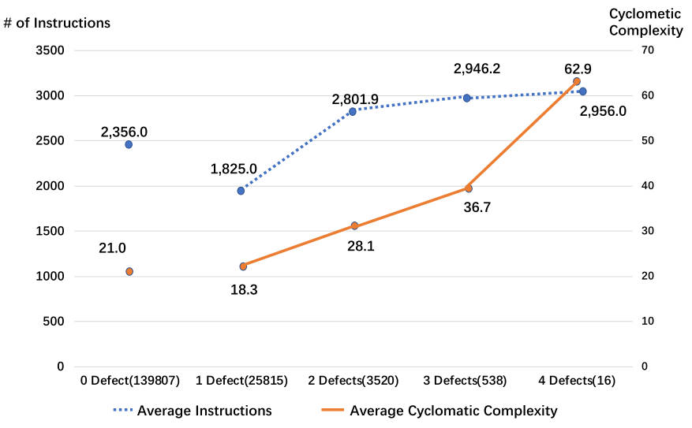
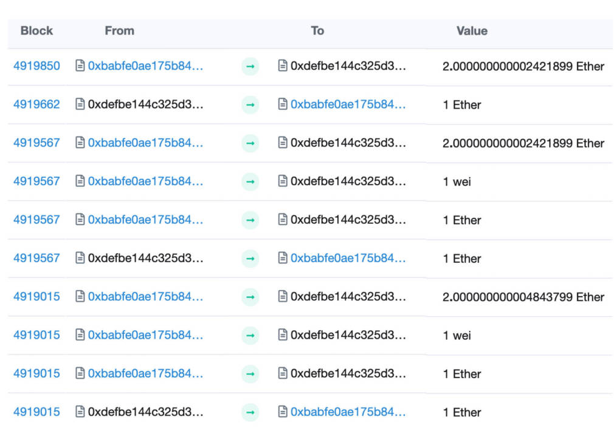

# DefectChecker：基于 EVM 字节码分析的智能合约缺陷检测自动化

## 摘要

智能合约是在区块链上运行的图灵完备程序。它们是不可变的，一旦部署后即便发现错误也无法修改。因此，在将智能合约部署到区块链之前，确保其无错误且设计完善极为重要。合约缺陷是指智能合约中的错误、缺陷或漏洞，这些问题可能导致合约产生错误或意外结果，或者因意外行为而无法正常工作。检测和消除合约缺陷可以避免潜在的攻击，增强程序的鲁棒性。我们之前的工作定义了 20 种智能合约缺陷，并将其分为五个影响级别。根据我们的分类，从 1 到 3 级的缺陷可能导致不安全行为，例如合约被攻击者控制。在本文中，我们提出了一种名为`DefectChecker`的工具，它基于符号执行的方法来检测以太坊区块链平台上智能合约的缺陷。`DefectChecker`可以从智能合约的字节码中检测出缺陷。我们通过将其应用于一个开源数据集来验证`DefectChecker`的性能。评估结果显示，`DefectChecker`在整个数据集中的 F-score 很高（88.8%），并且平均分析一个智能合约只需 0.15 秒。我们还将`DefectChecke`应用于以太坊平台上的 165,621 个智能合约，结果发现有 25,815 个智能合约至少包含一个属于 1 到 3 级影响的缺陷，其中包括一些真实的攻击案例。

`索引术语`——智能合约，以太坊，合约缺陷检测，字节码分析，符号执行

## 引言

近年来，去中心化加密货币引起了广泛关注。为了确保这些系统在没有中心化组织管理的情况下仍然具有可扩展性和安全性，去中心化加密货币采用区块链概念作为其基础技术。比特币[1]是第一个数字货币，它允许用户通过编码脚本自动处理交易。然而，比特币中的脚本不是图灵完备的，这限制了它们在货币转账或支付等应用上的能力。为了应对这一限制，以太坊[2]引入了一种名为智能合约的技术，这是一种在区块链上运行的图灵完备程序。通过利用该技术，实践者可以开发去中心化应用程序（DApps）[3]，并将区块链技术应用于游戏[4]和金融[5]等不同领域。

智能合约通常使用高级编程语言编写，例如Solidity[6]。当开发者将智能合约部署到以太坊时，合约首先会被编译为以太坊虚拟机（EVM）字节码。然后，以太坊系统中的每个节点都会接收到智能合约的字节码并在其分类账中保留一个副本。任何人，包括攻击者，都可以通过向相应的合约地址发送交易来调用该智能合约。

智能合约的关键特性使其成为黑客的有吸引力目标[7]。一方面，许多智能合约持有有价值的以太币，且无法隐藏其余额，这为黑客提供了经济动机[8]，[9]。另一方面，智能合约在无权限网络中运行，这意味着黑客可以自由地检查所有交易和字节码，并尝试找到合约中的漏洞。更糟的是，智能合约一旦部署，即便发现了错误也无法修改。因此，在将智能合约部署到以太坊之前，确保其无错误且设计完善至关重要。

合约缺陷[10]，[11]是指导致智能合约产生不正确或意外结果，或以意外方式行为的错误、缺陷或漏洞[12]。检测和消除合约缺陷是避免潜在攻击并改进现有代码设计的方法。在我们之前的工作中[11]，我们通过分析 StackExchange[13]帖子首先定义了 20 种合约缺陷。这也是第一个通过在线调查验证智能合约开发者是否认为这些缺陷有害的工作，这使得定义更具说服力。我们的工作将定义的 20 种合约缺陷分为五个影响级别，结果表明包含 1 到 3 级缺陷的智能合约可能导致不安全行为，例如合约被攻击者控制。

然而，我们之前的工作并未提出一种可以检测这些合约缺陷的合适工具。为了解决这一局限性，本文提出了`DefectChecker`，用于检测我们之前工作中定义的对合约造成严重影响（1 级为高，3 级为中）的缺陷，使用智能合约的字节码进行检测。`DefectChecker`通过字节码进行符号执行，无需源代码支持。在符号执行过程中，`DefectChecke`生成智能合约的控制流图（CFG）以及“堆栈事件”，并识别三种特征，即“资金调用”、“循环块”和“应付函数”。通过使用CFG、堆栈事件和这三种特征，我们设计了相应的规则来检测每种合约缺陷。

我们通过应用到我们之前工作中开发的开源数据集来验证`DefectChecker`的性能[11]。我们还将其结果与三种先进工具（如`Oyente`、`Mythril`和`Securify`）进行比较。评估结果表明，`DefectChecker`在整个数据集中的 F-score 最高（88.8%），并且分析一个智能合约的时间最短（每个合约 0.15 秒），相比其他基线工具。我们还提取了截至 2019 年 1 月部署到以太坊上的所有智能合约字节码，并将`DefectChecker`应用于 165,621 个不同的字节码智能合约。结果发现，以太坊上的智能合约中有 15.9% 至少包含一个属于 1 到 3 级影响的缺陷。

本工作的主要贡献如下：

- 据我们所知，`DefectChecker`是目前最准确且最快的基于符号执行的智能合约缺陷检测工具。
- 我们系统地评估了工具的性能，使用一个开源数据集进行测试。此外，我们还提取了以太坊平台上的所有字节码（165,621个），并确定其中25,815个智能合约包含至少一个缺陷。通过这些分析，我们发现了一些真实世界的攻击案例，并举例说明了检测合约缺陷的重要性。
- 我们的数据集、工具和分析结果已向社区开放：https://github.com/Jiachi-Chen/DefectChecker/。

本文其余部分的组织如下。在第 2 节中，我们提供了智能合约的背景知识，并介绍了带有代码示例的合约缺陷。在第 3 节中，我们介绍了`DefectChecker`的架构，在第 4 节中，我们介绍了其表示和实现。在第 5 节中，我们对在以太坊智能合约上的大规模案例研究进行了评估，并在第 6 节中给出了真实案例作为案例研究。在第 6 节中，我们介绍了相关工作。最后，我们在第 7 节中总结了本研究并讨论了未来可能的工作。

## 背景与动机

在本节中，我们简要介绍了关于智能合约及其合约缺陷的关键背景信息。

### 智能合约

合约。利用区块链技术，智能合约是在区块链上存储的自治协议。一旦启动，合约的运行是自动的，并且按照预先定义的程序逻辑进行[14]。当开发人员将智能合约部署到以太坊时，合约将被编译为 EVM 字节码，并由唯一的 160 位十六进制哈希合约地址标识。智能合约的执行取决于其代码，即使是合约创建者也无法影响其运行或状态。例如，如果合约不包含以太币转账的功能，即使是创建者也无法提取以太币。智能合约运行在无权限网络中，任何人都可以通过 ABI（应用程序二进制接口）[6]调用智能合约的方法。合约字节码、交易和调用参数对所有人都是公开的。

`Gas 系统`。为了确保智能合约的安全性，智能合约的每笔交易都将由所有矿工运行。以太坊使用 gas 系统[15]来衡量其计算工作量，发送交易以调用智能合约的开发人员需要支付执行费用。执行费用的计算方式为：$gas\_cost$ $\times$ $gas\_price$。gas 费用取决于执行所需的计算资源，而 gas 价格则由交易创建者提供。为了限制调用交易的 gas 费用，开发人员会设置 Gas 上限，以确定最大 gas 费用。如果交易的 gas 费用超过了 Gas 上限，则会失败并抛出`out-of-gas`错误[2]。某些特殊操作将会对 Gas 上限设定特定值。例如，`address.transfer()`和`address.send()`是以太坊提供的两种用于转移以太币的方法。如果智能合约使用这些方法向另一个智能合约发送以太币，Gas 上限将限制为 2300 gas 单位[6]。2300 gas 单位不足以进行存储、调用函数或发送以太币，这可能导致交易失败。因此，`address.transfer()`和`address.send()`只能用于向外部账户发送以太币（外部账户指由私钥控制的账户，与合约代码控制的合约账户不同[2]）。

`以太坊虚拟机（EVM）`。为了将智能合约部署到以太坊，其源代码需要编译为字节码并存储在区块链上。EVM 是一种基于堆栈的机器：当需要执行交易时，EVM 会首先将字节码拆分为字节，每个字节表示唯一的指令，称为操作码。截至 2019 年 4 月，共有 140 个唯一的操作码[2]，每个操作码由十六进制编号表示[2]。EVM 使用这些操作码执行任务。例如，考虑一个字节码`0x6070604001`。EVM 首先将该字节码拆分为字节（`0x60`，`0x70`，`0x60`，`0x40`，`0x01`），并执行第一个字节`0x60`，其操作码为`PUSH1`。`PUSH1`将一个字节数据推送到EVM堆栈中。因此，`0x70`被推送到堆栈中。然后，EVM 读取下一个`0x60`并将`0x40`推入堆栈。最后，EVM 执行`0x01`，其操作码为`ADD`。`ADD`从堆栈顶部获取两个值，即`0x70`和`0x40`，并将它们的和（`B0`）推入堆栈。

`EVM 字节码与控制流分析中的 JVM 字节码`。控制流分析方法在其他基于堆栈的机器（例如 JVM[16]）中被广泛使用。然而，JVM 字节码与 EVM 字节码之间存在一些差异。这些差异在分析 EVM 字节码时提出了一些新的挑战。我们在本文中强调了 EVM 字节码分析方法与 JVM 字节码分析的关键差异，包括：

（1）JVM 字节码在不同的控制流路径下具有固定的堆栈深度。而 EVM 无法在具有不同堆栈大小的情况下到达同一程序点[17]。EVM 字节码没有这种约束，这大大增加了识别 EVM 字节码中控制流结构的难度。例如，对于简单的递归代码“`function f(int a){f(a);}`”，其在 EVM 中的代码如下：

```
Block 1:
  JUMPDEST
  PUSH Block1' ID
  DUP2
  PUSH Block2' ID
  JUMP
Block 2:
  JUMPDEST
```
存在两个代码块；两个块标识符在相同的块（块1）中被推入，并将由相同的指令`JUMP`读取。JVM 和 EVM 的区别在于，JVM为每个方法调用创建一个新的操作数栈[18]，而 EVM 只有一个全局操作数栈。（帧用于存储数据和部分结果，也用于执行动态链接、方法返回值和调度异常）。

（2）JVM 字节码为每个跳转定义了明确的目标集[19]。相比之下，EVM 字节码的跳转目标从 EVM 堆栈中读取。当使用条件跳转时，目标将受堆栈第二项影响。例如，在图 2 中，跳转目标`JUMPI`（ID 140）从先前的指令`PUSH`读取，并将受堆栈第二项（例如，`ISZERO(GT(10, num))`）的影响。如果第二项为真值，则跳转目标为 148；否则，目标为 141。无条件跳转目标也从 EVM 堆栈顶部读取。例如，图 2 中的`JUMP`（ID 147）的跳转目标也从之前的指令`PUSH`读取。因此，我们需要通过符号执行 EVM 字节码来构造控制流边。

（3）JVM 字节码有明确的方法调用和返回指令[17]。相比之下，EVM 字节码使用跳转来执行合约内部的函数调用。在这种情况下，为了解析合约内部的函数调用，我们需要检查堆栈顶部元素以确定跳转目标。例如，假设有两个函数 A 和 B。函数 A 包含三个块，例如 A1、A2 和 A3；函数 B 包含两个块，例如 B1 和 B2。代码块 B2 调用函数 B 中的代码块 B1。在 EVM 字节码中，没有定义的方法调用和返回指令。相反，EVM 将返回地址推入堆栈中；调用方的块标识符（B1 的块 ID）需要通过字节码识别。为了返回，代码将从 EVM堆栈顶部读取调用者的块标识符（A3），然后跳转执行块。因此，执行序列为 A1、A2、B1、B2、A3。块 B1 和 A3 的标识符需要从字节码中获得以确定跳转目标。

`Fallback函数`。Fallback函数是智能合约相较于传统程序的一项独特特性。在智能合约编程中，Fallback函数是唯一没有命名的函数[6]。当交易调用合约中的某个函数但没有找到对应的函数时，Fallback函数将被自动执行。如果函数被标记为`payable`[6]，则在收到以太币时Fallback函数也会自动执行。

`CALL 指令和以太币转移`。以太币转移是以太坊中的一个重要功能。在 Solidity 编程中，有三种方法用于转移以太币，即`address.call.value()`，`address.transfer()`，和`address.send()`。在这三种方法中，只有`address.call.value()`允许用户将以太币发送到合约地址，而其他两种方法限制为 2300 gas 单位，这不足以发送以太币。`address.send()`返回一个布尔值，而`address.transfer()`在错误发生时抛出异常。这三种方法都可以在合约字节码中生成`CALL`指令。其他行为（例如函数调用）也可以生成`CALL`指令。`CALL`指令从 EVM 堆栈顶部读取七个值。它们代表 gas 限制、接收地址、转移金额、输入数据起始位置、输入数据大小、输出数据起始位置和输出数据大小。

### 智能合约中的合约缺陷

我们之前的工作[11]定义了 20 种智能合约的缺陷。我们将这些缺陷分为五个“影响”级别；在这些缺陷中，11 种属于影响级别 1（最严重）到 3（中等严重性），可能导致不安全行为。表 1 中给出了这些 11 种缺陷的定义。在本文中，我们提出了`DefectChecker`，一种符号执行工具，用于检测这些影响级别中的八个合约缺陷。`DefectChecker`不检测属于影响级别 4 和 5 的缺陷，因为这些缺陷不会影响智能合约的正常运行。例如，未指定编译器版本是五个最严重缺陷之一。消除该缺陷需要合约开发人员在合约中指定特定的编译器版本（如 0.4.25）。该缺陷不会影响合约的正常运行，仅对未来代码的重用构成威胁。这种缺陷很难通过字节码级别检测，因为语义信息在编译后丢失。

<p style="text-align:center">表1：影响级别为 1 - 3 的合约缺陷定义</p>

| 合约缺陷                    | 定义                                                       | 影响级别 |
| --------------------------- | ---------------------------------------------------------- | -------- |
| 交易状态依赖性 (TSD)        | 使用`tx.origin`检查权限                                    | IP1      |
| 外部影响下的拒绝服务 (DuEI) | 在可能受到外部用户影响的循环中抛出异常                     | IP2      |
| 严格余额质量 (SBE)          | 使用严格的余额质量来确定执行逻辑                           | IP2      |
| 重入漏洞 (RE)               | 重入攻击漏洞                                               | IP1      |
| 嵌套调用 (NC)               | 在无限长度的循环中执行`CALL`指令                           | IP2      |
| 贪婪合约 (GC)               | 合约可以接收以太币但无法提取                               | IP3      |
| 未检查的外部调用 (UEC)      | 不检查外部调用函数的返回值                                 | IP3      |
| 区块信息依赖性 (BID)        | 使用与区块信息相关的函数来确定执行逻辑                     | IP3      |
| 类型不匹配赋值              | 分配不匹配的类型值，可能导致整数溢出                       | IP2      |
| 硬编码地址                  | 在智能合约中使用硬编码地址                                 | IP3      |
| 数据位置误导                | 本地变量的引用类型（如`struct`、`array`或`mapping`）未明确 | IP2      |

`注：前八种合约缺陷可以通过 DefectChecker 检测`

然而，请注意，在本研究中，我们未考虑属于影响级别 1 到 3 的三种合约缺陷——类型不匹配赋值、硬编码地址和数据位置误导，因为这些缺陷不易通过字节码级别检测。我们的分析表明，它们分别出现在 22、84 和 587 个智能合约中。编译智能合约为字节码时，这些信息会被删除或丢失，这可能会掩盖源代码中的约束条件。对于硬编码地址，从区块链获取的字节码中不包含关于构造函数的信息，而我们发现大多数硬编码地址错误出现在构造函数中。对于检测类型不匹配赋值，我们需要知道最大循环迭代次数，这通常是从存储中读取的，并且很难通过静态分析获得。例如，对于循环“`for(uint8 i = 0; i < num; i++)`”，`uint8`的范围是 0 到 255。如果`num`大于 255，循环将会溢出。然而，`num`通常是从存储中读取的存储变量或依赖于外部输入。因此，通过字节码分析很难检测到这一缺陷。数据位置误导也不易通过字节码检测。在 Solidity 编程中，`storage`在 Solidity 中不是动态分配的，并且`struct`、`array`或`mapping`类型的数据在存储中维护。因此，这三种类型的数据将导致函数默认指向存储槽 0，这可能导致潜在的漏洞。然而，我们无法知道槽 0 上的指针是正确的还是 EVM 的错误。

#### 影响级别的定义

下面我们给出了八种智能合约缺陷中每种的代表性示例，并根据我们的先前工作引入了影响级别 1 到 3 的定义。

- `影响级别 1 (IP1)`：包含这些缺陷的智能合约可能导致严重的意外行为。攻击者可以利用这些缺陷触发不安全行为，并通过利用这些缺陷获利。
- `影响级别 2 (IP2)`：包含这些缺陷的智能合约可能导致严重的意外行为。攻击者可以利用这些缺陷触发不安全行为，但无法通过利用这些缺陷获利。
- `影响级别 3 (IP3)`：IP3有两种类型。`类型 A`：包含这些缺陷的智能合约可能导致严重的意外行为，但攻击者无法触发不安全行为。`类型 B`：包含这些缺陷的智能合约可能导致主要的意外行为。攻击者可以触发不安全行为，但无法通过利用这些缺陷获利。

“严重”代表合约缺陷可能导致崩溃、被攻击者控制或丢失所有以太币。“主要”代表合约缺陷可能导致部分以太币的丢失[11]。

#### 智能合约缺陷的示例

(1) `交易状态依赖性 (TSD)`：合约需要检查调用者是否有权执行一些权限敏感的函数。权限检查失败会导致严重后果。`tx.origin` 可以获取交易的原始地址，但由于返回的地址依赖于交易状态，这种方法不可靠。因此，不应使用 `tx.origin` 来检查调用者是否有权限执行函数。

`示例`：在代码示例1中，攻击者合约可以利用 `attack` 函数（代码第9行）使权限检查失效。通过这种方法，任何人都可以执行 `sendMoney` 函数（代码第3行）并提取合约中的以太币。

```
1	contract Victim {
2		address owner = owner_address;
3		function sendMoney(address addr){
4			require(tx.origin == owner);
5			addr.transfer(1 Ether);
6		}
7	}
8	contract Attacker {
9		function attack(address vim_addr, address myAddr){
10			Victim vic = Victim(vim_addr);
11			vic.sendMoney(myAddr);
12		}
13	}
```

`可能的解决方案`：Solidity 提供了 `msg.sender` 来获取发送者地址，可以用其来进行权限检查，而不是使用 `tx.origin`。

(2) `外部影响下的拒绝服务 (DuEI)`：智能合约将在运行期间检测到异常时回滚交易。如果导致异常的错误无法修复，该函数将会导致服务拒绝（DoS）错误。

`示例`：在代码清单2中，`members` 是一个存储了多个地址的数组。其中一个地址是攻击者合约，当调用 `transfer` 函数时，由于 2300 gas 限制，可能会触发 "out-of-gas"（超出 gas）异常【2】。此时，合约状态将回滚。由于代码无法修改，合约无法从 `members` 列表中移除攻击地址，这意味着如果攻击者不停止攻击，后续的函数将无法继续执行。

```
1	for(uint i = 0; i < members.length; i++){
2		if(this.balance > 0.1 ether)
3			members[i].transfer(0.1 ether);
4	}
```

`可能的解决方案`：开发者可以使用布尔值检查代替在循环中抛出异常。例如，在列表 2 的第 3 行中使用`if(members[i].send(0.1 ether) == false) break;`。

(3) `严格余额相等 (SBE)`：攻击者可以通过强制使用`selfdestruct()`[6]向任何合约发送以太币。此方法不会触发回退函数，这意味着受害合约无法拒绝这些以太币。因此，智能合约的逻辑可能因攻击者发送的意外以太币而无法工作。

`示例`：列表 3 中的`doingSomething()`函数仅在余额状态等于 1 ETH 时触发。然而，攻击者可以向合约发送 1 Wei（1 ETH = 1e18 Wei），导致余额不再等于 1 ETH。

```
1	if(this.balance == 1 ether) doingSomething();
```

`可能的解决方案`：合约可以使用`>=`来代替`==`，因为攻击者只能添加余额。在这种情况下，攻击者难以影响程序的逻辑。

(4) `重入漏洞 (RE)`：在以太坊中，通过 `call` 方法，一个函数可以在一次执行中多次调用自己。当一个合约调用另一个合约时，执行会等待被调用的合约执行完毕。因此，这可能在某些情况下导致多次调用和重复转账。

`示例`：代码清单4展示了一个重入攻击的示例。这里有两个智能合约，即 `Victim` 合约和 `Attacker` 合约。`Attacker` 合约用于从 `Victim` 合约中转出以太币，而 `Victim` 合约可以被视为一个“银行”，存储了用户的以太币。用户可以调用 `withdraw` 函数来提取他们的以太币，而 `withdraw` 函数中存在重入漏洞。

首先，`Attacker` 合约通过 `reentrancy()` 函数（第16行）调用 `Victim` 合约的 `withdraw()` 函数（第3行）。在第16行的 `addr` 参数是 `Victim` 合约的地址。正常情况下，`Victim` 合约会将以太币发送给调用者（第6行），然后在第7行将调用者的余额重置为 0。然而，由于 `Victim` 合约在余额重置之前发送了以太币，导致 `Attacker` 合约在收到以太币时自动触发其回退函数（fallback function）（第13行），并再次调用 `withdraw()` 函数。

这样，调用顺序变成：L16-17 → L3-6 → L13-14 → L3-6 → L13-14 ...，如此循环，直到 `Victim` 合约的余额耗尽。

```
1	contract Victim {
2		mapping(address => uint) public userBalance;
3		function withdraw() {
4			uint amount = userBalance[msg.sender];
5			if (amount > 0) {
6				msg.sender.call.value(amount)();
7				userBalance[msg.sender] = 0;
8			}
9		}
10	}
11	contract Attacker {
12		function() payable {
13			Victim(msg.sender).withdraw();
14		}
15		function reentrancy(address addr) {
16			Victim(addr).withdraw();
17		}
18	}
```

`可能的解决方案`：以太坊中有三种`Call`方法可用于发送以太币，即`address.send()`、`address.transfer()`和`address.call.value()`。`address.send()`和`address.transfer()`将更改最大gas限制为2300 gas单位，如果接收者是合约账户，则2300 gas单位不足以传输以太币，这意味着这两种方法不能导致重入漏洞。因此，使用`address.send()`和`address.transfer()`代替`address.call.value()`可以避免重入漏洞。

(5) `嵌套调用 (NC)`：`CALL` 指令非常昂贵（在非零值转账中，作为 `CALL` 操作的一部分，需支付 9000 gas）。如果循环中包含 `CALL` 指令，但没有限制循环的迭代次数，则总 gas 消耗可能会超出限制，导致合约执行失败。

`示例`：在清单5中，如果不限制循环的迭代次数，攻击者可能会恶意增加数组的大小，导致 "out-of-gas"（超出 gas）错误。一旦发生 out-of-gas 错误，该函数将无法再正常工作，因为无法减少循环的迭代次数。

```
1	for(uint i = 0; i < member.length; i++){
2		member[i].send(1 wei);
3	}
```

`可能的解决方案`：开发者应估算循环的最大迭代次数，并对循环进行限制。

(6) `贪婪合约 (GC)`：智能合约中的以太币只能通过将以太币发送到其他账户或使用 `selfdestruct` 函数来提取。否则，即使是合约的创建者也无法提取这些以太币，导致资金永久锁定在合约中。我们将能够接收以太币（包含 `payable` 函数）但没有任何方法可以提取以太币的合约称为“贪婪合约”。

`示例`：列表6是一个贪婪合约。该合约包含一个可支付的回退函数（第2行），可以接收以太币，但合约中没有任何方法提取以太币。

```
1	contract Greedy {
2		function() payable {
3			process(msg.sender);
4		}
5		function process(address addr) {...}
6	}
```

`可能的解决方案`：如果合约可以接收以太币，应添加一个函数以提取这些以太币。

(7) `未检查的外部调用 (UEC)`：Solidity 提供了许多函数（如 `address.send()` 和 `address.call()`）来转账或在合约之间调用函数。然而，这些与调用相关的方法可能会失败，例如由于网络错误或 gas 不足。当发生错误时，这些函数会返回布尔值，但不会抛出异常。如果调用者不检查外部调用的返回值，就无法确保后续代码逻辑的正确性。

`示例`：在清单7中，第一行代码未检查 `address.send()` 的返回值。由于以太币转账有时可能会失败，第一行代码无法确保后续代码逻辑的正确性。

```
address.send(ethers); doingSomething(); //bad
if(address.send(ethers)) doingSomething(); //good
```

`可能的解决方案`：始终检查 `address.send()` 和 `address.call()` 的返回值。

(8) `区块信息依赖性 (BID)`：开发者可以利用一系列与区块相关的函数来获取区块信息。例如，`block.blockhash` 用于获取当前区块的哈希值。许多智能合约依赖这些函数来决定程序的执行流程，例如生成随机数。然而，矿工可以在一定程度上影响区块信息，例如，矿工可以将区块的时间戳改变约 900 秒【20】。在这种情况下，区块信息依赖操作可以在一定程度上被矿工控制。

`示例`：清单8中的合约是一个轮盘赌合约。合约利用区块哈希值来选择获胜者，并向获胜者发送 1 个以太币作为奖励。然而，矿工可以控制结果，因此矿工可以始终成为赢家。

```
address[] participators;
uint winnerID = uint(block.blockhash) % participators.length;
participators[winnerID].transfer(1 ether);
```

`可能的解决方案`：安全随机数的前提是该随机数不能被单个用户控制，例如矿工。在以太坊中，我们可以使用完全随机的信息，包括用户地址、用户的输入数字等。此外，隐藏合约使用的值以及其他玩家避免攻击也是很重要的。由于我们无法隐藏以太坊中用户及其提交的值，一种可能的解决方案是使用哈希数来生成随机数。该算法有三个回合：

- `回合 1`：用户获得一个随机数并在本地机器上生成一个哈希值。该哈希值可以通过`keccak256`函数生成，确保信息保密。
- `回合 2`：所有用户提交哈希值后，用户需要提交原始的随机数。合约通过使用相同的`keccak256`函数检查是否可以通过原始数生成相同的哈希值。
- `回合 3`：如果所有用户提交正确的原始数，合约可以使用原始数来生成随机数。

## 缺陷检测器方法

### 设计概述

图 1 展示了缺陷检测器（DefectChecker）方法的总体架构。DefectChecker 包含四个组件，即输入器（Inputter）、CFG 构建器（CFG Builder）、特征检测器（Feature Detector）和缺陷标识器（Defect Identifier）。

<p style="text-align:center"></p>

<p style="text-align:center">图 1. DefectChecker 的总体架构</p>

图左侧的部分是输入器，用户可以将字节码作为输入提供。也允许使用 Solidity 源代码，但需要先将其编译为字节码。字节码会通过 Geth 提供的 API 被分解为操作码 [21]。然后，DefectChecker 将操作码拆分为几个基本块，并在每个块中进行符号执行以分析指令。之后，DefectChecker 生成智能合约的控制流图（CFG）并记录所有的栈事件。符号执行期间，特征检测器会检测出三个特征（即，资金调用、循环块和可支付函数），这些都是基础概念。基于这些信息，缺陷标识器使用八个不同的规则来识别智能合约中的缺陷。

通过字节码检测合约缺陷对于以太坊上的智能合约来说非常重要。所有智能合约的字节码都存储在区块链上，但只有不到 1% 的智能合约公开了其源代码 [22]。智能合约通常会调用其他合约，但被调用的合约可能并未公开其源代码供检查。在这种情况下，调用方智能合约只能通过字节码来检测被调用的合约是否安全。

### 基本块构建器

一个基本块是一个线性的代码序列，在入口处只有一个分支，在出口处没有分支 [23]。我们首先将操作码分割为多个块，并根据块的出口类型来确定其类型。出口类型可以通过块中的最后一条指令来决定。如果最后一条指令是 JUMP 或 JUMPI，那么块类型分别为无条件或条件块。如果最后一条指令是终止指令（STOP、REVERT 和 RETURN），则该块类型为终止块。一些块不属于这三种类型，我们称它们的块类型为 fall。总结来说，我们考虑四种块类型：无条件、条件、fall 和终止。

### 符号执行

与其他基于栈的机器不同，例如 Java 字节码在 JVM 中的每次跳转都有明确定义的目标位置，EVM 字节码的跳转位置需要在符号执行过程中计算。因此，DefectChecker 需要逐条符号执行每条 EVM 指令，以获得智能合约的控制流图（CFG）。EVM 是一种基于栈的机器——执行指令时，它会从 EVM 栈顶读取几个符号状态，并将符号结果放回 EVM 栈。在符号执行过程中，我们可以获得块之间的跳转关系。根据跳转行为，将块分为三种类型，即条件跳转、无条件跳转和 fall 执行。栈事件（Stack Event）记录每条指令执行后 EVM 栈中的所有符号状态。

<p style="text-align:center"></p>

<p style="text-align:center">图 2. 显示了符号执行的示例</p>

```solidity
function example(uint num) returns(uint){
    if(num > 10)
        return 1;
    else{
        return 0;
    }
}
```

图 2 是清单 9 中代码的符号执行示例。在此图中共有 4 个块，每个块包含若干指令。块 1 中的指令表示代码 `if(num > 10)`。块 2 和块 3 将值（0 或 1）放入 EVM 栈中。块 4 中的指令用于向环境返回值（0 或 1）。每个行号左侧的数字表示指令的索引 ID，中间部分是需要执行的指令。所有指令将按其索引 ID 顺序依次执行。如果指令是 `PUSH`，右侧会显示一个值，将该值推入 EVM 栈中。程序计数器（PC）记录当前时间下要执行的指令 ID。PC 从块 1 的 ID 0 开始，EVM 执行该指令。

图 2 中展示的示例代码是合约代码的一部分，因此 PC 从块 1 的 ID 130 开始。在 EVM 执行指令 `JUMPDEST` 之前，函数输入参数 `num` 已被推入 EVM 栈。符号 `num` 代表函数的输入值（清单 9 的 L1 行）。`JUMPDEST` 标记了一个有效的跳转位置；它不读取或推送任何值。因此，当 PC 指向 ID 131 时，EVM 向栈中推入值 0，并将 PC 指向 135。`DUP3` 复制栈中第三个位置的值，因此符号 `num` 被推入 EVM 栈。接下来，`GT` 指令从 EVM 栈中读取两个值。如果栈顶的第一个值大于第二个值，则 EVM 将 1 推入栈；否则，将 0 推入栈。我们用符号 `GT(a, num)` 表示结果，并将该值推入 EVM 栈中。`JUMPI`（ID 140）从栈中读取两个值，第一个值代表跳转位置 "148"，第二个值为条件表达式。如果条件表达式的结果为“1”（true），则 PC 跳转到 ID 148，开始执行块 2。否则，如果结果为“0”（false），EVM 则执行块 3 的指令，继续执行到 ID 141（块 3 的起始位置）。

由于 `ISZERO(GT(a, num))` 的结果可能是“0”或“1”，此符号执行生成了两个路径，即块 1 -> 块 2 和块 1 -> 块 3。

首先假设 `ISZERO(GT(a, num))` 的结果为“1”，此时路径为块 1 -> 块 2。在这种情况下，PC 指向 ID 148。此路径的跳转类型为条件跳转。在执行 ID 148-152 的指令后，EVM 将跳转到块 4。块 2 到块 4 的跳转类型为 fall。块 4 的第一个指令将两个值（即 `num` 和 0）压入 EVM 栈中。块 4 使用指令 `STOP` 终止执行。

我们再假设 `ISZERO(GT(a, num))` 的结果为“0”，此时路径为块 1 -> 块 3。在这种情况下，PC 指向 ID 141，此路径的跳转类型为 fall。它从栈顶读取一个值。指令 `JUMP` 将 PC 指向 ID 153（块 4 的起始位置）。EVM 执行块 4 的指令，使用 `STOP` 终止执行。

在执行条件跳转时，我们需要确定条件表达式的可满足性，这通常是通过调用 SMT（可满足性模块理论）求解器 [24]，例如 Z3 [25]。如果 SMT 求解器找不到解，我们将此程序路径视为不可行。因此，符号执行可用于发现死代码。然而，EVM 字节码中可能几乎没有死代码，因为编译器会在智能合约编译期间消除死代码。为加速分析，我们将等于“0”的条件表达式视为不可满足，并将所有其他条件表达式视为可满足，而不检查其可满足性。

### 特征检测器

为了在字节码级别检测合约缺陷，我们需要从操作码中识别出一些特定的行为。在本节中，我们介绍用于检测合约缺陷的三个特征。

#### 资金调用

为了检测重入攻击（Reentrancy），我们需要识别智能合约是否可以向其他合约转移以太币。以太坊提供了三种转移以太币的方法，即 `address.send()`、`address.transfer()` 和 `address.call().value()`。这三种方法都会生成一个 `CALL` 指令。然而，仅仅检测 `CALL` 指令是不够的，因为其他许多行为也可能生成 `CALL` 指令，例如，调用其他合约或库中的函数。在本文中，如果 `CALL` 指令是由用于转移以太币的函数生成的，我们称此 `CALL` 指令为资金调用（Money-CALL）。否则，`CALL` 指令为非资金调用（No-Money-CALL）。`CALL` 指令会从 EVM 栈中读取七个值。前三个值分别代表 gas 限制、接收者地址和转移金额。如果转移金额大于 0，则该 `CALL` 指令为资金调用（Money-CALL）。

然而，仅检测资金调用（Money-CALL）仍然不够，因为 `address.send()` 和 `address.transfer()` 将 gas 消耗限制为 2300，这不足以转移以太币。因此，这两种方法也无法引发重入攻击。如果 `CALL` 指令是由 `address.send()` 和 `address.transfer()` 生成的，则一个特定值 "2300" 会被推入 EVM 栈，代表最大 gas 消耗。因此，如果 `CALL` 指令读取了一个特定值 "2300" 且来自 EVM 栈，则该 `CALL` 指令是由 `address.send()` 和 `address.transfer()` 生成的。我们称此 `CALL` 指令为有限 gas 资金调用（Gas-Limited-Money-CALL）。否则，如果第一个读取的值不是特定值 "2300"，我们假定该 `CALL` 指令是由 `address.call().value()` 生成的。我们称此 `CALL` 指令为无限 gas 资金调用（Gas-Unlimited-Money-CALL）。

#### 循环块

在构建控制流图（CFG）后，我们需要检测哪个块是循环的起始块，以及哪些块构成循环体。为了检测这些信息，我们首先通过深度优先搜索（DFS）[26] 遍历控制流图的路径，并标记我们访问的所有块。如果有一个块已经被访问过，那么该块就是循环的起始块，而循环中的其他块则构成循环体。由于一些智能合约非常复杂，可能包含大量路径。为了减少计算量，我们采用了修剪策略。例如，块 A 是许多其他块的目标，并且我们发现块 A 的路径不包含任何循环。因此，当其他路径遇到块 A 时，我们不需要访问剩余的路径。

#### 可支付函数

只有包含可支付函数的智能合约才能接收以太币 [2]。为了检测一个函数是否可支付，我们可以检查每个函数的第一个块。`CALLVALUE` 指令用于获取接收到的以太币数量。如果智能合约接收到以太币，`CALLVALUE` 指令将获得一个非零值。可以通过 `ISZERO` 指令检查此值，以判断交易是否包含以太币。如果函数不可支付，在接收以太币时会抛出异常并终止执行。

为了找到第一个块，我们首先按索引 ID 对所有指令进行排序。所有在第一个 `JUMPDEST` 指令之前的条件跳转都是每个函数的起始位置。EVM 使用哈希值来识别函数；当 EVM 接收到一个函数调用时，它首先将接收到的值与每个函数的哈希值进行比较。如果某个函数的哈希值等于接收到的哈希值，它将跳转到目标位置，这表明这是该函数的起始位置。否则，它将进入回退函数（fallback function），其起始位置是第一个 `JUMPDEST` 指令。

### 缺陷检测器（DefectChecker）

表 2 描述了检测每种合约缺陷所需的信息。为了检测 TSD 和 UEC，DefectChecker 只需要符号执行生成的符号状态，因为我们只需要检查 `ORIGIN` 和 `CALL` 指令是否分别被 `EQ` 和 `ISZERO` 指令读取。DefectChecker 只需要控制流信息来检测 BID，因为我们只需检查条件表达式中是否包含区块相关指令，例如 "BLOCKHASH"。

<p style="text-align:center">表2：检测每种合约缺陷所需的信息</p>

|          合约缺陷           | 控制流信息 | 符号状态 |
| :-------------------------: | :--------: | :------: |
|    交易状态依赖性 (TSD)     |            |    ✓     |
| 外部影响下的拒绝服务 (DuEI) |     ✓      |    ✓     |
|    严格余额相等性 (SBE)     |     ✓      |    ✓     |
|        重入攻击 (RE)        |     ✓      |    ✓     |
|        嵌套调用 (NC)        |     ✓      |    ✓     |
|        贪婪合约 (GC)        |     ✓      |    ✓     |
|   未检查的外部调用 (UEC)    |            |    ✓     |
|    区块信息依赖性 (BID)     |     ✓      |          |

为了检测其他 5 种合约缺陷，DefectChecker 需要控制流信息和符号状态。在上一小节中，我们介绍了由特征检测器检测的三个特征，即资金调用（Money Call）、循环块（Loop Block）和可支付函数（Payable function）。资金调用需要符号状态，因此要检测它，DefectChecker 需要检查 EVM 栈中的值。循环块和可支付函数需要控制流信息，因为它们都需要 CFG 来定位循环和函数的起始位置。NC、DuEI、GC 和重入攻击都需要检测资金调用。DuEI 和 NC 还需要检测循环块；GC 需要检测可支付函数。要检测重入攻击，DefectChecker 需要遍历包含无限 Gas 的资金调用的所有路径，这需要 CFG 的帮助。要检测 SBE，DefectChecker 需要检查条件表达式中 `BALANCE` 指令是否被 `EQ` 指令读取，这需要控制流信息和符号状态。

以下描述了用于确定智能合约是否包含一种或多种合约缺陷的详细模式。

#### 交易状态依赖性（Transaction State Dependency）

`tx.origin` 会生成一个 `ORIGIN` 指令。我们首先定位所有 `ORIGIN` 指令。然后检查是否有被 `EQ` 指令读取的 `ORIGIN`。`EQ` 指令从 EVM 栈中读取两个值，并验证这两个值是否相等。如果合约包含这种类型的合约缺陷，`ORIGIN` 指令将会与一个地址值进行比较。以太坊使用 40 位的值表示地址，所有地址都符合 EIP55 标准 [27]。

#### 外部影响下的拒绝服务（DoS Under External Influence）

如果智能合约包含此合约缺陷，指令部分会检查资金调用（Money Call）的返回值，然后终止循环。为了检测此合约缺陷，我们首先找到与循环相关的块。然后检查是否存在包含资金调用的块，并且块的类型为条件块，因为它需要检查返回值。然后，该块跳转到一个类型为终止的块。

#### 严格余额相等性（Strict Balance Equality）

这种合约缺陷可能导致部分代码永远不会执行。我们需要检查条件表达式中是否包含相关模式。`BALANCE` 指令用于获取合约的余额。如果 `BALANCE` 指令被 `EQ` 读取，则表示存在严格的余额相等性检查。如果此检查发生在条件跳转表达式中，则表示该合约包含此合约缺陷。

#### 重入攻击（Reentrancy）

`SLOAD` 指令用于从存储中获取值 [2]。它从 EVM 栈中读取一个值（称为 `Slot ID`）并将读取的结果推送回 EVM 栈。以清单 4 为例，受害合约不会在发送以太币之前将攻击合约的余额清零（L7），从而允许攻击合约再次提取以太币。为了检测此合约缺陷，我们首先需要找到包含无限 Gas 资金调用的路径，因为只有这种调用才可能引发重入攻击。然后我们需要获得这些路径上的所有条件表达式。攻击合约通常会在将金额发送给攻击合约之前检查该值，并将此金额从存储中加载。在这种情况下，我们需要检查条件表达式中是否包含 `SLOAD` 指令并获取其 `Slot ID`。如果在执行 `CALL` 指令时该值依然有效且未更新，则表示 `CALL` 指令可以再次执行并引发重入攻击。为了检查存储值是否已更新，我们需要检测同一个 `Slot ID` 是否被 `SSTORE` 指令写入。（`SSTORE` 指令用于将数据保存到存储中。它从 EVM 栈中读取两个值，即 `slot id` 和写入存储的值。）

#### 嵌套调用（Nested Call）

以清单 5 为例，数组 `members` 是一个存储变量，其所有值（包括长度）都存储在存储中。要获取其长度，`SLOAD` 指令会从 EVM 栈中读取其 `Slot ID δ`，该值是存储 `members.length` 的位置。为了检测此合约缺陷，第一步是找到循环的起始块并获取 `Slot ID`。然后，我们需要检查此循环是否限制其大小。如果循环限制其大小，则同一 `Slot ID δ` 会在循环体中再次被读取，该值会与另一个值进行比较。如果智能合约包含一个不限制大小且包含资金调用的循环，则在此合约中检测到嵌套调用缺陷。

#### 贪婪合约（Greedy Contract）

智能合约可以通过资金调用或 `selfdestruct` 函数转移资金。`selfdestruct` 函数生成 `SELFDESTRUCT` 指令。如果智能合约包含可支付函数但没有资金调用或 `SELFDESTRUCT` 指令，则该合约为贪婪合约。

#### 未检查的外部调用（Unchecked External Calls）

外部调用返回一个布尔值。如果合约检查结果，它会生成 `ISZERO` 指令。为了检测此合约缺陷，我们首先定位所有 `CALL` 指令。然后，检查每个 `CALL` 指令是否被 `ISZERO` 读取。如果存在未被 `ISZERO` 检查的 `CALL` 指令，则检测到此合约缺陷。

#### 区块信息依赖性（Block Info Dependency）

检测此合约缺陷类似于严格余额相等性检查。此合约缺陷可能允许矿工控制合约，因为矿工可以更改一些区块信息的值，从而影响条件表达式的结果。如果条件表达式包含区块相关指令，例如 "BLOCKHASH"、"COINBASE"、"NUMBER"、"DIFFICULTY"、"GASLIMIT"，则表示该合约包含此合约缺陷。

以下是您提供的论文内容的翻译，保持注释序号：

## 评估

为了衡量 DefectChecker 的效果，我们基于其在一个开源数据集上的应用结果，并在本节中展示我们的实验结果分析。

### 实验设置

所有实验均在运行 Mac OS 10.14.4、配备 Intel i7 六核 CPU 和 16 GB 内存的 PC 上进行。我们使用 Solidity 0.4.25 作为编译器将源代码编译为字节码，并使用 EVM 1.8.14 将字节码反编译为操作码。

### 数据集

我们用来评估 DefectChecker 的数据集来自我们之前的工作 [11]。我们首先从 Etherscan 抓取了所有 17,013 个开源智能合约。然后，我们从这些合约中随机选择了 600 个合约。我们发现有 13 个智能合约没有任何内容，因此将它们从数据集中移除。最终，我们从 Etherscan 获得了 587 个智能合约。这些合约的代码行数总计 231,098 行，余额总和超过 400 万以太币。

表 3 显示了数据集的一些关键特征，例如代码行数、合约中的函数数量、合约中的指令数量、圈复杂度 [28] 和合约持有的以太币数量。圈复杂度是一个衡量程序复杂度的软件指标，通过分析控制流图（CFG）计算得出。其计算公式为：`E - N + 2P`。E 是 CFG 中的边数，N 是 CFG 中的节点数，P 是 CFG 中的连通分量数。由于 CFG 是连通图，因此 P 总是等于 1，该公式可以简化为：`E - N + 2`。

<p style="text-align:center">表3：数据集的一些特征</p>

| 特征                | 最小值 (Min) | 最大值 (Max) | 平均值 (Mean) | 标准差 (SD) |
| ------------------- | ------------ | ------------ | ------------- | ----------- |
| 代码行数            | 5            | 2,239        | 393.6         | 356.8       |
| 函数数量            | 1            | 174          | 30.1          | 621.6       |
| 指令数量            | 7            | 15,355       | 3,597.3       | 2,523.7     |
| 圈复杂度 (CC)       | 1            | 132          | 30.3          | 22.4        |
| 以太币余额 (Ethers) | 0            | 1,500,000    | 7,844.9       | 1,704,552.7 |

我们数据集中最简单的合约只包含一个构造函数，具有 7 条指令和 1 的圈复杂度。圈复杂度最高的合约包含 11,696 条指令和 2,004 行代码。数据集中余额最高的合约持有 150 万以太币，而余额最低的合约没有任何以太币。

我们之前工作的两位作者手动标注了该数据集。他们都具有三年的智能合约开发和研究经验，并参与了定义合约缺陷的过程，因此对智能合约编程和本文介绍的合约缺陷有很好的理解。他们首先独立手动标注数据集，然后讨论分歧并给出最终结果。其整体 Kappa 值 [29] 为 0.71，表明两者之间具有显著的一致性。

在本研究中，我们开发了一种名为 DefectChecker 的工具，用于检测八种具有影响等级 1-3 的合约缺陷。表 4 显示了我们数据集中每种合约缺陷的数量。结果表明，区块信息依赖性（Block Info Dependency）是我们数据集中最常见的合约缺陷，而交易状态依赖性（Transaction State Dependency）和严格余额相等性（Strict Balance Equality）是最少见的，数量分别为 42、5 和 5。DefectChecker 以 Solidity 版本 0.4.0+ 为目标，这是本文撰写时最广泛使用的版本 [30]。然而，一些智能合约是针对 Solidity 版本 0.2.0+ 和 0.3.0+ 设计的。因此，我们移除了八个智能合约，使用剩下的 579 个智能合约作为我们的基准数据。

<p style="text-align:center">表4：DefectChecker 的实验结果</p>

| 缺陷类型 | 缺陷数量 (#Defects) | 真阳性 (#TP) | 真阴性 (#TN) | 假阳性 (#FP) | 假阴性 (#FN) | 准确率 (P%) | 召回率 (R%) | F值 (F%) |
| -------- | ------------------- | ------------ | ------------ | ------------ | ------------ | ----------- | ----------- | -------- |
| TSD      | 5                   | 5            | 474          | 0            | 0            | 100.0       | 100.0       | 100.0    |
| DuEI     | 6                   | 6            | 466          | 7            | 0            | 46.2        | 100.0       | 63.2     |
| SBE      | 5                   | 4            | 474          | 0            | 1            | 100.0       | 80.0        | 88.9     |
| RE       | 12                  | 10           | 461          | 6            | 2            | 62.5        | 83.3        | 71.4     |
| NC       | 8                   | 7            | 464          | 1            | 2            | 81.8        | 69.2        | 75.0     |
| GC       | 6                   | 6            | 473          | 0            | 0            | 100.0       | 100.0       | 100.0    |
| UEC      | 22                  | 20           | 454          | 3            | 2            | 87.0        | 90.9        | 88.9     |
| BID      | 42                  | 41           | 437          | 0            | 1            | 100.0       | 97.6        | 98.8     |

在我们介绍的六种工具中（见表 5），只有 Zeus 开源了他们的数据集。然而，Zeus 数据集中缺少四种我们定义的缺陷。此外，Zeus 的作者没有提供他们构建数据集的详细信息。其论文只提到“他们手动验证了每个结果”，但没有提供任何细节，例如标注数据集的人员数量及其是否为专业的智能合约开发人员。因此，我们没有使用这些数据集。

<p style="text-align:center">表5：各工具的输入类型和检测的缺陷</p>

| 工具 | 输入类型 | TSD  | DuEI | SBE  | RE   | NC   | GC   | UEC  | BID  | 其他缺陷数量 |
| ---- | -------- | ---- | ---- | ---- | ---- | ---- | ---- | ---- | ---- | ------------ |
| DefectChecker | 字节码 | ✓    | ✓    | ✓    | ✓    | ✓    | ✓    | ✓    | ✓    | 0    |
| Oyente [20] | 字节码 | ✓    |      |      | ✓    | ✓    | ✓    | ✓    |      | 1    |
| Maian [31] | 字节码 |      | ✓    |      |      |      | ✓    |      |      | 2    |
| Securify [32] | 字节码 |      |      |      | ✓    | ✓    |      | ✓    |      | 7    |
| Mythril [33] | 字节码 | ✓    | ✓    | ✓    |      | ✓    |      | ✓    | ✓    | 28   |
| Contractfuzzer [34] | 字节码 + ABI |      |      |      | ✓    |      |      | ✓    | ✓    | 3    |
| Zeus [35] | 源代码 | ✓    |      |      | ✓    |      |      | ✓    |      | 3    |

### 评估方法和指标

我们的实验中获得了七个测量值：真阳性（True Positive, TP）、真阴性（True Negative, TN）、假阳性（False Positive, FP）、假阴性（False Negative, FN）、精确率（Precision, P）、召回率（Recall, R）和 F 值（F-Measure, F）。TP 表示正确预测智能合约中存在缺陷的结果。TN 表示正确预测智能合约中不存在缺陷的结果。FP 和 FN 分别表示错误预测智能合约中存在或不存在缺陷的结果。精确率、召回率和 F 值的计算公式如下：
$$
\text{Precision} = \frac{\#TP}{\#TP + \#FP} \times 100\%
$$

$$
\text{Recall} = \frac{\#TP}{\#TP + \#FN} \times 100\%
$$

$$
F\text{ - Measure} = \frac{2 \times \text{Precision} \times \text{Recall}}{\text{Precision} + \text{Recall}} \times 100\%
$$

### 实验结果与分析

表 4 总结了 DefectChecker 在我们之前工作中的数据集上的应用结果。第一列是需要检测的合约缺陷，第二列是我们数据集中合约缺陷的数量（基准真值）。其余七列用于衡量 DefectChecker 的性能。以下是对每种合约缺陷的分析：

（1）**交易状态依赖性（Transaction State Dependency）**。DefectChecker 检测到 5 个包含此合约缺陷的智能合约，共 579 个智能合约，且无假阳性和假阴性。

（2）**外部影响下的拒绝服务（DoS Under External Influence）**。DefectChecker 检测到 13 个包含此合约缺陷的智能合约，共 579 个智能合约，其中 7 个为假阳性，0 个为假阴性。这 7 个错误是由于循环识别错误引起的。

在我们的检测方法中，我们首先将字节码分解为多个块。然后，符号执行用于在块之间找到边。我们使用深度优先搜索（DFS）遍历 CFG 的路径。如果有一个块已被访问，则将其视为循环的起始块（见第 3.4.2 节）。由于我们将所有路径视为可达的，因此只标记两个块是否有边。这种机制导致在检测循环时出现假阳性。

在清单 10 中，L9、L10 和 L11 分别包含一个单独的块，函数 `sub()` 包含多个块。EVM 首先执行 L9 的块，然后执行 L2 中函数 `sub()` 的块。执行完 L10、L11 的块后，将再次执行 `sub()` 函数的块。因此，在使用 DFS 遍历 CFG 时，我们可以找到一个循环（`fun sub()→L10→L11→fun sub()`)。由于我们将所有路径视为可达的，因此无法知道 `sub()` 函数的块在执行完 L11 的块后不会跳转到 L10 的块。

```solidity
library SafeMath {
    function sub(uint256 a, uint256 b) internal
        returns (uint256) {
        assert(b <= a);
        return a - b;
    }
}
contract Mainsale {
    using SafeMath for uint256;
    uint256 public total;
    function() payable {
        uint amount = total.sub(100);
        msg.sender.transfer(amount);
        uint contri = msg.value.sub(amount);
    }
}
```

通过持续执行循环可以解决这种假阳性问题。例如，使用循环 `for(int i = 0; i < 100; i++)`，我们需要记录变量 `i` 的状态值，并检查表达式 `(i < 100)` 是否满足。如果我们证明循环可以持续执行，就可以确认在 Listing 10 中是真正的循环。然而，执行循环需要 SMT 求解器的协助，但执行循环将非常耗时。因此，我们认为在方法中去除 SMT 求解器的优势大于劣势。

（3）**严格余额相等性（Strict Balance Equality）**。DefectChecker 检测到 4 个包含严格余额相等性的智能合约，具有 0 个假阳性和 1 个假阴性。错误的原因在于该合约缺陷涉及多个函数。例如，清单 11 中的合约使用全局变量 `balance` 来表示合约的余额。调用方首先调用 `getBalance` 函数以获取余额，然后在第 5 行检查余额。为了检测此合约缺陷，我们需要知道全局变量 `balance` 表示合约余额。因此，只有在我们知道用户将首先调用 `getBalance()` 然后调用 `DefectFunction()` 时才能检测到该合约缺陷。然而，在字节码级别很难检测到此缺陷，因为这两个操作（例如 `balance == 1 eth` 和 `balance == this.balance`）在两个独立的函数中，我们不知道调用的顺序。

```solidity
contract Demo {
    uint balance = 0;
    function getBalance() { balance = this.balance; }
    function DefectFunction() {
        if (balance == 1 ether)
            doSomething();
    }
}
```

（4）**重入攻击（Reentrancy）**。DefectChecker 检测到 16 个包含重入攻击的智能合约，具有 6 个假阳性和 2 个假阴性。假阳性是由于错误的资金调用检测引起的。智能合约包含重入攻击的必要条件是存在无限 Gas 的资金调用。为了检测该缺陷，我们需要检查 gas 限制是否大于 2300 且转账金额大于 0。然而，在一些例子中，这两个值由复杂的符号表达式表示。某些表达式还包含从存储中读取的值（通过 `SLOAD`）。因此，通过静态分析无法确定这些值的具体值。当 DefectChecker 遇到复杂的符号表达式时，默认值是大于 2300 的 gas 和大于 0 的转账金额，这导致假阳性。

在检测重入攻击缺陷时，我们需要检查由 `SLOAD` 读取的 `Slot ID` 是否在执行 `CALL` 指令时仍保持不变。某些 `Slot ID` 也由复杂的符号表达式表示。DefectChecker 无法检测它们是否相等，从而导致报告假阴性。

当检测到资金调用时，我们将 `Gas-Limited-Money-Call` 作为默认值，如果无法通过符号推导出 gas 限制的具体值。我们还进行了另一个实验，将 `Gas-Limited-Money-Call` 作为默认值。然而，DefectChecker 未能检测到任何重入攻击。原因是 `Gas-Limited-Money-Call` 通常很容易检测，例如 `address.transfer()` 和 `address.send()` 会将特定值 "2300" 推送到 EVM 栈中。因此，我们只需检测特定值即可。然而，`Gas-Unlimited-Call` 的 gas 限制很难检测，因为它通常使用复杂的表达式来表示 gas。由于 `address.call.value()` 不会更改 gas 成本，因此在大多数情况下不会导致超出 gas 的错误。这就是我们将 `Gas-Unlimited-Call` 用作默认值的原因。

（5）**嵌套调用（Nested Call）**。DefectChecker 检测到 11 个包含嵌套调用缺陷的智能合约，其中 2 个为假阳性，4 个为假阴性。假阳性的原因也是循环识别错误，与外部影响下的拒绝服务类似。假阴性是由于复杂数据结构引起的。在检测此合约缺陷时，第一步是知道循环迭代是否与数组的长度相关。我们使用 `SLOAD` 指令来获取数组的长度，如第 3.5.5 节所述。然而，如清单 12 所示，`self` 是一个结构体，其长度通过外部函数获得。由于外部函数可以以不同方式设计，检测该模式具有挑战性。

```solidity
for (uint i; i < self.keys.length; i++) {
    self.data[self.keys[i]].transfer(1 Ether);
}
```

（6）**贪婪合约（Greedy Contract）**。DefectChecker 检测到 6 个贪婪合约，具有 0 个假阳性和假阴性。

（7）**未检查的外部调用（Unchecked External Call）**。DefectChecker 报告 23 个合约具有此类缺陷，具有 3 个假阳性和 2 个假阴性。我们分析了假阳性示例，发现这些合约将 `send()` 的返回值用作函数的返回值，并在其他函数中检查返回值。例如，清单 13 中的 `addr.send()` 是 `Example` 函数的返回值，并在调用程序中检查该值。假阴性是因为缺陷出现在构造函数中，而构造函数的字节码在运行时字节码中不包含。因此，我们未能检测到它。然而，构造函数中的合约缺陷不会影响已部署的合约，因为构造函数仅在将合约部署到区块链时执行。

 ```solidity
 function Example(Address addr) returns (bool) {
     return addr.send();
 }
 ```

（8）**区块信息依赖性（Block Info Dependency）**。DefectChecker 检测到 41 个包含此缺陷的智能合约，具有 0 个假阳性和 1 个假阴性。假阴性的原因类似于严格余额相等性。该缺陷合约使用全局变量来表示区块信息，并在其他函数中使用该全局变量，从而导致检测到该合约缺陷。

### 与最先进工具的比较

在我们之前的工作中，我们调查了是否存在可以检测我们定义的合约缺陷的现有工具。首先，我们从顶级安全和软件工程会议/期刊（例如 CCS、S&P、USENIX Security、NDSS、ACSAC、ASE、FSE、ICSE、TIFS 和 TOSEM）中收集了 2016 年至 2019 年的所有论文。然后，我们只保留了标题中包含关键字“智能合约”、“以太坊”或“区块链”的论文。接着，我们手动阅读摘要以验证其相关性。最终，我们只发现了四篇与智能合约缺陷检测相关的论文，即 Oyente [20]、Maian [31]、Zeus [35] 和 ContractFuzzer [34]。

为了扩大我们的基准方法，我们采用 Kitchenham 等人 [36] 提出的参考文献方法。我们首先阅读这 4 篇相关论文的参考文献，并尝试找出是否存在可以检测定义的合约缺陷的工具。如果找到相关论文，我们会重复此过程，直到没有新的论文可以找到。通过这种方法，我们还发现了另外两个工具，即 Securify [32] 和 Mythril [33]。

表 5 显示了这些工具可以检测的缺陷类型。最后一列显示了除前述 8 个合约缺陷外还能检测的其他缺陷数量。我们知道，以太坊上的智能合约在部署后，字节码是可见的，而源代码不一定是公开的 [22]。因此，在字节码级别检测合约缺陷非常重要。为了确保公平比较，我们选择了 Oyente、MAIAN、Securify 和 Mythril 作为我们的基准工具，因为它们能够在字节码级别检测缺陷，与 DefectChecker 保持一致。然而，我们发现 MAIAN 尚未更新以支持最新的以太坊环境，因此无法在我们的数据集上运行 MAIAN。例如，他们使用了由 web3 [37] 提供的方法来获取以太坊上的合约信息，但这些方法已被移除且不再支持我们使用的以太坊当前版本。此外，DefectChecker 在检测贪婪合约（Greedy Contract）时获得了 100% 的 F 值。因此，在本案例中，我们不与 MAIAN 比较，而选择 Oyente、Securify 和 Mythril 作为我们的基准工具。

Oyente 检测三种与安全性相关的智能合约漏洞。其中三种与安全性相关的漏洞与我们的未检查的外部调用（Unchecked External Calls）、区块信息依赖性（Block Info Dependency）和重入攻击（Reentrancy）相同。Mythril [33] 是由 ConsenSys（领先的区块链技术公司之一）开发的一种工具。他们在来自在线帖子或新闻中的漏洞上进行了安全审计，这与我们之前的工作类似 [11]。我们的前期工作分析了来自 StackExchange 帖子的帖子并定义了 20 种合约缺陷。Mythril 可以检测表 7 中所列的 6 种合约缺陷。Securify 是一种智能合约安全分析工具，它将 EVM 字节码作为输入。它首先反编译 EVM 字节码并分析反编译代码的语义信息。在我们的研究中，Securify 使用多个安全模式来检测缺陷，Securify 可以检测出重入攻击（Reentrancy）和未检查的外部调用（Unchecked External Call），这两种缺陷 DefectChecker 也可以检测。

表 6 显示了在我们之前的工作数据集 [11] 上运行 Oyente 的结果。Oyente 在检测 RE、UEC 和 BID 时的 F 值分别为 3.7%、68.1% 和 37.3%，而 DefectChecker 的对应值分别为 71.4%、88.9% 和 98.8%。我们发现 Oyente 仅在检测区块信息依赖性时考虑 `BLOCKHASH` 指令，而其他许多指令（如 `NUMBER`，用于获取区块编号）也会导致此类合约缺陷。此外，Oyente 在检测重入攻击时有很多假阳性。这是因为它无法区分字节码级别上的 `send()`、`transfer()` 和 `call()` 函数，而 `send()` 和 `transfer()` 将 gas 限制在 2300 单位，不会引发重入攻击。此外，导致这些错误的最重要原因是 **代码覆盖率**。代码覆盖率表示已执行的指令百分比。Oyente 的平均代码覆盖率为 18.9%，而 DefectChecker 为 77.1%。较低的代码覆盖率意味着只能分析少量代码来检测合约缺陷的发生，从而导致大量假阳性和假阴性。与 DefectChecker 相比，Oyente 的低代码覆盖率有三个原因。首先，Oyente 检查路径是否可达，而 DefectChecker 假设所有路径都是可达的。其次，Oyente 仅针对 Solidity 版本 0.4.19 进行了优化，而我们数据集中包含的 Solidity 版本范围较广。最后，某些无条件跳转指令的位置可能难以找到。具体来说，跳转位置可能是复杂表达式的结果。因此 Oyente 和 DefectChecker 都无法检测到这些无条件跳转，这也是 DefectChecker 丢失某些块的原因。

<p style="text-align:center">表 6：Oyente 的实验结果</p>

| 缺陷类型 | 缺陷数量 | 真阳性（TP） | 真阴性（TN） | 假阳性（FP） | 假阴性（FN） | 精确率（P%） | 召回率（R%） | F 值（F%） |
| -------- | -------- | ------------ | ------------ | ------------ | ------------ | ------------ | ------------ | ---------- |
| RE（重入） | 12   | 2    | 94   | 373  | 10   | 2.1  | 16.7 | 3.7  |
| UEC（未检查的外部调用） | 22   | 16   | 448  | 9    | 6    | 64.0 | 72.7 | 68.1 |
| BID（区块信息依赖性） | 42   | 11   | 431  | 6    | 31   | 64.7 | 26.2 | 37.3 |

表 7 显示了 Mythril 的结果。Mythril 无法检测到交易状态依赖性和严格余额相等性等缺陷。此外，其结果中存在许多假阳性，特别是在检测重入攻击和外部影响下的拒绝服务时。我们发现 Mythril 类似于 Oyente - 它无法区分字节码级别上的 `call()` 和 `transfer()` 与 `send()`，这不会导致重入攻击。此外，Mythril 在检测循环相关模式时表现不佳，导致在检测如外部影响下的拒绝服务或嵌套调用等缺陷时出现错误。

<p style="text-align:center">表 7：Mythril 的实验结果</p>

| 缺陷类型 | 缺陷数量 | 真阳性（TP） | 真阴性（TN） | 假阳性（FP） | 假阴性（FN） | 精确率（P%） | 召回率（R%） | F 值（F%） |
| -------- | -------- | ------------ | ------------ | ------------ | ------------ | ------------ | ------------ | ---------- |
| TSD（事务状态依赖性） | 5    | 0    | 474  | 0    | 5    | 0    | 0    | 0    |
| DuEI（外部影响下的拒绝服务） | 6    | 1    | 245  | 228  | 5    | 0.4  | 16.7 | 0.8  |
| SBE（严格余额相等性） | 5    | 0    | 474  | 0    | 5    | 0    | 0    | 0    |
| RE（重入） | 12   | 5    | 280  | 187  | 7    | 2.6  | 41.7 | 4.9  |
| NC（嵌套调用） | 13   | 2    | 414  | 52   | 11   | 3.7  | 15.4 | 6.0  |
| UEC（未检查的外部调用） | 22   | 11   | 436  | 21   | 11   | 34.4 | 50.0 | 40.8 |

表 8 展示了 Securify 的结果。Securify 可以检测与 DefectChecker 相同的两个缺陷，即重入攻击和未检查的外部调用。所有 DefectChecker、Oyente、Mythril 和 Securify 工具都可以检测到这两个缺陷。Securify 在测试重入攻击方面的表现（4.9%）优于 Oyente（3.7%），且与 Mythril（4.9%）相似，但远逊于 DefectChecker（71.4%）。在未检查的外部调用方面，Securify 的 F 值（62.5%）略低于 Oyente（68.1%），但远高于 Mythril。DefectChecker 仍然在未检查的外部调用中获得最佳 F 值，为 88.9%。

<p style="text-align:center">表 8：Securify 的实验结果</p>

| 缺陷类型                | 缺陷数量 | 真阳性（TP） | 真阴性（TN） | 假阳性（FP） | 假阴性（FN） | 精确率（P%） | 召回率（R%） | F 值（F%） |
| ----------------------- | -------- | ------------ | ------------ | ------------ | ------------ | ------------ | ------------ | ---------- |
| RE（重入）              | 12       | 1            | 439          | 28           | 11           | 3.5          | 8.3          | 4.9        |
| UEC（未检查的外部调用） | 22       | 10           | 457          | 0            | 12           | 100.0        | 45.5         | 62.5       |

为了在四种工具之间进行比较，我们在表 9 中加入了 F 值的比较，结果显示 DefectChecker 在四种工具中获得了最高的 F 值。我们还计算了四种工具在整个实验数据集上的总体准确率、召回率和 F 值。以总体准确率为例，结果可以通过以下公式计算：
$$
 \text{Overall precision} = \frac{\sum_{i=1}^{n} p_i \times |c_i|}{\sum_{i=1}^{n} |c_i|} 
$$
其中 $p_i$ 为第 $i$ 种合约缺陷的精确率，$|c_i|$ 为数据集中第 $i$ 种合约缺陷的数量。表 10 中显示的结果清楚地表明 DefectChecker 在检测合约缺陷方面表现最好。

<p style="text-align:center">表 9：四种工具之间的 F 值（F-Measure）比较</p>

| 工具          | TSD    | DuEI  | SBE   | RE    | NC    | GC     | UEC   | BID   |
| ------------- | ------ | ----- | ----- | ----- | ----- | ------ | ----- | ----- |
| DefectChecker | 100.0% | 63.2% | 88.9% | 71.4% | 75.0% | 100.0% | 88.9% | 98.8% |
| Oyente        | /      | /     | /     | 3.7%  | /     | /      | 68.1% | 37.3% |
| Securify      | /      | /     | /     | 4.9%  | /     | /      | 62.5% | /     |
| Mythril       | 0%     | 0.8%  | 0%    | 4.9%  | 6.0%  | /      | 40.8% | /     |

<p style="text-align:center">表 10：每种工具的总体精确率、召回率和 F 值</p>

| 工具 | O. P. (%) | O. R. (%) | O. F. (%) |
| ---- | --------- | --------- | --------- |
| DefectChecker | 88.3 | 90.9 | 88.8 |
| Oyente | 54.6 | 38.2 | 40.9 |
| Securify | 65.9 | 32.4 | 42.2 |
| Mythril | 13.3 | 30.2 | 16.5 |

**时间消耗**。我们计算了每个工具分析一个智能合约所需的时间。为了使评估公平，我们在测试工具之前关闭了所有后台进程，以确保环境干净。对于每个工具，我们运行 10 次并记录平均时间来测试数据集中的一个智能合约。

表 11 显示了每个工具的时间消耗结果。DefectChecker 是这四个工具中最快的。它只需 0.15 秒即可分析一个智能合约。Oyente 和 Securify 的运行时间相近。Oyente 需要 18.48 秒分析一个智能合约，Securify 的时间为 21.55 秒。Mythril 是最慢的工具；分析一个智能合约需要 103.55 秒。DefectChecker 分析一个智能合约的最大时间为 2.42 秒，而 Oyente、Securify 和 Mythril 分别为 1096.32 秒、1203.99 秒和 2480.26 秒。我们数据集中最简单的智能合约仅包含一个构造函数和 7 行代码。DefectChecker 需要 0.04 秒来分析它，而 Oyente、Securify 和 Mythril 分别需要 0.28 秒、0.37 秒和 1.58 秒。DefectChecker 还具有这四个工具中最小的标准偏差值，这表明 DefectChecker 在分析智能合约时具有最稳定的速度。

<p style="text-align:center">表 11：每种工具的时间消耗</p>

| 工具 | 平均时间 (Avg.) | 最大时间 (Max) | 最小时间 (Min) | 标准差 (S.D.) |
| ---- | --------------- | -------------- | -------------- | ------------- |
| DefectChecker | 0.15s | 2.42s | 0.04s | 5.43 |
| Oyente | 18.48s | 1,096.32s | 0.28s | 2,877.64 |
| Securify | 21.55s | 1,203.99s | 0.37s | 3,384.39 |
| Mythril | 103.55s | 2,480.26s | 1.58s | 13,063.80 |

总之，这四个工具的效率顺序为：**DefectChecker > Oyente > Securify > Mythril**。

### 有效性威胁

**内部有效性**。我们使用了在我们之前的工作 [11] 中发布的数据集作为评估 DefectChecker 的标准真值（ground truth）。由于开发 DefectChecker 的人也是标记数据集的人，因此他们对数据集的熟悉程度可能导致在开发 DefectChecker 时的潜在优化或遗漏。我们尝试使用基线工具的数据集来评估 DefectChecker，但未能找到相关数据集。Luu 等人曾在 19,366 个合约上运行 Oyente。他们只是手动检查了一些示例的正确性，而不是使用完整的数据集来评估 Oyente。我们只能在他们的论文中找到一些假阳性和真阳性值。Securify 使用了一个完整的数据集，其中包含 100 个智能合约。然而，他们并未向公众开放该数据集。Mythril 是一个来自工业界的工具，他们甚至没有在其技术论文中提供评估部分。因此，我们不得不构建自己的数据集。为了减少我们数据集的影响，我们首先编写了一些示例智能合约用于开发 DefectChecker，并用这些合约对我们提出的工具进行小规模测试。然后，我们使用从以太坊区块链爬取的真实世界字节码进行大规模测试。数据集与我们在第 5 节中介绍的相同。在大规模测试期间，我们随机选择了一些可以找到其源代码的智能合约。我们使用这些智能合约来改进用于检测合约缺陷的性能和模式。我们承认对标准真值数据集的熟悉可能会导致偏差，但用于开发 DefectChecker 的方法可以减少这种影响。

**外部有效性**。我们用于评估 DefectChecker 的数据集基于手动分析，这可能包含一些假阳性和假阴性。为了解决这个问题，我们对结果进行了二次检查，并在发现一些错误时更新了数据集。另一个威胁是 Solidity 是一种快速发展的编程语言。2018 年发布了九个版本，这些版本可能增加或修改了之前版本的任何特性。DefectChecker 是基于 Solidity 版本 0.4.0+ 设计的，这是在撰写本文时最流行的版本 [30]。未来，更多的智能合约可能会使用更高版本，这可能导致我们的工具无法工作。

## 大规模评估

在上一节中，我们展示了 DefectChecker 在小规模数据集上应用时具有出色的性能。在本节中，为验证 DefectChecker 在现实世界智能合约中仍然可用于发现合约缺陷，我们在一个从以太坊区块链上爬取的大规模数据集上运行 DefectChecker，并展示了由 DefectChecker 发现的合约缺陷。我们给出两个真实世界的攻击案例，以展示这些合约缺陷的危害性。

### 数据集

为了确定合约缺陷在一个大规模、真实世界数据集中的实际普遍性，我们从以太坊区块链爬取了截至 2019 年 1 月的字节码，并获得了 183,706 个不同的字节码。由于一些智能合约版本不受 DefectChecker 支持，我们将这些版本从实验数据集中移除。最终，我们在 165,621 个不同的智能合约字节码上运行了 DefectChecker。所有这些字节码都是运行时字节码。运行时字节码不包含合约构造函数函数的信息，它是存储在以太坊上的默认字节码。

### 以太坊上的合约缺陷

我们在 165,621 个智能合约字节码上运行了 DefectChecker。表 12 中提供了详细的结果，展示了每种缺陷在以太坊上的频率。由于 DefectChecker 只识别合约是否包含缺陷，而不计数相同类型的缺陷在一个智能合约中出现的次数，如果相同类型的缺陷在一个智能合约中多次出现，我们只在表 12 中计为一次。表中的第二列显示包含相关缺陷的合约数量，最后一列给出了包含该缺陷的合约的比例。如果一个合约包含多种缺陷，所有的缺陷都会被计入。

<p style="text-align:center">表 12 以太坊上的合约缺陷</p>

| 合约缺陷 | 缺陷数量 | 百分比 |
| -------- | -------- | ------ |
| 事务状态依赖性 (Transaction State Dependency) | 1,669 | 1.0% |
| 外部影响下的拒绝服务 (DoS Under External Influence) | 2,116 | 1.3% |
| 严格余额相等性 (Strict Balance Equality) | 390  | 0.2% |
| 重入 (Reentrancy) | 3,892 | 2.4% |
| 嵌套调用 (Nested Call) | 1,043 | 0.6% |
| 贪婪合约 (Greedy Contract) | 3,139 | 1.9% |
| 未检查的外部调用 (Unchecked External Calls) | 12,439 | 7.5% |
| 区块信息依赖 (Block Info Dependency) | 5,201 | 3.1% |

未检查的外部调用（Unchecked External Calls）是以太坊上最常见的缺陷，约有 7.5% 的现实世界智能合约包含此缺陷。大约有 3.1% 的智能合约包含区块信息依赖（Block Info Dependency），这是区块链上第二常见的合约缺陷。严格余额相等性（Strict Balance Equality）是我们定义的缺陷中最少见的。DefectChecker 仅检测到 390 个包含该缺陷的智能合约。嵌套调用（Nested Call）的比例也不到 1%，共有 1,043（0.6%）个智能合约存在这种缺陷。事务状态依赖性（Transaction State Dependency）和外部影响下的拒绝服务（DoS Under External Influence）的比例在以太坊上相近，分别约为 1.0% 和 1.3%。以太坊上存在 3,139 个贪婪合约（Greedy Contracts），以及 3,892 个包含重入问题（Reentrancy）的智能合约，这可能会导致严重的安全问题。

我们发现有 16 个智能合约包含 4 种合约缺陷，因此这些是缺陷最多的合约。包含 3 种合约缺陷的智能合约数量为 539，包含 2 种合约缺陷的智能合约数量为 3,520。约有 25,815 个智能合约至少包含一种缺陷，这意味着大约有 15.9% 的以太坊智能合约包含由 DefectChecker 报告的某种缺陷。

我们利用圈复杂度（cyclomatic complexity）[28] 和指令数量来进行进一步分析。我们计算了数据集中合约的圈复杂度和指令数量。结果显示，以太坊智能合约的平均圈复杂度为 21.3，平均指令数量为 2,342.6。图 3 显示了智能合约中包含的缺陷数量与指令数和圈复杂度的关系。横轴代表智能合约中缺陷的数量，左侧纵轴表示指令的数量，右侧纵轴表示圈复杂度。这两条曲线呈现出类似的趋势。

<p style="text-align:center"></p>

<p style="text-align:center">图 3：合约缺陷数量与指令数量及环路复杂度之间的关系</p>

指令数量与合约代码的长度成正比，这可以在代码级别上展示合约的复杂性。圈复杂度的数量指示了程序的复杂性。我们利用 R [38] 提供的泊松误差分布模型（Poisson error distribution model）进行广义线性回归，分析缺陷数量与指令、圈复杂度之间的关系。在我们的模型中，我们分别使用指令数量和圈复杂度来预测缺陷数量。由于两个相关系数均为正（0.001，标准误差 = 0.0009 和 0.023，标准误差 = 0.0179），表明合约越复杂，包含缺陷的概率越高。我们利用 Pearson 相关方法 [39] 在 5% 显著性水平上计算了这两种复杂性度量之间的相关性。统计检验显示相关系数为 0.702，$p$ 值 < 0.05。这些相关性结果表明指令数量和圈复杂度是相关的，因此我们可以只使用其中一个作为预测因子。

### 案例研究

DefectChecker 在对完整的以太坊数据集进行大规模测试时，发现了一些真实的攻击/财务损失。在本节中，我们提供了两个示例，以显示检测此类合约缺陷的重要性。

**案例研究 1**。第一个示例如 Listing 14 所示。合约余额中有 2,335.8 个以太币，截至 2020 年 3 月，这些以太币价值 552,720 美元。不幸的是，由于合约缺陷，即 Nested Call（嵌套调用），所有以太币都被锁住了。Listing 14 中存在漏洞的函数名为 sendReward()。我们在代码的两行中突出显示（第 2 行和第 14 行），这些行与两种合约缺陷相关，即 Nested Call（嵌套调用）和 DoS Under External Influence（外部影响下的 DoS 攻击）。

```solidity
function sendReward() public isOwner{
    for (uint i = 0; i < investors.length; i++){
        address _add = investors[i];
        User memory _user = addressToUser[_add];
        if (_user.gameOver){
            autoReInvest(_add);
            _user.rebirth = now - (oneLoop / 2);
            addressToUser[_add] = _user;
        } else {
            if (SafeMath.sub(now , _user.rebirth) >= oneLoop){
                address payable needPay = address(uint160(_add));
                uint staticAmount = getStatic(_add);
                if (staticAmount > 0){
                    needPay.transfer(staticAmount);
                }
           ......
    }
}

Listing 14：案例研究 1 - 存在嵌套调用的合约。合约代码来源：0x41AeB72624f739281b12aDE663791254F32DB669。
```

在函数 sendReward() 中存在一个循环，循环迭代次数随着 investors[] 列表的长度增加。然而，合约并未限制其循环的迭代次数。如我们所知，发送以太币非常耗费 gas，因为它需要大量的 gas 消耗，而合约会在第 14 行将以太币发送给合约中的投资者。因此，随着 investors[] 列表长度的增加，执行 sendReward() 所需的 gas 消耗也会增加。当我们检查交易的执行情况时，发现合约在初始阶段可以正常工作，因为此时 sendReward() 的 gas 消耗未超出最大 gas 限制。然而，随着 investors[] 列表的长度增加，总 gas 消耗迅速上升，最终超出 gas 限制，并导致“gas 超限”错误。更糟糕的是，由于 investors[] 列表的长度无法减少，一旦发生此错误，sendReward() 函数便无法再次调用，这意味着余额中的所有以太币将被永久锁住。图 4 显示了失败交易的详细信息。可以清楚地看到，当用户调用 sendReward() 时，发生了“gas 超限”错误。

<p style="text-align:center"></p>

<p style="text-align:center">图 4：案例研究 1 的交易详情</p>

需要注意的是，尽管在真实案例中造成财务损失的原因是嵌套调用，但 Listing 14 所示的合约还存在另一个合约缺陷，即 DoS Under External Influence（外部影响下的 DoS 攻击）。此合约缺陷也可能导致以太币被锁住。特别地，如果 needPay（第 14 行）是一个合约地址，那么最大 gas 限制会被限制在 2300 gas 单位内，而这不足以传输以太币。因此，在第 14 行可能会发生“gas 超限”错误，导致以太币传输无法成功。

**案例研究 2**：第二个示例是一个银行合约，如 Listing 15 所示。用户可以通过调用 Deposit() 函数向合约存入以太币，并通过调用 CashOut() 函数提取以太币。首先，合约在第 11 行发送以太币，然后在第 12 行减少调用者的余额。然而，如果调用者是攻击合约，这可能导致重入攻击。当受害合约向攻击合约发送以太币时，攻击合约的回退函数可以再次调用 CashOut() 函数，并窃取受害合约的以太币。最终，合约中的所有余额被攻击者窃取。

```solidity
function Deposit() public payable{
    if(msg.value >= MinDeposit){
        balances[msg.sender]+=msg.value;
        TransferLog.AddMessage(msg.sender,msg.value,"Deposit");
    }
}

function CashOut(uint _am){
    if(_am<=balances[msg.sender]){
        if(msg.sender.call.value(_am)()){
            balances[msg.sender]-=_am;
            TransferLog.AddMessage(msg.sender,_am,"CashOut");
        }
    }
}

Listing 15：案例研究 2 - 存在重入攻击的合约。合约代码来源：0xbABfE0AE175b847543724c386700065137d30e3B。
```

图 5 显示了一次攻击交易的详细信息，此攻击交易是由攻击合约发起的。攻击合约的地址以 0xdefbe 开头，受害合约的地址以 0xbabfe 开头。攻击发生了三次，分别在区块 4919015、4919567 和 4919662。首先，攻击合约向受害合约发送 1 个以太币，然后受害合约将以太币返还给攻击合约。通过这三次攻击，攻击合约从受害合约中窃取了大约 5 个以太币，这些以太币在撰写论文时的价值约为 1200 美元。我们在图 5 中仅展示了一个示例。实际上，受害合约遭到了多个攻击合约的攻击，因此财务损失远不止 5 个以太币。

<p style="text-align:center"></p>

<p style="text-align:center">图 5：案例研究 2 的交易详情</p>

### 有效性威胁

**内部有效性**。我们使用的数据集是从以太坊上抓取的，其中包含了不同版本的 Solidity。DefectChecker 仅支持高于 0.4.0+ 的版本，因此我们必须从数据集中删除约 20,000 个合约，这可能会影响总体结果。然而，被删除的字节码大多来自多年前，因为第一个 0.4.0+ 版本是在 2016 年 9 月发布的。尽管在这些删除的字节码中可能存在许多合约缺陷，但这些并不代表当前智能合约的使用情况。

另一个关键威胁是我们使用 DefectChecker 来获得结果，但正如上一节所示，DefectChecker 也会报告假阳性和假阴性。然而，DefectChecker 是在字节码级别检测合约缺陷的最准确且高效的工具，正如我们在上一节中展示的。因此，我们认为这些结果和由此得出的结论是合理的。

**外部有效性**。每天有超过 1,000 个智能合约部署到以太坊网络 [40]。许多指南和安全检测工具 [31]，[41] 向公众发布，这有助于提高智能合约的质量。在这种情况下，智能合约中的缺陷可能会减少，这可能导致我们在本节中发现和报告的结果有所不同。

## 相关工作

`智能合约缺陷的研究。`我们之前的工作[11]是首个通过分析StackExchange上的帖子来定义20种智能合约缺陷的研究。我们从StackExchange上抓取了所有17,128个智能合约相关的帖子，并使用关键词筛选出相关的Solidity帖子。获取这些Solidity相关帖子后，我们的两位论文作者使用Open Card Sorting方法对这些帖子进行了分类，发现了20种智能合约缺陷，并将它们分为五类，即**安全性**、**可用性**、**性能**、**可维护性**和**可复用性**。根据他们的论文，尽管之前的研究定义了若干安全性缺陷，但并未从实践者的角度考虑这些问题。因此，我们首先设计了一个在线调查，向开发者收集反馈，以验证他们是否认为这些缺陷有害。调查结果显示，所有定义的缺陷对智能合约都是有害的。我们根据调查结果和缺陷症状，为这些缺陷分配了1到3级的影响等级。根据我们的定义，具有1-3级影响等级的缺陷会导致合约出现不期望的行为，例如合约可能会被攻击者控制。

`智能合约安全问题及检测工具。`Luu等人[20]引入了四种安全性问题，即异常处理不当、交易顺序依赖、时间戳依赖和重入攻击。他们提出了名为**Oyente**的工具，这是首个基于符号执行的智能合约漏洞检测工具。该工具将字节码分解成若干基本块，并构建出检测合约的骨架控制流图（CFG）。然后，他们使用Z3[25]作为SMT求解器，符号化地执行每条指令以获得完整的控制流图。最后，他们定义了不同的模式以检测输入合约是否包含所定义的安全问题。Oyente分析了19,366个以太坊合约，并发现其中有8,519个包含所定义的安全问题。

Kalra等人[35]开发了名为**Zeus**的工具。该工具将源代码作为输入并将其翻译成LLVM字节码。Zeus可以检测七种安全问题（其中四种与Oyente相同），其余三个问题是**未检查的发送**、**失败发送**、**整数溢出/下溢**。他们还将Zeus与Oyente进行了比较，并发现Oyente在许多情况下存在误报和漏报。Zeus分析了从Etherscan[30]、Etherchain[42]和EtherCamp[43]中获取的1,524个智能合约，以验证他们的工具。结果表明，大约94.6%的合约至少存在一种安全问题。然而，Zeus需要源代码限制了其使用范围。

Jiang等人[34]提出了一个名为**ContractFuzzer**的工具来检测七种安全问题。ContractFuzzer是首个利用模糊测试技术来检测智能合约安全问题的工具。他们测试了6,991个智能合约，并发现459个智能合约存在这些问题。然而，只有少于0.5%的合约公开了ABI以进行深度分析，因此ContractFuzzer的适用范围受到限制。

Nikolić等人[31]开发了工具**MAIAN**，与Oyente相似，MAIAN利用符号执行并定义了几种执行规则来检测这些安全问题。MAIAN的工具可以接受字节码或源代码作为输入。MAIAN关注的安全问题类型不同于我们的工具。它们重点关注可能导致合约无法释放以太币、合约被任意地址攻击或合约被强行终止的安全问题。他们的结果基于970,898个智能合约，发现其中34,200个（2,365个不同合约）至少包含上述三种安全问题之一。

ConsenSys是一个领先的区块链技术公司。他们建立了名为**SWC Registry**的网站[44]，即智能合约弱点分类和测试案例，用于收集来自在线帖子和众包的智能合约安全性问题。**Mythril**[33]是一个检测SWC Registry上安全问题的工具，其首个版本于2018年5月发布。Mythril使用与Oyente相似的方法——构建CFG并利用Z3[25]作为SMT求解器。然后它设计了若干规则以检测相关问题。Mythril是一个工业工具，其说明文档中未包含评估部分。

**Securify**[32]是由Tsankov等人提出的工具。Securify是首个利用语义信息检测智能合约安全问题的工具。该工具首先反编译EVM字节码，分析语义信息，包括数据流和控制流依赖关系。最终，它检查若干写在特定领域语言中的安全性模式，以检测相关安全问题。Securify关注的两个主要安全问题是**盗窃以太币**和**冻结资金**。该工具可以检测到9种安全问题，Tsankov等人使用两个数据集对工具进行了评估。第一个数据集是大规模评估数据集，包含24,594个智能合约。结果显示，超过70%的智能合约至少存在一种安全问题。第二个是小规模评估数据集，包含100个智能合约用于评估工具的有效性。

在本文中，我们提出了一个名为 **DefectChecker** 的工具，这是最准确且最快的智能合约缺陷检测工具。**DefectChecker** 通过分析字节码来检测合约缺陷，而 **Zeus** 和 **ContractFuzzer** 需要源代码和合约 ABI（应用二进制接口）才能运行。智能合约的字节码对所有人可见，但只有约 1% 的智能合约向公众开放源代码和 ABI【22】，这限制了它们的使用。**MAIAN** 使用一种动态分析方法来检测安全问题，这不同于我们的静态分析方法。然而，我们发现其工具不支持我们使用的以太坊的当前版本。**Oyente**、**Mythril** 和 **Securify** 使用符号执行来检测安全问题，这与 **DefectChecker** 相似，但 **DefectChecker** 使用堆栈事件和特征检测器代替了 SMT 求解器，使得 **DefectChecker** 的运行时间更短且准确率更高。

**Oyente**、**Mythril** 和 **Securify** 可以检测出其他 **DefectChecker** 不支持的合约缺陷。尤其是 **Mythril**，可以检测出 34 种合约缺陷。我们承认有些工具可以检测到比 **DefectChecker** 更多的缺陷，但这并不是本文的主要动机。之前的工作，如 **Oyente** 和 **Securify**，仅提出了智能合约的一些安全缺陷，却没有验证这些缺陷是否真的有害。这对智能合约生态系统的发展没有帮助。在我们的前期工作中，我们验证了从 StackExchange 帖子中找到的智能合约缺陷开发人员是否认为有害，并通过在线调查证明了这些缺陷是有害的。在本文中，我们提出了 **DefectChecker**，旨在自动检测经过验证的合约缺陷。我们将 **Oyente**、**Mythril** 和 **Securify** 作为基准方法，以展示我们的方法比这些最先进的工具更加准确和高效。

我们的 **DefectChecker** 是可扩展的。如图 1 所示，**DefectChecker** 包含三个组件，即控制流图生成器（CFG Builder）、特征检测器（Feature Detector）和缺陷标识器（Defect Identifier）。缺陷标识器使用八种不同的规则来识别合约缺陷，而其他两个组件也可以用于检测其他缺陷。当检测到其他缺陷时，我们可以定义新的规则，这些规则使用特征检测器、控制流图和堆栈事件组件提供的数据。已有许多工具基于 **Oyente** 构建。例如，我们之前的工作 **GasChecker**【23】是一种检测智能合约气体低效的问题工具。该工具使用 **Oyente** 生成的控制流图来检测相关的气体低效问题。**DefectChecker** 在生成控制流图方面比 **Oyente** 更高效。**GasChecker** 还可以使用 **DefectChecker** 生成的控制流图。因此，**DefectChecker** 也可以扩展来检测其他类型的问题。

## 结论与未来工作

在本文中，我们提出了一种名为 **DefectChecker** 的工具，通过分析合约字节码，利用符号执行来检测智能合约缺陷。**DefectChecker** 使用不同的规则来检测8种合约缺陷，并在我们的前期工作数据集中获得了非常好的结果。与现有的最先进的工具（如 **Oyente**、**Mythril** 和 **Securify**）相比，我们的工具得分更高。我们还从以太坊中抓取了165,621个不同字节码的智能合约，并对其进行了**DefectChecker**的检测。结果表明，以太坊上大约15.89%的智能合约至少包含我们识别出的8种合约缺陷中的一种。

这一工作可以惠及两个群体。对于智能合约开发人员，他们可以利用 **DefectChecker** 来检查他们的智能合约，使其更加健壮。由于 **DefectChecker** 可以在不需要源代码的情况下从字节码中检测合约缺陷，开发人员可以使用 **DefectChecker** 检查他们调用的智能合约是否安全，即使被调用的合约没有开源。这也能使他们的合约更安全。对于软件工程研究人员，**DefectChecker** 提供了一个良好的框架来帮助他们解决其他智能合约相关的研究问题，因为 **DefectChecker** 生成的控制流图（CFG）可以用于其他目的。

**DefectChecker** 在检测一些缺陷时会有一些误报/漏报，例如 **NC** 和 **DuEI**。如我们在4.4节中所描述的，添加一个SMT求解器可以减少一些错误情况，但这也会增加分析合约的时间消耗。未来的工作可以探索如何将 **DefectChecker** 的方法与SMT求解器结合起来，以平衡效率和准确性。具体来说，研究人员可以识别哪些代码模式会导致 **DefectChecker** 的误报。例如，**DefectChecker** 假定所有路径都可以到达，而某些条件表达式总是评估为假，从而导致检测循环时的误报。开发人员可以使用SMT求解器来检查循环相关代码块中的条件表达式。此方法可以提高检测循环相关代码块的准确性。

## 致谢

本研究得到了以下项目的部分资助：澳大利亚研究理事会青年科学家早期职业研究奖（DECRA）资助计划（DE200100021）、澳大利亚研究理事会桂冠研究奖学金资助计划（FL190100035）、澳大利亚研究理事会发现资助计划（DP200100020）、新加坡教育部（MOE2019-T2-1-193）、香港研究资助委员会项目（编号：152193/19E）、中国国家自然科学基金（61872057）和中国国家重点研发计划（2018YFB0804100）。
